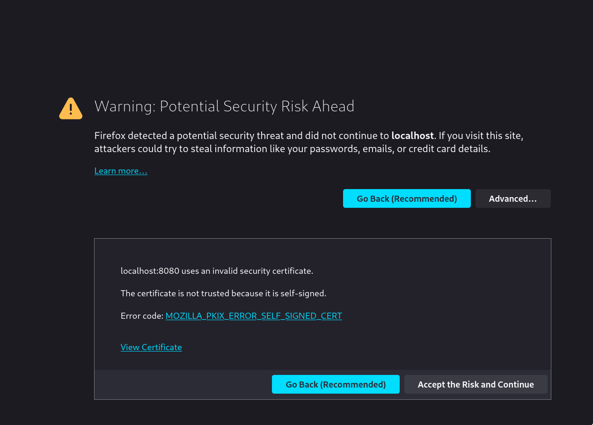

# RCOMP - Shared Board

## Introduction

This document describes the RCOMP part of the project related to the Shared Board communication infrastructure.

## Shared Board Protocol

- A TCP connection is established between the client and the server;
- The client sends a request to the server, with the server accepting incoming requests;
- Every request has a mandatory response format described in the communication protocol document;
- Once the connection is established, it is kept alive and is used for all required data exchanges while the client application is running.

### Communication Protocol Message Format

The communication protocol message format is described in the following table:

| Field        | Offset (bytes) | Length (bytes) | Description                                                                                                                                                                                   |
| ------------ | -------------- | -------------- | --------------------------------------------------------------------------------------------------------------------------------------------------------------------------------------------- |
| `VERSION`    | 0              | 1              | SBP message format version. This field is a single byte and should be interpreted as an unsigned integer (0 to 255). The present message format version number is one.                        |
| `CODE`       | 1              | 1              | This field identifies the type of request or response, it should be interpreted as an unsigned integer (0 to 255).                                                                            |
| `D_LENGTH_1` | 2              | 1              | These **two** fields `D_LENGTH_1` & `D_LENGTH_2` are used to specify the length in bytes of the `DATA` field. Both these fields are to be interpreted as unsigned integer numbers (0 to 255). |
| `D_LENGTH_2` | 3              | 1              | The length of the `DATA` field is to be calculated as: `D_LENGTH_1 + 256 x D_LENGTH_2`. The length of the `DATA` field may be zero, meaning it does not exist.                                |
| `DATA`       | 4              | -              | Contains data to meet the specific needs of the participating applications, the content depends on the message code.                                                                          |

### Communication Protocol Message Codes

The communication protocol message codes are described in the following table:

| Code | Description             | Meaning                                                                                                                                                                                                                                                                                                |
| ---- | ----------------------- | ------------------------------------------------------------------------------------------------------------------------------------------------------------------------------------------------------------------------------------------------------------------------------------------------------ |
| 0    | `COMMTEST`              | Communications test request with no other effect on the counterpart application than the response with a code two message (ACK). This request has no data.                                                                                                                                             |
| 1    | `DISCONN`               | End of session request. The counterpart application is supposed to respond with a code two message, afterwards both applications are expected to close the session (TCP connection). This request has no data.                                                                                         |
| 2    | `ACK`                   | Generic acknowledgment and success response message. Used in response to successful requests. This response contains no data.                                                                                                                                                                          |
| 3    | `ERR`                   | Error response message. Used in response to unsuccessful requests that caused an error. This response message may carry a human readable phrase explaining the error. If used, the phrase explaining is carried in the `DATA` field as string of ASCII codes, it’s not required to be null terminated. |
| 4    | `AUTH`                  | User authentication request. Described ahead.                                                                                                                                                                                                                                                          |
| 5    | `SPLIT`                 | Indicates the original payload has exceeded the maximum size supported by the protocol. The payload of this request indicates the length of the original message payload and the following messages together make the full payload.                                                                    |
| 6    | `GET_BOARDS`            | Used to get boards which the authenticated user has permission to access.                                                                                                                                                                                                                              |
| 7    | `GET_OWN_BOARDS`        | Used to get boards which the authenticated user owns.                                                                                                                                                                                                                                                  |
| 8    | `GET_WRITABLE_BOARDS`   | Used to get boards which the authenticated user has write permission.                                                                                                                                                                                                                                  |
| 9    | `GET_BOARD`             | Used to get a board by specifying the desired id in the payload. The authenticated user have at least read permission to the board.                                                                                                                                                                    |
| 10   | `GET_USER_PERMISSIONS`  | Used to retrieve the permissions a specific user has to a certain board. The authenticated user must have at least read permission to the board.                                                                                                                                                       |
| 11   | `SHARE_BOARD`           | Used to modify another user's permission to a board. The authenticated user must be owner of the board.                                                                                                                                                                                                |
| 12   | `ARCHIVE_BOARD`         | Used to archive a user's board. The authenticated user must be owner of the board.                                                                                                                                                                                                                     |
| 13   | `GET_POSTITS_BOARD`     | Used to get the post-its of a board. The authenticated user must have at least read permission to the board.                                                                                                                                                                                           |
| 14   | `GET_OWN_POSTITS_BOARD` | Used to get the authenticated user's post-its of a board. The authenticated user must have at least read permission to the board.                                                                                                                                                                      |
| 15   | `GET_BOARD_HISTORY`     | Used to get the history of a specific board. The authenticated user must have at least read permission to the board.                                                                                                                                                                                   |
| 16   | `CREATE_POSTIT`         | Used to create a post-it in a specific board. The authenticated user must have write permission to the board.                                                                                                                                                                                          |
| 17   | `CHANGE_POSTIT`         | Used to edit a post-it. The authenticated user must be owner of the post-it.                                                                                                                                                                                                                           |
| 18   | `UNDO_POSTIT`           | Used to undo the last change in a post-it. The authenticated user must be owner of the post-it and have write permission to the board.                                                                                                                                                                 |
| 19   | `IS_CELL_AVAILABLE`     | Used to check if a certain cell does not have a post-it in it. The authenticated user must have at least read permission to the board.                                                                                                                                                                 |
| 20   | `GET_ONLINE_COUNT`      | Used to get the number of clients currently connected to the server.                                                                                                                                                                                                                                   |

### Authentication Request

Once the TCP connection between the Shared Board App application (client) and the Shared Board Server application (server) is established, the Shared Board App is forced to authenticate the local user by sending an `AUTH` request.

- Prior to successful `AUTH`, the server must ignore any request from the client with a code value above four and send back an `ERR` message as response.
- The user authentication is achieved by a username and password pair, both will be provided to the client application (Shared Board App) by the local user running it.
- The username and the password values are incorporated in the `AUTH` request at the `DATA` field as two null terminated strings of ASCII codes, first the username, followed by the password.
- The response to an `AUTH` request may be an `ACK`, meaning the authentication was successful, or an `ERR`, meaning it has failed. In the latter case, additional `AUTH` requests could be tried by the client.

### Split Messages

The protocol's maximum supported payload size is (2^8)^2 - 1 bytes. If the message exceeds this size, the message will be split into multiple messages.

The first message will have the code `SPLIT` and the payload will be the number of bytes of the original message.

The following messages will carry the payload divided into chunks.

## HTTP Server

The Shared Board App also implements an HTTP server to render a view only page of a board.
The browser receives static files from the server and can also send AJAX requests to certain endpoints in order to retrieve data from the server.

A Router was implemented to handle each HTTP request. The Router will check the request's method and path and call the appropriate controller.
A Middleware was also implemented to serve static files. The middleware will check if the request's path matches a static file and serve it if it does.
If the request's path does not match a static file, the Router will be called.
All `/api` endpoints respond with JSON. These controllers make requests to the Shared Board Server and return the response to the browser.

The available endpoints are described in the following table:

| Method | Path             | Description                                                                                                              |
| ------ | ---------------- | ------------------------------------------------------------------------------------------------------------------------ |
| `GET`  | `/api`           | Returns a "Hello World" message formatted in JSON.                                                                       |
| `GET`  | `/api/session`   | Returns the current authenticated user, 401 (Unauthorized) otherwise.                                                    |
| `GET`  | `/api/board`     | Returns all boards the authenticated user has read permission to.                                                        |
| `GET`  | `/api/board/:id` | Returns the board and its post-its with the specified id. The authenticated user must have read permission to the board. |
| `GET`  | `/api/online`    | Returns the number of connected to the Shared Board Server clients.                                                      |

## SSL

The Shared Board also implements SSL to encrypt the communication between the Shared Board App and the Shared Board Backend, as well as to encrypt the communication between the HTTP server and the browser by using HTTPS.

By using SSL, we ensure that the communication between the client and the server is private and the data integrity is not compromised by a third-party.

The certificates used in the SSL implementation are self-signed certificates generated by the the team members and stored in the project file root directory.
Due to the certificates being self-signed, the browser will warn the user that the connection is not secure.

## Cloud Deployment

ISEP provides to its students a cloud platform where students can deploy Virtual Servers using pre-made templates.
We deployed the Shared Board Backend & the database on this platform.

Go to the [ISEP's DEI Virtual Servers Private Cloud](https://vs-ctl.dei.isep.ipp.pt/).

To use the deployment, read the [Deployment Guide](../README.md#6-deploy-to-a-remote-machine) section in the main README.

## References

- [Integrative Project Application Protocol](https://moodle.isep.ipp.pt/pluginfile.php/294514/mod_resource/content/1/RCOMP-2022-2023-integrative-project-application-protocol.pdf)
- [TP 8 - Berkeley Sockets in Java (UDP)](https://moodle.isep.ipp.pt/pluginfile.php/282301/mod_resource/content/4/TP08.pdf)
- [TP 9 - Berkeley Socket Java & C API (TCP)](https://moodle.isep.ipp.pt/pluginfile.php/282302/mod_resource/content/6/TP09.pdf)
- [TP 10 - Web Services, Simple HTTP Server in C](https://moodle.isep.ipp.pt/pluginfile.php/282303/mod_resource/content/6/TP10.pdf)
- [TP 11 - SSL Programming in C](https://moodle.isep.ipp.pt/pluginfile.php/282304/mod_resource/content/7/TP11.pdf)
- [ISEP's DEI Virtual Servers Private Cloud Documentation](https://vs-gate.dei.isep.ipp.pt:10124/overview.html)
