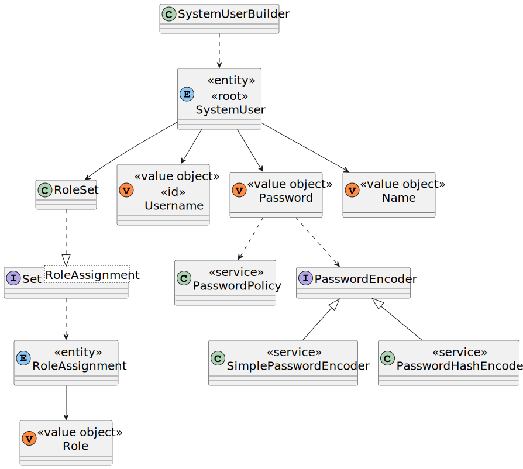
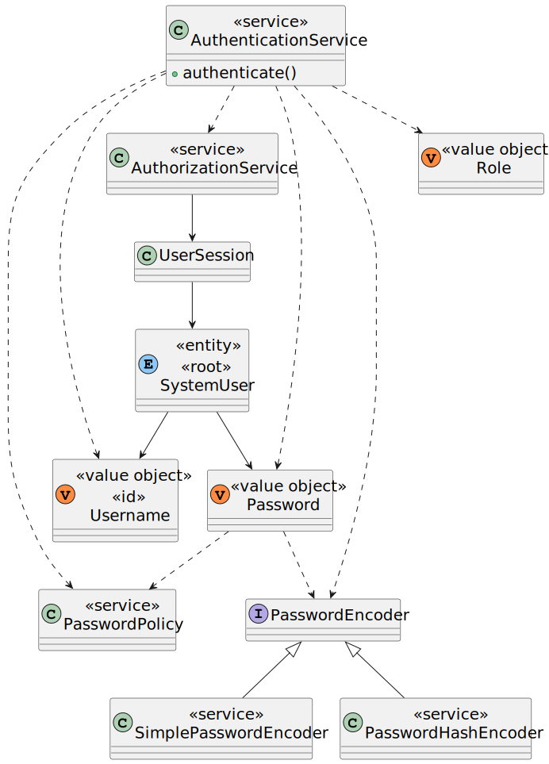

# User Story G006 - Authentication Functionality

> As Project Managers, I want the system to support and apply authentication and authorization for all its users and functionalities.

|             |             |
| ----------- | ----------- |
| ID          | 06          |
| Sprint      | A           |
| Application | 0 - General |
| Priority    | 1           |

## Acceptance Criteria

- N/A.

## Requirements

- **NFR08** Authentication and Authorization - The system must support and apply authentication and authorization for all its users and functionalities.

## Analysis

### Related Tasks

**Task 02** - Make sign up go back to main menu instead of existing the app bug

This was a known bug that was fixed.

**Task 03** - Implement password hashing

The base program used a PlainTextEncoder that was not secure.
We implemented 2 different encoders.
[SimplePasswordEncoder](../../../ecourse.infrastructure.application/src/main/java/eapli/ecourse/infrastructure/authz/SimplePasswordHashEncoder.java) and [PasswordHashEncoder](../../../ecourse.infrastructure.application/src/main/java/eapli/ecourse/infrastructure/authz/PasswordHashEncoder.java).

The simple one is used for testing purposes and all of the downsides are listed in the class file.

## Design

The framework already had a base implementation of the authentication and authorization system.

### SystemUser Model

The following diagram shows the SystemUser model used by the framework, including the new encoder implemented with this user story.



### Authentication and Authorization

The following diagram shows the authentication and authorization system used by the framework, including the new encoder implemented with this user story.



### Applied patterns

#### Factory (GOF - Creational)

The factory pattern will be used to create the encoders.
This was not implemented in this user story, but will be used in the future. This way we can easily change the encoder used in the application at any time using a simple configuration file.

### Tests

As we implemented 2 different encoders, we also implemented 2 different tests to ensure the differences between them.
The rest of the implementation was already done in the base project so we did not need to implement any more tests.

#### Password Hash Encoder

```java
 @Test
  public void ensureHashingIsOneWay() {
    final String password = "password";
    final String encodedPassword = encoder.encode(password);
    final String encodedPassword2 = encoder.encode(password);
    assertNotEquals(password, encodedPassword);
    assertNotEquals(encodedPassword, encodedPassword2);
    assertTrue(encoder.matches(password, encodedPassword));
    assertTrue(encoder.matches(password, encodedPassword2));
  }
```

```java
  @Test
  public void ensurePasswordIsEncodedAndMatches() {
    final String password = "password";
    final String encodedPassword = encoder.encode(password);
    assertNotEquals(password, encodedPassword);
    assertTrue(encoder.matches(password, encodedPassword));
  }
```

```java
  @Test
  public void ensurePasswordIsEncodedAndDoesNotMatch() {
    final String password = "password";
    final String encodedPassword = encoder.encode(password);
    assertNotEquals(password, encodedPassword);
    assertFalse(encoder.matches("wrongPassword", encodedPassword));
  }
```

#### Simple Password Hash Encoder

```java
  @Test
  public void ensurePasswordIsNotOneWay() {
    final String password = "password";
    final String encodedPassword = encoder.encode(password);
    final String encodedPassword2 = encoder.encode(password);
    assertEquals(encodedPassword, encodedPassword2);
    assertTrue(encoder.matches(password, encodedPassword));
    assertTrue(encoder.matches(password, encodedPassword2));
  }
```

## Implementation

Write about the useful details of the implementation of the user story.

## Observations

N/a
