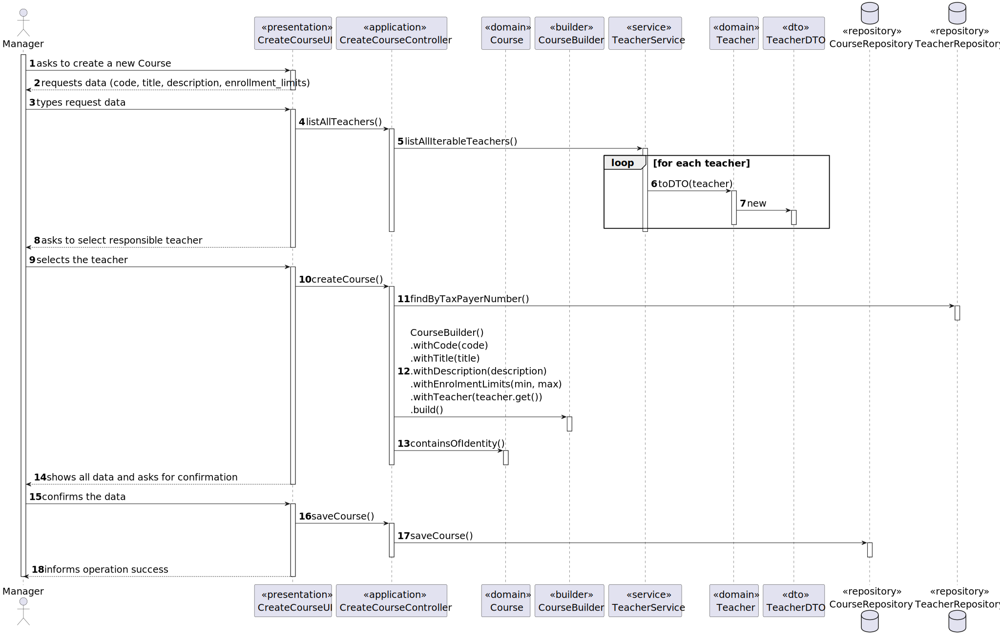

# User Story 1003 - Create Courses

|             |             |
| ----------- | ----------- |
| ID          | 08          |
| Sprint      | B           |
| Application | 2 - Courses |
| Priority    | 1           |

---

## 1. Context

This is the first time this task is assigned to be developed. This is a new functionality that is needed to create courses.

## 2. Requirements

### "As Manager, I want create courses"

## 2.1. Client Specifications

- A course is characterized by its title and a unique code inputed by the administrator, e.g.,
  "JAVA-1".

- The usual workflow related to the course can be illustrated as follows:
  event create (-> state close) -> event open (->state open) -> event open enrollments (-> state enroll) -> event close enrollments (-> state in progress) -> event close (-> state closed)

- Each course should have a unique identifier (automatically generated) and a unique name. A course may be open or closed. A closed course can not have any activity.

- Each course must have a teacher in charge, but may also have other teachers. Courses are not divided into sections (i.e., "turmas").

- A course has also a small textual descriptions of its contents.

- Courses may have a minimum and a maximum number of enrolled students. This may limit the possibility of opening (i.e. starting) courses that do not satisfy the limits.

## 2.2. Client Clarifications

> [**Question**: Course id is unique and generated o\*r inputed? Course title and name are the same?](https://moodle.isep.ipp.pt/mod/forum/discuss.php?d=21835)
>
> **Answer**: "Unique code inputted by the administrator, e.g., "JAVA-1, that is used to identify it. It has a name (name and title may refer to the same property of courses, and I would say that there is no need for it to be unique)"

> [**Question**:A course can open if the limits are exceeded or not? Who can setup the limits? Are the limits mandatory?](https://moodle.isep.ipp.pt/mod/forum/discuss.php?d=21913)
>
> **Answer**:"Managers should be able to specify the limits. In my opinion the system should notify the manager if a course is out of the enrolment limits (before this course is changed to "in progress"). But, in the end, it is up to the manager to follow/enforce or not, the limits."

> [**Question**: Course code verifications?](https://moodle.isep.ipp.pt/mod/forum/discuss.php?d=21971)
>
> **Answer**:"Course code should be unique and there are not restrictions on the format of the code."

## 2.3. Functional Requirements

> **FRC01** - Create Course Different editions of a course are to be considered different courses (e.g., Intro-Math-Sem01, Intro-Math-Sem02). Only managers are able to execute this functionality

## 2.4. Acceptance Criteria

- N/a

---

## 3. Analysis

### 3.1. Main success scenario

1. Manager asks to create a new course
2. The System asks the manager to introduce the data needed to create a course
3. Manager types the requested data
4. The system shows the manager the data typed and asks for confirmation
5. Manager confirms the data
6. The system reports the success of the operation

### 3.2. Conditions

- The manager must be authenticated and authorized to perform the operation.

### 3.3. System Sequence Diagram


### 3.4. Sequence Diagram (Simplified)



### 3.5. Partial Domain Model


## 4. Design

### 4.1. Functionality Realization


### 4.2. Class Diagram


### 4.3. Applied Patterns

- xxx

### 4.4. Tests

_Note: This are some simplified versions of the tests for readability purposes._

**Test 1:** xxx

```java
  @Test
  private void test1() {
    assetTrue(true);
  }
```

## 5. Implementation

### 5.1. Controller

- Relevant implementation details

```java
  private void sample() {
    return true;
  }
```

## 6. Integration & Demonstration


## 7. Observations

- N/a
