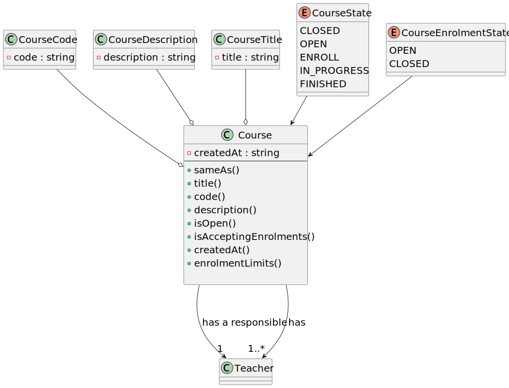

# User Story 1002 - Create Courses

|             |             |
| ----------- | ----------- |
| ID          | 08          |
| Sprint      | B           |
| Application | 2 - Courses |
| Priority    | 1           |

---

## 1. Requirements

### As Manager, I want to create courses.

## 1.1. Client Specifications

- xxx

## 1.2. Client Clarifications

> [**Question**](): xxx
>
> **Answer**: xxx

## 1.3. Functional Requirements

> **FRC02** Open/Close Enrollments in Course - Only managers are able to execute this functionality.

## 1.4. Acceptance Criteria

> **AC.1**: Different editions of a course are to be considered different courses (e.g., Intro-Math-Sem01, Intro-Math-Sem02).

> **AC.2**: Only managers are able to execute this functionality.

> **AC.3**: The course code must be unique.

> **AC.4**: The course code must be composed of the course acronym, the course edition and the course semester (e.g., Intro-Math-Sem01).

---

## 2. Analysis

### 2.1. Main success scenario

1. Course was created successfully and is available for the Manager to open/close enrollments.

2. Course has enrollments limits

### 2.2. Conditions

The registration information of the new category is persisted/saved in the system.

### 2.3. System Sequence Diagram


### 2.4. Sequence Diagram (Simplified)


### 2.5. Partial Domain Model


## 3. Design

### 3.1. Functionality Realization


### 3.2. Class Diagram



### 3.3. Applied Patterns

- xxx

### 3.4. Tests

**Test 1:** xxx

```java
  @Test
  private void test1() {
    assetTrue(true);
  }
```

## 4. Implementation

### 4.1. Controller

- Relevant implementation details

```java
  private void sample() {
    return true;
  }
```

## 5. Integration & Demonstration


## 6. Observations

N/a
