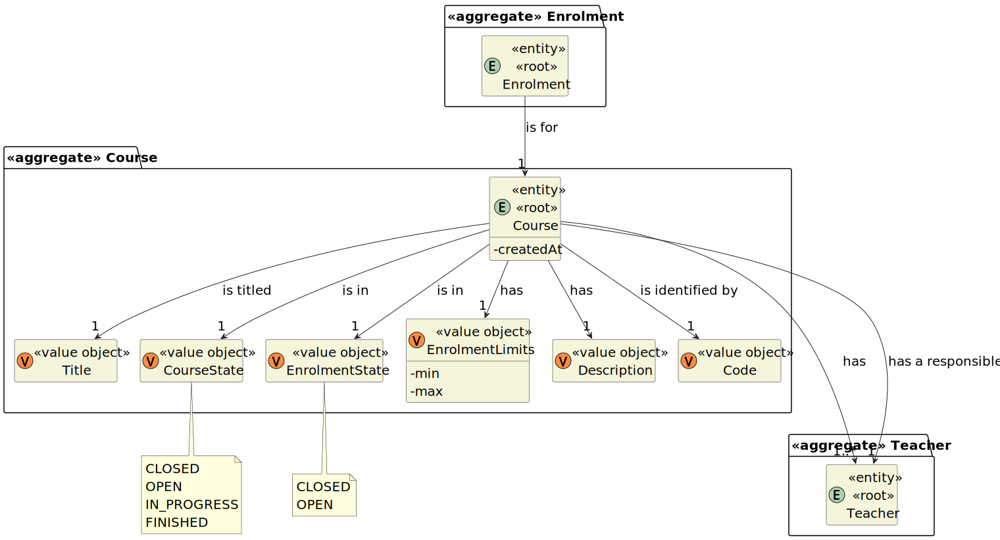
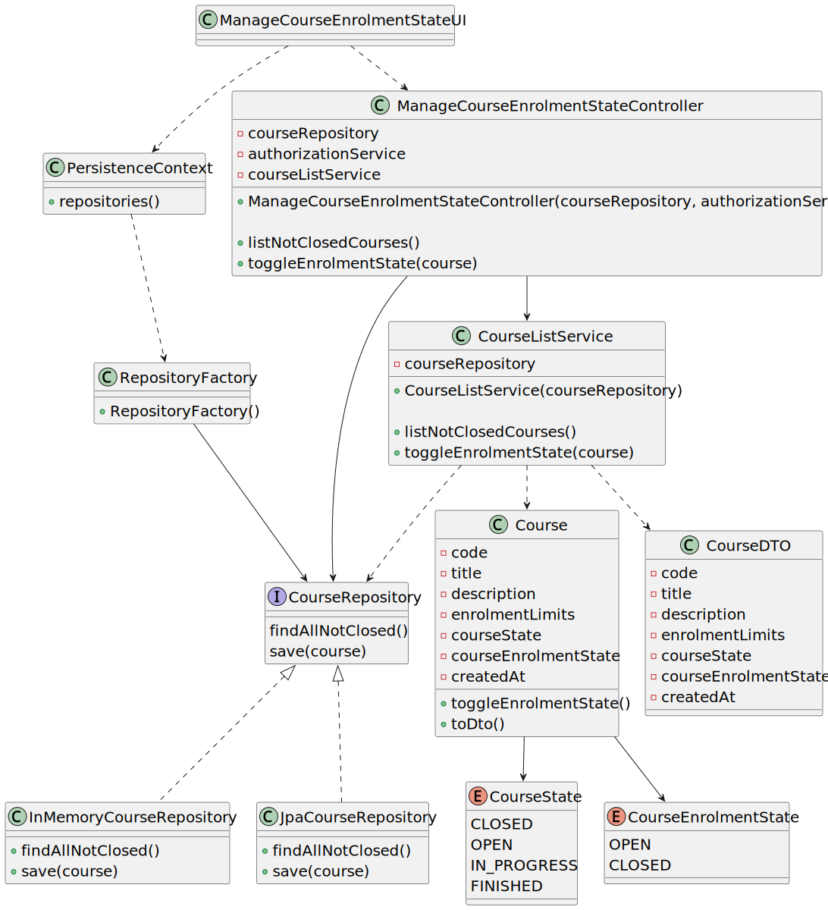

# User Story 1003 - Manage Course Enrollments

|             |             |
| ----------- | ----------- |
| ID          | 09          |
| Sprint      | B           |
| Application | 2 - Courses |
| Priority    | 1           |

---

## 1. Requirements

### "As Manager, I want to open and close enrollments in courses"

## 1.1. Client Specifications

- "The Admin app is used by managers to manage courses, users and enrollment of students."

- "Managers [...] manage all the users of the system as well as [...] students enrollment."

- "Courses may have a minimum and a maximum number of enrolled students."

- "Students enroll in courses"

- "The usual workflow related to the course can be illustrated as follows:
  event create (-> state close) -> event open (->state open) -> event open enrollments (-> state
  enroll) -> event close enrollments (-> state in progress) -> event close (-> state closed"

## 1.2. Client Clarifications

> [**Question**](): xxx
>
> **Answer**: xxx

## 1.3. Functional Requirements

> **FRC02** Open/Close Enrollments in Course - Only managers are able to execute this functionality.

## 1.4. Acceptance Criteria

> **AC.1**: xxx

---

## 2. Analysis

### 2.1. Main success scenario

1. Warehouse Employee requires the configuration of an AGV available in the Warehouse.
2. The System asks for information related to the AGV
3. Warehouse Employee enters the information.
4. The System reports the success of the operation.

### 2.2. Conditions

The registration information of the new category is persisted/saved in the system.

### 2.3. System Sequence Diagram


### 2.4. Sequence Diagram (Simplified)


### 2.5. Partial Domain Model



## 3. Design

### 3.1. Functionality Realization


### 3.2. Class Diagram



### 3.3. Applied Patterns

- xxx

### 3.4. Tests

**Test 1:** xxx

```java
  @Test
  private void test1() {
    assetTrue(true);
  }
```

## 4. Implementation

### 4.1. Controller

- Relevant implementation details

```java
  private void sample() {
    return true;
  }
```

## 5. Integration & Demonstration


## 6. Observations

N/a
