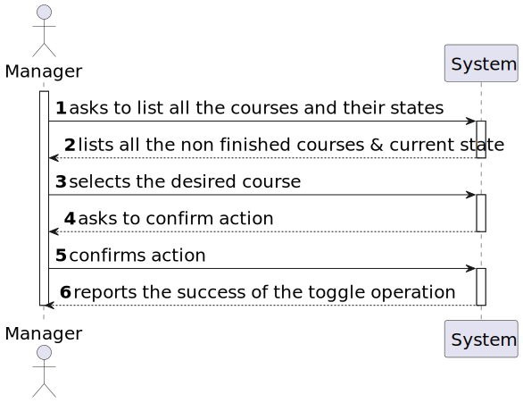
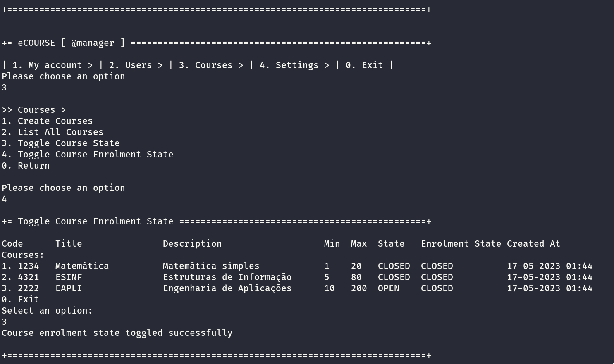

# User Story 1003 - Manage Course Enrollments

|             |             |
| ----------- | ----------- |
| ID          | 09          |
| Sprint      | B           |
| Application | 2 - Courses |
| Priority    | 1           |

---

## 1. Context

This is the first time this task is assigned to be developed. This is a new functionality that is needed to know the state of the course relative to its enrollments.

## 2. Requirements

### "As Manager, I want to open and close enrollments in courses"

## 2.1. Client Specifications

- "The Admin app is used by managers to manage courses, users and enrollment of students."

- "Managers [...] manage all the users of the system as well as [...] students enrollment."

- "Courses may have a minimum and a maximum number of enrolled students."

- "Students enroll in courses"

- "The usual workflow related to the course can be illustrated as follows:
  event create (-> state close) -> event open (->state open) -> event open enrollments (-> state
  enroll) -> event close enrollments (-> state in progress) -> event close (-> state closed"

## 2.2. Client Clarifications

> [**Question**: A course can open if the limits are exceeded or not? Who can setup the limits? Are the limits mandatory?](https://moodle.isep.ipp.pt/mod/forum/discuss.php?d=21913)
>
> **Answer**: "Managers should be able to specify the limits. In my opinion the system should notify the manager if a course is out of the enrolment limits (before this course is changed to "in progress"). But, in the end, it is up to the manager to follow/enforce or not, the limits."

> [**Question**: Can one student be enrolled in different courses?](https://moodle.isep.ipp.pt/mod/forum/discuss.php?d=21922)
>
> **Answer**: "Yes"

> [**Question**: In US1009, What are the criteria for a student to be enrolled in a course?](https://moodle.isep.ipp.pt/mod/forum/discuss.php?d=22498)
>
> **Answer**: "This is not a system requirement. You should only register the decision of the manager."]

## 2.3. Functional Requirements

> **FRC02** Open/Close Enrollments in Course - Only managers are able to execute this functionality.
> **FRC07** - Request Enrollment in Course The student requests to be enrolled in a course

## 2.4. Acceptance Criteria

- N/a

---

## 3. Analysis

### 3.1. Main success scenario

1. Manager asks to list all the courses and their states
2. The System lists all the non-finished courses
3. Manager selects the desired course
4. The system asks the manager to select the desired action
5. Manager selects the desired action
6. The system reports the success of the operation

### 3.2. Course State Diagram


### 3.3. Conditions

- The manager must be authenticated and authorized to perform the operation.
- The course must be in a state that allows the operation to be performed.

### 3.4. System Sequence Diagram



### 3.5. Partial Domain Model


## 4. Design

### 4.1. Functionality Realization


### 4.2. Class Diagram


### 4.3. Applied Patterns

- xxx

### 4.4. Tests

_Note: This are some simplified versions of the tests for readability purposes._

**Test 1:** Ensure the course is in the correct state after the operation

```java
  @Test
  private void ensureCourseIsInCorrectStateAfterToggle() {
    assertEquals(CourseState.OPEN, course.getState());
    course.toggleEnrollments();
    assertEquals(CourseState.ENROLL, course.getState());
  }
```

**Test 2:** Ensure that double toggle does not change the state (the state is reversible)

```java
  @Test
  private void ensureDoubleToggleDoesNotChangeState() {
    assertEquals(CourseState.OPEN, course.getState());
    course.toggleEnrollments();
    course.toggleEnrollments();
    assertEquals(CourseState.OPEN, course.getState());
  }
```

## 5. Implementation

### 5.1. Controller

- Relevant implementation details

```java
  private void sample() {
    return true;
  }
```

## 6. Integration & Demonstration



## 7. Observations

- The history of the states of a course is not relevant.
