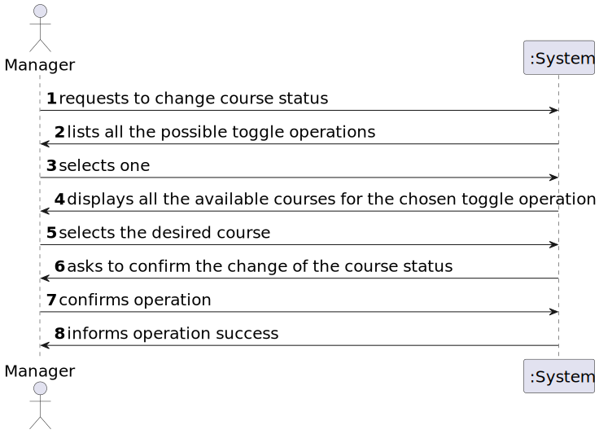

# User Story 1004 - Toggle Course Status

|             |             |
| ----------- | ----------- |
| ID          | 10          |
| Sprint      | B           |
| Application | 2 - Courses |
| Priority    | 1           |

---

## 1. Context

This is the first time this task is assigned to be developed. This is a new functionality that is needed to open/close course activity.

## 2. Requirements

### As Manager, I want to open and close courses.

## 2.1 Client Specifications

- "A course may be open or closed. A closed course can not have any activity."

- "The usual workflow related to the course can be illustrated as follows:
  event create (-> state close) -> event open (-> state open) -> event open enrollments (-> state
  enroll) -> event close enrollments (-> state in progress) -> event close (-> state closed)"

- "The Admin app is used by managers to manage courses, users and enrollment of students."

## 2.2. Client Clarifications

- N/A

## 2.3. Functional Requirements

> **FRC03** Open/Close Course - Only managers are able to execute this functionality.

## 2.4. Acceptance Criteria

- N/A

## 3. Analysis

### 3.1. Main success scenario

1. Manager asks to change course status
2. The system lists all the available courses
3. Manager selects the desired course
4. System informs the success of the operation

### 3.2. Conditions

- The manager must be authenticated and authorized to perform the operation.
- The course must be in a state that allows the operation to be performed. (e.g. cannot toggle the state of a finished course)

### 3.3. System Sequence Diagram



### 3.4. Sequence Diagram (Simplified)


### 3.5. Partial Domain Model


## 4. Design

### 4.1. Functionality Realization


### 4.2. Class Diagram


### 4.3. Applied Patterns

- xxx

### 4.4. Tests

**Test 1:** Ensure is possible to toggle the status in an open course

```java
  @Test
  public void ensureIsPossibleToToggleOpenCourseStatus() {
    final Course course = getDummyOpenCourse();

    assertTrue(course.state().isOpen());
    course.state().previous();
    assertTrue(course.state().isClosed());
    course.state().changeToOpen();
    course.state().next();
    assertTrue(course.state().isInProgress());
  }
```


**Test 2:** Ensure is possible to toggle the status in a closed course

```java
  @Test
  public void ensureIsPossibleToToggleClosedCourseStatus() {
    final Course course = getDummyClosedCourse();

    assertTrue(course.state().isClosed());
    course.state().next();
    assertTrue(course.state().isOpen());
  }
```


**Test 3:** Ensure is possible to toggle the status of an in progress course

```java
  @Test
  public void ensureIsPossibleToToggleInProgressCourseStatus() {
    final Course course = getDummyInProgressCourse();

    assertTrue(course.state().isInProgress());
    course.state().next();
    assertTrue(course.state().isFinished());
  }
```

**Test 4:** Ensure cannot toggle status of a finished course

```java
  @Test
  public void ensureCannotToggleFinishedCourseStatus() {
  final Course course = getDummyFinishedCourse();

    assertTrue(course.state().isFinished());
    assertThrows(IllegalStateException.class, () -> {
    course.state().previous();
    });
    assertThrows(IllegalStateException.class, () -> {
    course.state().next();
    });
  }
```

## 5. Implementation

### 5.1. Controller

- Relevant implementation details

```java
  public Course toggleToNextCourseStatus(CourseDTO courseDTO) {
    authz.ensureAuthenticatedUserHasAnyOf(ClientRoles.POWER_USER, ClientRoles.MANAGER);

    Course course = getCourse(courseDTO);

    course.nextState();
    return courseRepository.save(course);
  }

  public Course toggleToPreviousCourseStatus(CourseDTO courseDTO) {
    authz.ensureAuthenticatedUserHasAnyOf(ClientRoles.POWER_USER, ClientRoles.MANAGER);

    Course course = getCourse(courseDTO);

    course.previousState();
    return courseRepository.save(course);
  }
```

## 6. Integration & Demonstration


## 7. Observations

N/a
