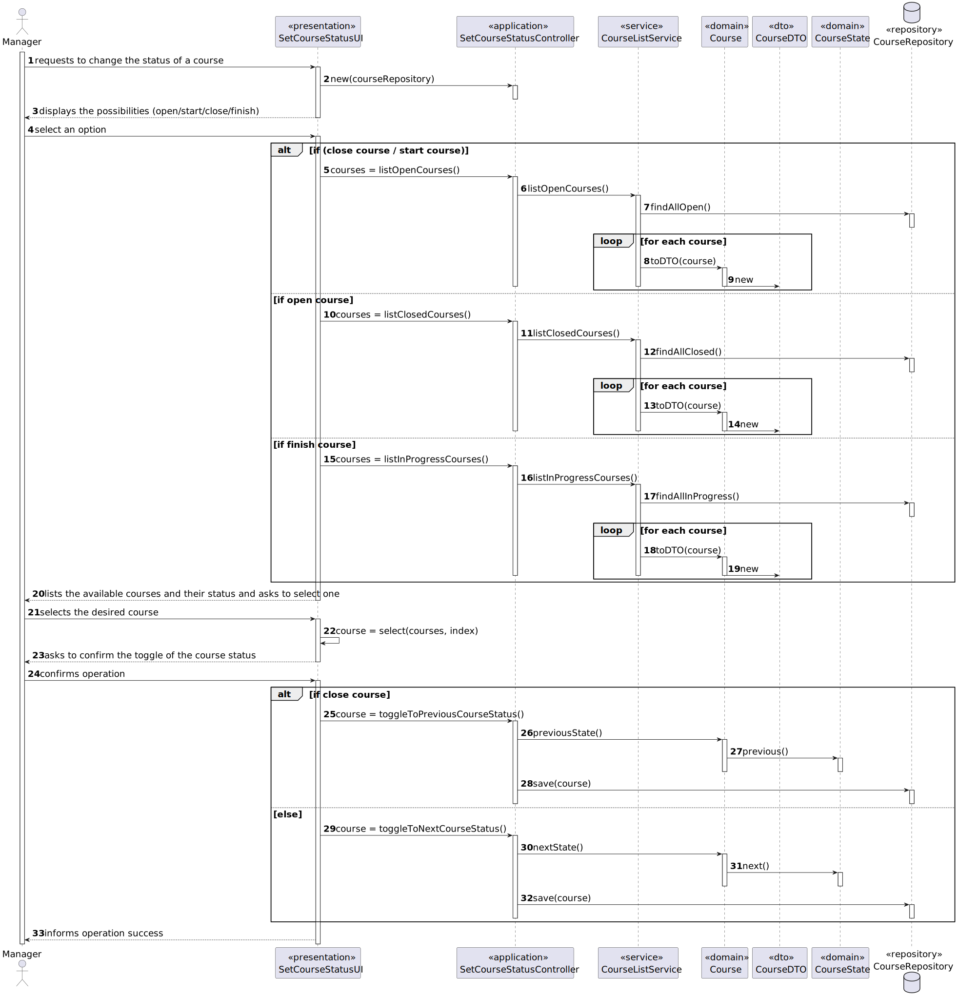

# User Story 1004 - Toggle Course Status

|             |             |
| ----------- | ----------- |
| ID          | 10          |
| Sprint      | B           |
| Application | 2 - Courses |
| Priority    | 1           |

---

## 1. Context

This is the first time this task is assigned to be developed. This is a new functionality that is needed to open/close course activity.

## 2. Requirements

### As Manager, I want to open and close courses.

## 2.1 Client Specifications

- "A course may be open or closed. A closed course can not have any activity."

- "The usual workflow related to the course can be illustrated as follows:
  event create (-> state close) -> event open (-> state open) -> event open enrollments (-> state
  enroll) -> event close enrollments (-> state in progress) -> event close (-> state closed)"

- "The Admin app is used by managers to manage courses, users and enrollment of students."

## 2.2. Client Clarifications

- N/A

## 2.3. Functional Requirements

- FRC03 Open/Close Course - Only managers are able to execute this functionality.

## 2.4. Acceptance Criteria

- N/A

## 3. Analysis

### 3.1. Main success scenario

1. Manager asks to change course status
2. The system lists all the available courses
3. Manager selects the desired course
4. System informs the success of the operation

### 3.2. Conditions

- The manager must be authenticated and authorized to perform the operation.

### 3.3. System Sequence Diagram

### 3.4. Sequence Diagram (Simplified)

### 3.5. Partial Domain Model

## 4. Design

### 4.1. Functionality Realization

### 4.2. Class Diagram

### 4.3. Applied Patterns

- xxx

### 4.4. Tests

Test 1: xxx

@Test
private void test1() {
assetTrue(true);
}

## 5. Implementation

### 5.1. Controller

- Relevant implementation details

  private void sample() {
  return true;
  }

## 6. Integration & Demonstration

## 7. Observations

N/a
