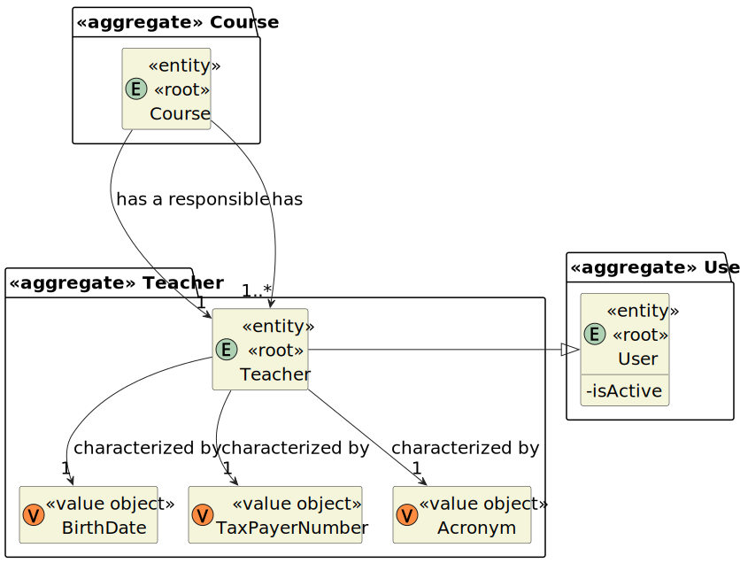

# User Story 1005 - Set Course Teachers

|             |             |
| ----------- | ----------- |
| ID          | 11          |
| Sprint      | B           |
| Application | 2 - Courses |
| Priority    | 1           |

---

## 1. Context

This is the first time this task is assigned to be developed. This is a new functionality that is needed to define the teachers of a course.

This US is divided in two parts/features:

- Set all teachers;
- Set teacher in charge.

In order to select the teacher in charge, the manager must first define the teachers of the course.

---

## 2. Requirements

#### "As Manager, I want to set the teachers of a course."

### 2.1. Client Specifications

- **Managers** can set the teachers of a course.
-
- There is only one **Teacher in Charge** per course.

### 2.2. Client Clarifications

## [Question 1](https://moodle.isep.ipp.pt/mod/forum/discuss.php?d=22007)

> Can a teacher be in charge of more than one course?

"Yes"

## [Question 2](https://moodle.isep.ipp.pt/mod/forum/discuss.php?d=22324)

> Is there any difference between a teacher and a teacher in charge? Do they have the same permissions regarding classes?

"No, there is no difference. In the app, they have the same permissions. You only need to register the teacher in charge for each course."

### 2.3. Functional Requirements

- **FRC04** Set Course Teachers - Each course may have several teachers and must have only one Teacher in Charge. Only managers are able to execute this functionality.

### 2.4. Acceptance Criteria

- N/A.

---

## 3. Analysis

### 3.1. Input and Output Data

#### Input

- Course (Selected from a list of courses)
- Teacher (Selected from a list of teachers - if defining the teacher in charge, the teachers listed are the ones that were already defined for the course)

#### Output

- Success or error message

### 3.2. System Sequence Diagram


### 3.3. Partial Domain Model



---

## 4. Design

### 4.1. Functionality Realization


<!-- ### 4.2. Class Diagram

 -->

### 4.3. Applied Patterns

- xxx

### 4.4. Tests

**Test 1:** Test to ensure that controller is able to assign teachers to a course.

```java
  @Test
  public void testAssignTeachersToCourse() {
    CourseDTO courseDTO = getDummyCourseDTO();
    TeacherDTO teacherDTO = getNewTeacherDTO();

    Course c = getDummyCourse();
    when(courseRepository.ofIdentity(courseDTO.getCode())).thenReturn(Optional.of(c));
    when(teacherRepository.ofIdentity(teacherDTO.getNumber())).thenReturn(Optional.of(getNewDummyTeacher()));
    List<TeacherDTO> teachers = new ArrayList<>();
    teachers.add(teacherDTO);
    controller.assignTeachersToCourse(teachers, courseDTO);

    assertEquals(new ArrayList<Teacher>(c.teachers()).get(0).identity(), teacherDTO.getNumber());
  }
```

<!-- ---

## 5. Implementation

### 5.1. Controller

- Relevant implementation details

```java
  private void sample() {
    return true;
  }
``` -->

---

## 6. Integration & Demonstration


---

## 7. Observations

- N/A
