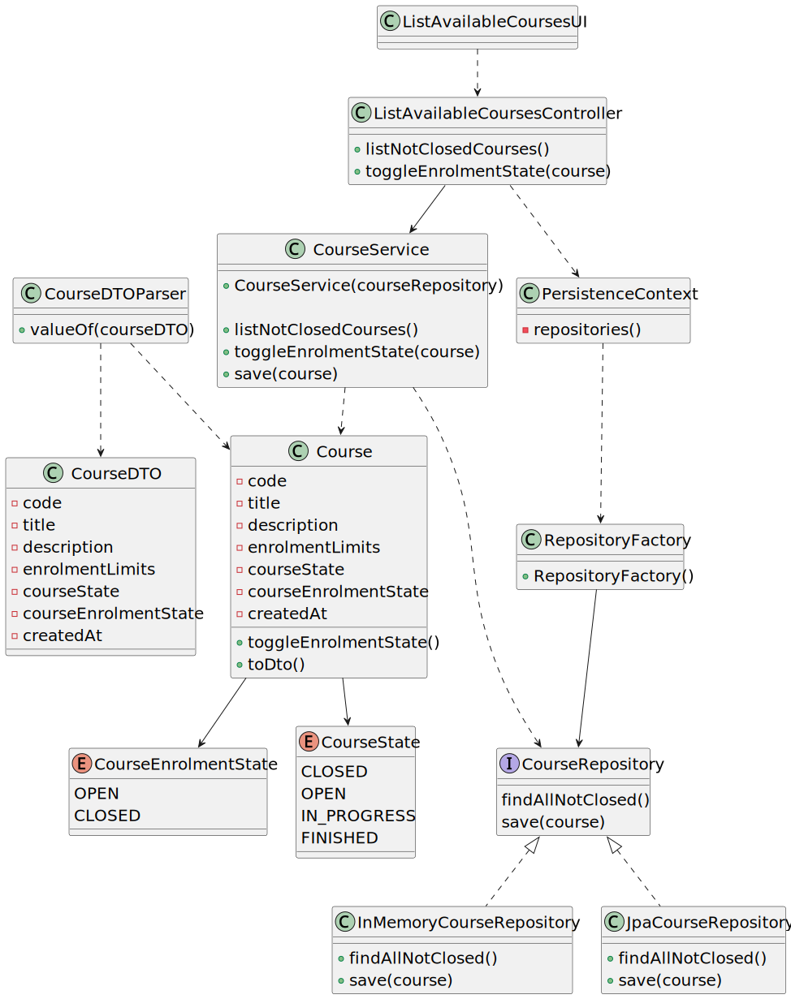

# User Story 1006 - List Available Courses

|             |             |
| ----------- | ----------- |
| ID          | 12          |
| Sprint      | B           |
| Application | 2 - Courses |
| Priority    | 1           |

---

## 1. Requirements

### "As User, I want to list all the courses that are available to me."

## 1.1. Client Specifications

- "The platform should support the activities of the major actors of a course, mainly teachers, students and managers."
- "The Admin app is used by managers to manage courses, users and enrollment of students."
- "A course may be open or closed."
- "A course has also a small textual descriptions of its contents."
- "Courses may have a minimum and a maximum number of enrolled students."
- "The usual workflow related to the course can be illustrated as follows:
  event create (-> state close) -> event open (-> state open) -> event open enrollments (-> state
  enroll) -> event close enrollments (-> state in progress) -> event close (-> state closed")

## 1.2. Client Clarifications

> [**Question 46**](../../client-clarifications.md#question-46): In G1006, what are the available courses for each role?
>
> **Answer**: "Teachers: courses that they are in charge of; Students: courses that they are enrolled in, and courses that have opened enrolment status; Managers: all courses."

## 1.3. Functional Requirements

> **FRC05** List Courses - All users are able to execute this functionality.

## 1.4. Acceptance Criteria

<!-- > **AC.1**: xxx -->

> N/A.

---

## 2. Analysis

### 2.1. Main success scenario

- A list of available courses is displayed to the user.

### 2.2. Conditions

- The user must be authenticated and authorized to perform the operation.
- The course must have the state enroll to be listed to the user.

### 2.3. System Sequence Diagram


### 2.4. Sequence Diagram (Simplified)


### 2.5. Partial Domain Model


## 3. Design

### 3.1. Functionality Realization


### 3.2. Class Diagram



### 3.3. Applied Patterns

<!-- TODO -->

- xxx

### 3.4. Tests

<!-- TODO -->

**Test 1:** xxx

```java
  @Test
  private void test1() {
    assetTrue(true);
  }
```

## 4. Implementation

### 4.1. Controller

<!-- TODO -->

- Relevant implementation details

```java
  private void sample() {
    return true;
  }
```

## 5. Integration & Demonstration

<!-- TODO -->


## 6. Observations

- N/a.
