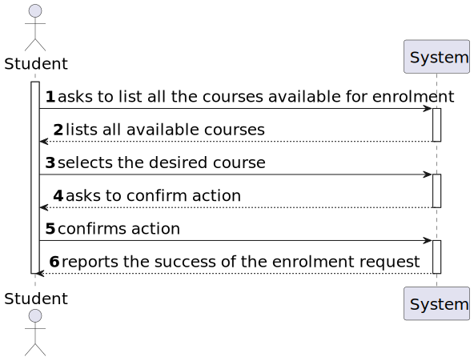
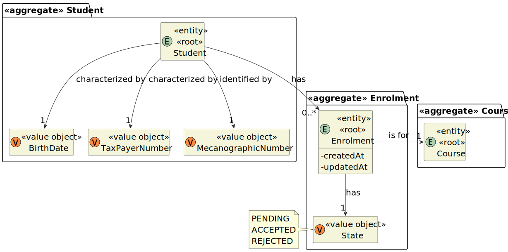

# User Story 1008 - Apply to a Course

|             |             |
| ----------- | ----------- |
| ID          | 14          |
| Sprint      | B           |
| Application | 2 - Courses |
| Priority    | 1           |

---

## 1. Context

This is the first time this task is assigned to be developed. This is a new functionality that is needed so the students can apply to courses.

## 2. Requirements

### "As Student, I want to request my enrollment in a course."

## 2.1. Client Specifications

- "Students enroll in courses."

## 2.2. Client Clarifications

> [**Question:** Can one student be enrolled in different courses?](https://moodle.isep.ipp.pt/mod/forum/discuss.php?d=21922)
>
> **Answer**: "Yes"

> [**Question:** In US1009, What are the criteria for a student to be enrolled in a course?](https://moodle.isep.ipp.pt/mod/forum/discuss.php?d=22498)
>
> **Answer**: "This is not a system requirement. You should only register the decision of the manager."

## 2.3. Functional Requirements

- **FRC07** Request Enrollment in Course - The student requests to be enrolled in a course.

## Acceptance Criteria

- N/a

---

## 3. Analysis

### 3.1. Conditions

- The student must be authenticated

### 3.2. System Sequence Diagram



### 3.3. Partial Domain Model



## 4. Design

### 4.1. Functionality Realization


### 4.2. Class Diagram


### 4.3. Applied Patterns

- **Factory**: The factory pattern is used in the instantiation of the CourseRepository and EnrolmentRepository. This is done to enable the use of a mock repository in the tests and to allow swapping of the repository using a property file.

### 4.4. Tests

_Note: This are some simplified versions of the tests for readability purposes._

**Test 1:** xxx

```java
  @Test
  public void xxx() {
  }
```

## 5. Implementation

### 5.1. Controller

- Relevant implementation details

```java
   public void sample() {
    return true;
  }
```

## 6. Integration & Demonstration


## 7. Observations

- xxx
