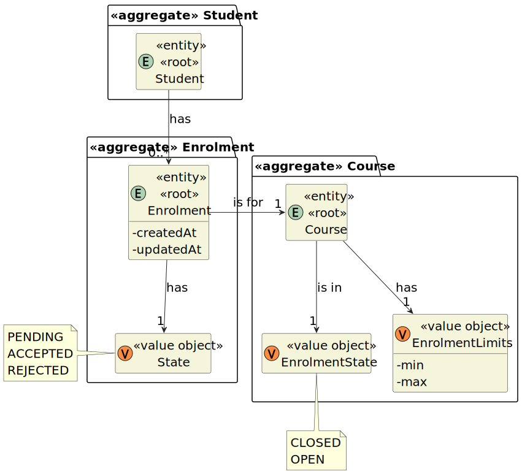

# User Story 1009 - Respond to Applications for Courses

> As Manager, I want to approve or reject students applications to courses.

|             |             |
| ----------- | ----------- |
| ID          | 15          |
| Sprint      | B           |
| Application | 2 - Courses |
| Priority    | 1           |

---

## 1. Context

This is the first time this task is assigned to be developed. This is a new functionality that allows managers to accept or reject student applications to courses.

## 2. Requirements

### "Create Board - A user creates a board"

## 2.1. Client Specifications

- "Courses may have a minimum and a maximum number of enrolled students."

## 2.2. Client Clarifications

> [**Question:** Can one student be enrolled in different courses?](https://moodle.isep.ipp.pt/mod/forum/discuss.php?d=21922)
>
> **Answer**: "Yes"
>
> [**Question:** In US1009, What are the criteria for a student to be enrolled in a course?](https://moodle.isep.ipp.pt/mod/forum/discuss.php?d=22498)
>
> **Answer**: "This is not a system requirement. You should only register the decision of the manager."
>
> [**Question** A course can open if the limits are exceeded or not? Who can setup the limits? Are the limits mandatory?](https://moodle.isep.ipp.pt/mod/forum/discuss.php?d=21913)
>
> **Answer**: "Managers should be able to specify the limits. In my opinion the system should notify the manager if a course is out of the enrolment limits (before this course is changed to "in progress"). But, in the end, it is up to the manager to follow/enforce or not, the limits."

## 2.3. Functional Requirements

> **FRB08** Approve/Reject Enlistment in Course - A manager approves or rejects a students’ application to a course.

## 2.4. Acceptance Criteria

- N/a

---

## 3. Analysis

### 3.1. Conditions

- The manager must be authenticated and authorized to perform the operation.
- The course must be open for enrolment.
- The user must have applied to the course.

### 3.2. System Sequence Diagram


### 3.3. Partial Domain Model

**Note:** The domain model was made in a way to avoid the synchronization problems, as several clients will try to concurrently update boards.



## 4. Design

### 4.1. Functionality Realization


### 4.2. Class Diagram


### 4.3. Applied Patterns

- **Builder:** The builder pattern is used to provide a flexible way to create a board. This is done by using the `BoardBuilder` class. This allows the creation of a board with different ways to set some of its attributes and also allows the creation of a board without setting non mandatory attributes. This will also be useful to develop the tests.
- **Dependency Injection:** This is used in the controller and in the service. This is done to enable the use of a mock repository in the tests and to reduce coupling.
- **Repository:** This is used to store the boards. This is done to allow the persistence of the boards and to allow the use of the boards in other parts of the application.
- **Service:** This is used to provide a list of System Users to the controller. This is done to reduce coupling and to allow the use of the service in other parts of the application.

### 4.4. Tests

_Note: This are some simplified versions of the tests for readability purposes._

**Test 1:** Ensure the course is in the correct state after the operation

```java
  @Test
  public void ensureCourseIsInCorrectStateAfterToggle() {
    final Course course = getDummyOpenCourse();

    assertTrue(course.enrolmentState().isClosed());
    course.toggleEnrolmentState();
    assertTrue(course.enrolmentState().isOpen());
  }
```

**Test 2:** Ensure that double toggle does not change the state (the state is reversible)

```java
  @Test
  public void ensureDoubleToggleDoesNotChangeState() {
    final Course course = getDummyOpenCourse();

    assertTrue(course.enrolmentState().isClosed());
    course.toggleEnrolmentState();
    course.toggleEnrolmentState();
    assertTrue(course.enrolmentState().isClosed());
  }
```

**Test 3:** Ensure that is not possible to open enrolments in a closed course

```java
  @Test
  public void ensureCannotOpenEnrolmentsInClosedCourse() {
    final Course course = getDummyClosedCourse();

    assertTrue(course.state().isClosed());
    assertTrue(course.enrolmentState().isClosed());
    assertThrows(IllegalStateException.class, () -> course.toggleEnrolmentState());
  }
```

**Test 4:** Ensure that is not possible to toggle enrolments in a course that is finished

```java
  @Test
  public void ensureCannotOpenEnrolmentsInFinishedCourse() {
    final Course course = getDummyFinishedCourse();

    assertTrue(course.state().isFinished());
    assertThrows(IllegalStateException.class, () -> course.toggleEnrolmentState());
  }
```

**Test 5:** Ensure that is possible to toggle enrolments in a course that is in progress

```java
  @Test
  public void ensureIsPossibleToToggleEnrolmentsInProgressCourse() {
    final Course course = getDummyInProgressCourse();

    assertTrue(course.state().isInProgress());
    assertTrue(course.enrolmentState().isClosed());
    course.toggleEnrolmentState();
    assertTrue(course.enrolmentState().isOpen());
  }
```

**Test 6:** Ensure that is possible to toggle enrolemtns in a course that is open

```java
  @Test
  public void ensureIsPossibleToToggleEnrolmentsInOpenCourse() {
    final Course course = getDummyOpenCourse();

    assertTrue(course.state().isOpen());
    assertTrue(course.enrolmentState().isClosed());
    course.toggleEnrolmentState();
    assertTrue(course.enrolmentState().isOpen());
  }
```

## 5. Implementation

### 5.1. Controller

- Relevant implementation details

```java
  public CourseDTO toggleEnrolmentState(CourseDTO courseDTO) {
    authz.ensureAuthenticatedUserHasAnyOf(ClientRoles.POWER_USER, ClientRoles.MANAGER);

    Course course = courseRepository.findByCode(courseDTO.getCode()).orElseThrow();

    course.toggleEnrolmentState();

    return courseRepository.save(course).toDto();
  }
```

## 6. Integration & Demonstration

### 6.1. Success scenario


### 6.2. Failure scenario


## 7. Observations

- The history of the states of a course is not relevant.
