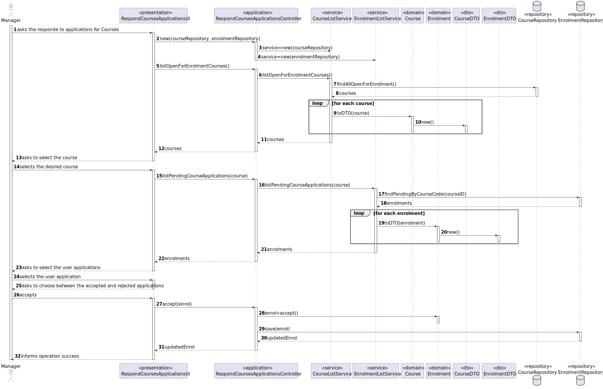
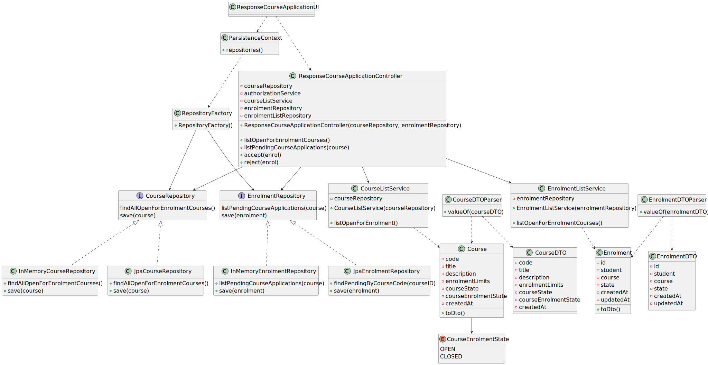

# User Story 1009 - Respond to Applications for Courses

> As Manager, I want to approve or reject students applications to courses.

|             |             |
| ----------- | ----------- |
| ID          | 15          |
| Sprint      | B           |
| Application | 2 - Courses |
| Priority    | 1           |

---

## 1. Context

This is the first time this task is assigned to be developed. This is a new functionality that allows managers to accept or reject student applications to courses.

## 2. Requirements

### "Approve/Reject Enlistment in Course - A manager approves or rejects a students’ application to a course."

## 2.1. Client Specifications

- "Courses may have a minimum and a maximum number of enrolled students."

## 2.2. Client Clarifications

> [**Question:** Can one student be enrolled in different courses?](https://moodle.isep.ipp.pt/mod/forum/discuss.php?d=21922)
>
> **Answer**: "Yes"
>
> [**Question:** In US1009, What are the criteria for a student to be enrolled in a course?](https://moodle.isep.ipp.pt/mod/forum/discuss.php?d=22498)
>
> **Answer**: "This is not a system requirement. You should only register the decision of the manager."
>
> [**Question** A course can open if the limits are exceeded or not? Who can setup the limits? Are the limits mandatory?](https://moodle.isep.ipp.pt/mod/forum/discuss.php?d=21913)
>
> **Answer**: "Managers should be able to specify the limits. In my opinion the system should notify the manager if a course is out of the enrolment limits (before this course is changed to "in progress"). But, in the end, it is up to the manager to follow/enforce or not, the limits."

## 2.3. Functional Requirements

> **FRB08** Approve/Reject Enlistment in Course - A manager approves or rejects a students’ application to a course.

## 2.4. Acceptance Criteria

- N/a

---

## 3. Analysis

### 3.1. Conditions

- The manager must be authenticated and authorized to perform the operation.
- The course must be open for enrolment.
- The user must have applied to the course.

### 3.2. System Sequence Diagram


### 3.3. Partial Domain Model


## 4. Design

### 4.1. Functionality Realization



### 4.2. Class Diagram



### 4.3. Applied Patterns

- **Dependency Injection:** This is used in the controller and in the services. This is done to enable the use of a mock repository in the tests and to reduce coupling.
- **Repository:** This is used to store the enrollments. This is done to allow the persistence of the enrollments and to allow the use of the enrollments in other parts of the application.
- **Service:** This is used to provide a list of courses and enrollments to the controller. This is done to reduce coupling and to allow the use of the services in other parts of the application.

### 4.4. Tests

**Test 1:** Ensure the enrolment state is accurate after accepting an application

```java
  @Test
  public void ensureCourseIsInCorrectStateAfterToggle() {
    final Enrolment enrolment = getDummyOpenCourse();

    assertTrue(enrolment.state().isPending());

    enrolment.accept();

    assertTrue(enrolment.state().isAccepted());
  }
```

**Test 1:** Ensure the enrolment state is accurate after accepting an application

```java
  @Test
  public void ensureCourseIsInCorrectStateAfterToggle() {
    final Enrolment enrolment = getDummyOpenCourse();

    assertTrue(enrolment.state().isPending());

    enrolment.reject();

    assertTrue(enrolment.state().isRejected());
  }
```

**Test 3:** Ensure that is not possible to accept/reject an application in a course enrolment state is closed

```java
  @Test
  public void ensureCannotAcceptOrRejectApplicationInClosedCourse() {
    final Enrolment enrolment = getDummyClosedCourse();

    assertTrue(enrolment.state().isClosed());
    assertThrows(IllegalStateException.class, () -> enrolment.accept());
    assertThrows(IllegalStateException.class, () -> enrolment.reject());
  }
```

## 5. Implementation

### 5.1. Controller

- Relevant implementation details

```java
public class RespondCourseApplicationController {

  private EnrolmentRepository enrolmentRepository;
  private final ListCourseService listCoursesService;
  private final ListEnrolmentService listEnrolmentService;
  private AuthorizationService authz;

  public RespondCourseApplicationController(final CourseRepository courseRepository,
      final EnrolmentRepository enrolmentRepository, AuthorizationService authz) {
    this.enrolmentRepository = enrolmentRepository;
    this.authz = authz;
    this.listCoursesService = new ListCourseService(courseRepository);
    this.listEnrolmentService = new ListEnrolmentService(enrolmentRepository);
  }

  public Iterable<CourseDTO> listOpenForEnrolmentCourses() {
    authz.ensureAuthenticatedUserHasAnyOf(ClientRoles.MANAGER, ClientRoles.POWER_USER);
    return listCoursesService.listOpenForEnrolment();
  }

  public Iterable<EnrolmentDTO> listPendingCourseApplications(final CourseDTO courseDTO) {
    authz.ensureAuthenticatedUserHasAnyOf(ClientRoles.MANAGER, ClientRoles.POWER_USER);
    return listEnrolmentService.listPendingCourseApplications(courseDTO.getCode());
  }

  public EnrolmentDTO accept(final EnrolmentDTO enrolmentDTO) {
    authz.ensureAuthenticatedUserHasAnyOf(ClientRoles.MANAGER, ClientRoles.POWER_USER);

    CourseCode code = enrolmentDTO.getCourseCode();
    MecanographicNumber number = enrolmentDTO.getStudentNumber();

    Enrolment enrolment = enrolmentRepository
        .findWithUserAndCourse(number, code).orElseThrow();

    enrolment.accept();

    return enrolmentRepository.save(enrolment).toDto();
  }

  public EnrolmentDTO reject(final EnrolmentDTO enrolmentDTO) {
    authz.ensureAuthenticatedUserHasAnyOf(ClientRoles.MANAGER, ClientRoles.POWER_USER);

    CourseCode code = enrolmentDTO.getCourseCode();
    MecanographicNumber number = enrolmentDTO.getStudentNumber();

    Enrolment enrolment = enrolmentRepository
        .findWithUserAndCourse(number, code).orElseThrow();

    enrolment.reject();

    return enrolmentRepository.save(enrolment).toDto();
  }

}
```

## 6. Integration & Demonstration

### 6.1. Success scenario


### 6.2. Failure scenario

There are no pending applications for the course.


## 7. Observations

- The history of the states of a course is not relevant.
