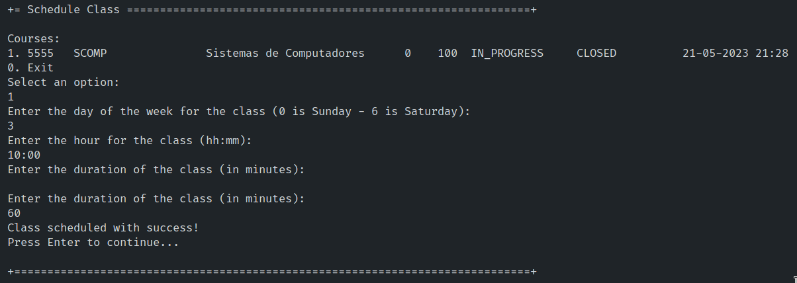

# User Story 1010 - Schedule a Class

|             |             |
| ----------- | ----------- |
| ID          | 16          |
| Sprint      | B           |
| Application | 2 - Courses |
| Priority    | 1           |

---

## 1. Context

This is the first time the task is assigned to be developed and is to be completed in this sprint. This user story is a feature.

## 2. Requirements

**US 1010** As Teacher, I want to schedule a class.

## 1.3. Functional Requirements

> **FRC09** Schedule of Class - A teacher schedule a class (always a recurring class, happens every week). System must check if the Teacher is available for the class period.

## 1.4. Acceptance Criteria

> N/A.

## 3. Analysis

### 3.1. Conditions

- The teacher must be authenticated and authorized to perform the operation;
- The teacher must be teacher of the selected course;
- The teacher must be available at the time of the class (no class or meeting overlap).

### 3.2. System Sequence Diagram


## 4. Design

### 4.1. Functionality Realization


### 4.2. Class Diagram


### 4.3. Applied Patterns

- **Dependency Injection:** This is used in the controller and in the services. This is done to enable the use of a mock repository in the tests and to reduce coupling.
- **Repository:** This is used to store the scheduled extraordinary classes. This is done to reduce coupling and to allow the use of the repository in other parts of the application.
- **Service:** This is used to provide a list of System Users and courses to the controller. This is done to reduce coupling and to allow the use of the service in other parts of the application.

### 4.4. Tests

_Note: This are some simplified versions of the tests for readability purposes._

**Test 1:** Ensure CourseClass has a valid day of week

```java
  @Test
  public void ensureClassHasTeacher() {
    assertThrows(IllegalArgumentException.class, () ->
    new CourseClass(
        null, Duration.valueOf(60), Hours.valueOf(Calendar.getInstance), course, teacher));
  }
```

**Test 2:** Ensure CourseClass has a valid Duration

```java
  @Test
  public void ensureClassHasDuration() {
    assertThrows(IllegalArgumentException.class, () -> new CourseClass(
        DayInWeek.valueOf(3), null, Hours.valueOf(Calendar.getInstance), course, teacher));
  }
```

**Test 3:** Ensure CourseClass has a valid Teacher

```java
  @Test
  public void ensureClassHasTeacher() {
    assertThrows(IllegalArgumentException.class, () ->
    new CourseClass(
        DayInWeek.valueOf(3), Duration.valueOf(60), null, course, teacher));
  }
```

**Test 4:** Ensure CourseClass has a valid Course

```java
  @Test
  public void ensureClassHasTeacher() {
    assertThrows(IllegalArgumentException.class, () ->
    new CourseClass(
        DayInWeek.valueOf(3), Duration.valueOf(60), Hours.valueOf(Calendar.getInstance), null, teacher));
  }
```

**Test 5:** Ensure CourseClass has a valid Teacher

```java
  @Test
  public void ensureClassHasTeacher() {
    assertThrows(IllegalArgumentException.class, () ->
    new CourseClass(
        DayInWeek.valueOf(3), Duration.valueOf(60), Hours.valueOf(Calendar.getInstance), course, null));
  }
```

## 5. Implementation

```java
public class ScheduleClassController {
  private ListCourseService listCourseService;

  private Teacher teacher;

  private CourseClassRepository classRepository;
  private CourseRepository courseRepository;
  private TeacherRepository teacherRepository;

  public ScheduleClassController(CourseClassRepository classRepository,
      CourseRepository courseRepository, TeacherRepository teacherRepository) {
    this.listCourseService = new ListCourseService(courseRepository);

    this.classRepository = classRepository;
    this.courseRepository = courseRepository;
    this.teacherRepository = teacherRepository;
  }

  public void setCurrentAuthenticatedTeacher() {
    AuthorizationService authz = AuthzRegistry.authorizationService();

    authz.ensureAuthenticatedUserHasAnyOf(ClientRoles.TEACHER);
    SystemUser authenticatedUser = authz.loggedinUserWithPermissions(ClientRoles.TEACHER).orElseThrow();

    teacher = teacherRepository.findByUsername(authenticatedUser.username()).orElseThrow();
  }

  public Iterable<CourseDTO> listAllInProgressLecturedBy() {
    setCurrentAuthenticatedTeacher();

    return listCourseService.listInProgressCoursesThatTeacherLectures(teacher);
  }

  public CourseClass createClass(CourseCode code, int duration, DayInWeek day, Hours hours) {
    Course course = courseRepository.ofIdentity(code).orElseThrow();

    Duration durationObj = Duration.valueOf(duration);

    return classRepository.save(new CourseClass(day, durationObj, hours, course, teacher));
  }
}
```

## 6. Integration/Demonstration



## 7. Observations

N/A.
