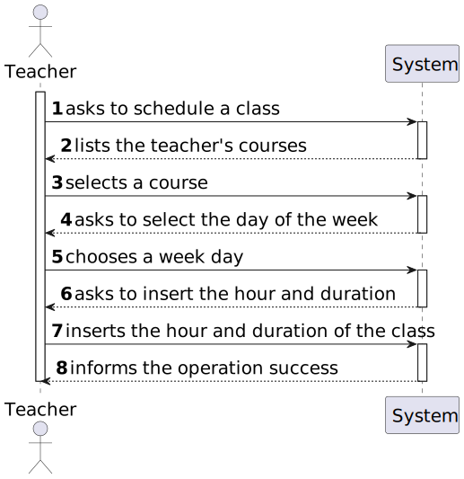
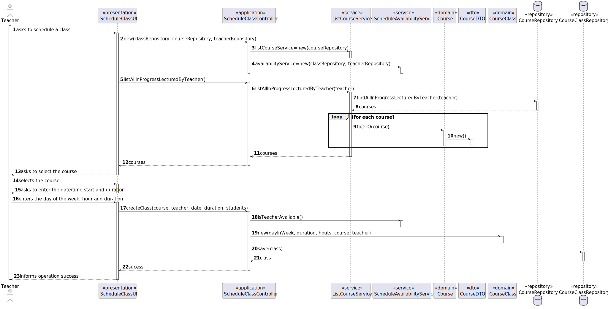
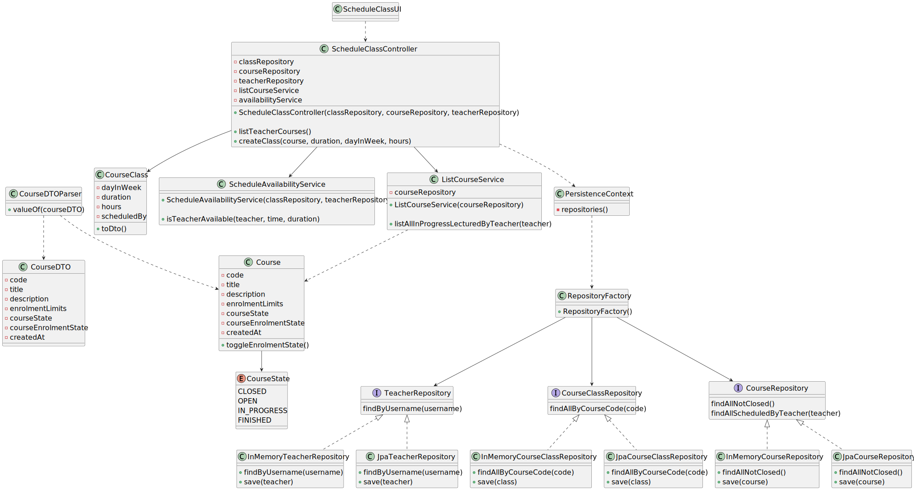

# User Story 1010 - Schedule a Class

|             |             |
| ----------- | ----------- |
| ID          | 16          |
| Sprint      | B           |
| Application | 2 - Courses |
| Priority    | 1           |

---

## 1. Context

This is the first time the task is assigned to be developed and is to be completed in this sprint. This user story is a feature.

## 2. Requirements

**US 1010** As Teacher, I want to schedule a class.

## 1.3. Functional Requirements

> **FRC09** Schedule of Class - A teacher schedule a class (always a recurring class, happens every week). System must check if the Teacher is available for the class period.

## 1.4. Acceptance Criteria

> N/A.

## 3. Analysis

### 3.1. Conditions

- The teacher must be authenticated and authorized to perform the operation;
- The teacher must be teacher of the selected course;
- The teacher must be available at the time of the class (no class or meeting overlap).

### 3.2. System Sequence Diagram



## 4. Design

### 4.1. Functionality Realization



### 4.2. Class Diagram



### 4.3. Applied Patterns

- **Dependency Injection:** This is used in the controller and in the services. This is done to enable the use of a mock repository in the tests and to reduce coupling.
- **Repository:** This is used to store the scheduled extraordinary classes. This is done to reduce coupling and to allow the use of the repository in other parts of the application.
- **Service:** This is used to provide a list of System Users and courses to the controller. This is done to reduce coupling and to allow the use of the service in other parts of the application.

### 4.4. Tests

_Note: This are some simplified versions of the tests for readability purposes._

**Test 1:** Ensure CourseClass has a valid Teacher

```java
  @Test
  public void ensureClassHasTeacher() {
    assertThrows(IllegalArgumentException.class, () ->
    new CourseClass(
        DayInWeek.valueOf(3), Duration.valueOf(60), Hours.valueOf(Calendar.getInstance), course, null));
  }
```

**Test 2:** Ensure CourseClass has a valid Duration

```java
  @Test
  public void ensureClassHasDuration() {
    assertThrows(IllegalArgumentException.class, () -> new CourseClass(
        DayInWeek.valueOf(3), null, Hours.valueOf(Calendar.getInstance), course, teacher));
  }
```

## 5. Implementation

_In this section the team should present, if necessary, some evidencies that the implementation is according to the design. It should also describe and explain other important artifacts necessary to fully understand the implementation like, for instance, configuration files._

_It is also a best practice to include a listing (with a brief summary) of the major commits regarding this requirement._

## 6. Integration/Demonstration

```java
public class ScheduleClassController {
  private ListCourseService listCourseService;

  private Teacher teacher;

  private CourseClassRepository classRepository;
  private CourseRepository courseRepository;
  private TeacherRepository teacherRepository;

  public ScheduleClassController(CourseClassRepository classRepository,
      CourseRepository courseRepository, TeacherRepository teacherRepository) {
    this.listCourseService = new ListCourseService(courseRepository);

    this.classRepository = classRepository;
    this.courseRepository = courseRepository;
    this.teacherRepository = teacherRepository;
  }

  public void setCurrentAuthenticatedTeacher() {
    AuthorizationService authz = AuthzRegistry.authorizationService();

    authz.ensureAuthenticatedUserHasAnyOf(ClientRoles.TEACHER);
    SystemUser authenticatedUser = authz.loggedinUserWithPermissions(ClientRoles.TEACHER).orElseThrow();

    teacher = teacherRepository.findByUsername(authenticatedUser.username()).orElseThrow();
  }

  public Iterable<CourseDTO> listAllInProgressLecturedBy() {
    setCurrentAuthenticatedTeacher();

    return listCourseService.listInProgressCoursesThatTeacherLectures(teacher);
  }

  public CourseClass createClass(CourseCode code, int duration, DayInWeek day, Hours hours) {
    Course course = courseRepository.ofIdentity(code).orElseThrow();

    Duration durationObj = Duration.valueOf(duration);

    return classRepository.save(new CourseClass(day, durationObj, hours, course, teacher));
  }
}
```

## 7. Observations

_This section should be used to include any content that does not fit any of the previous sections._

_The team should present here, for instance, a critical prespective on the developed work including the analysis of alternative solutioons or related works_

_The team should include in this section statements/references regarding third party works that were used in the development this work._
