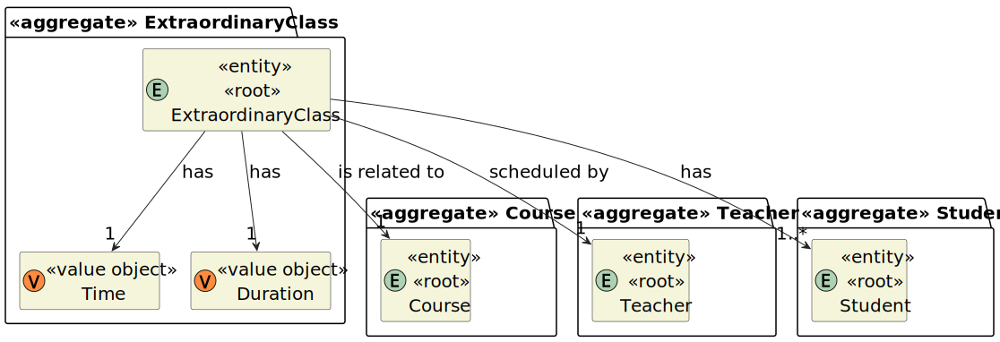

# User Story 1011 - Schedule an Extra Class

> As Teacher, I want to schedule an extraordinary class.

|             |             |
| ----------- | ----------- |
| ID          | 17          |
| Sprint      | B           |
| Application | 2 - Courses |
| Priority    | 5           |

---

## 1. Context

This is the first time this task is assigned to be developed. This is a new functionality that allows teachers to schedule an extra class.

## 2. Requirements

### "Schedule an Extra Class - A teacher schedule an extraordinary class."

## 2.1. Client Specifications

- "An extra class is a one occurrence only and it has a specific group of participants (a subset of the class students)"

- " The system should also warn if one of the participants in the class (either a teacher or a student) has other classes at the same time." - This was interpreted as class not extraordinary class.

## 2.2. Client Clarifications

- N/a

## 2.3. Functional Requirements

> **FRC10** Schedule of Extra Class - A teacher schedule an extraordinary class. An extra class is a one occurrence only and it has a specific group of participants (a subset of the class students)

## 2.4. Acceptance Criteria

- N/a

---

## 3. Analysis

### 3.1. Conditions

- The teacher must be authenticated and authorized to perform the operation.
- The teacher must be teacher of the course.
- The invited users must be part of the course.
- The invited users must and teacher must be available at the time of the class (no class, extraordinary class or meeting overlap).

### 3.2. System Sequence Diagram


### 3.3. Partial Domain Model



## 4. Design

### 4.1. Functionality Realization


### 4.2. Class Diagram


### 4.3. Applied Patterns

- **Dependency Injection:** This is used in the controller and in the services. This is done to enable the use of a mock repository in the tests and to reduce coupling.
- **Repository:** This is used to store the scheduled extraordinary classes. This is done to reduce coupling and to allow the use of the repository in other parts of the application.
- **Service:** This is used to provide a list of System Users and courses to the controller. This is done to reduce coupling and to allow the use of the service in other parts of the application.

### 4.4. Tests

_Note: This are some simplified versions of the tests for readability purposes._

**Test 1:** Ensure Extraordinary Class has a valid Duration

```java
  @Test
  public void ensureExtraordinaryClassHasDuration() {
    assertThrows(IllegalArgumentException.class, () -> new ExtraordinaryClass(
        null, Time.valueOf(Calendar.getInstance()), teacher, students, course));
  }
```

**Test 2:** Ensure Extraordinary Class has a valid Time

```java
  @Test
  public void ensureExtraordinaryClassHasTime() {
    assertThrows(IllegalArgumentException.class, () -> new ExtraordinaryClass(
        Duration.ofHours(1), null, teacher, students, course));
  }
```

**Test 3:** Ensure Extraordinary Class has a valid Teacher

```java
  @Test
  public void ensureExtraordinaryClassHasTeacher() {
    assertThrows(IllegalArgumentException.class, () -> new ExtraordinaryClass(
        Duration.valueOf(30), Time.valueOf(Calendar.getInstance()), null, students, course));
  }
```

**Test 4:** Ensure Extraordinary Class has a valid students

```java
  @Test
  public void ensureExtraordinaryClassHasTeacher() {
    assertThrows(IllegalArgumentException.class, () -> new ExtraordinaryClass(
        Duration.valueOf(30), Time.valueOf(Calendar.getInstance()), teacher, null, course));
  }
```

**Test 5:** Ensure Extraordinary Class has a valid course

```java
  @Test
  public void ensureExtraordinaryClassHasTeacher() {
    assertThrows(IllegalArgumentException.class, () -> new ExtraordinaryClass(
        Duration.valueOf(30), Time.valueOf(Calendar.getInstance()), teacher, students, null));
  }
```

## 5. Implementation

### 5.1. Controller

- Relevant implementation details

```java
  public class ScheduleClassController {
  private ListCourseService listCourseService;

  private Teacher teacher;

  private CourseClassRepository classRepository;
  private CourseRepository courseRepository;
  private TeacherRepository teacherRepository;

  public ScheduleClassController(CourseClassRepository classRepository,
      CourseRepository courseRepository, TeacherRepository teacherRepository) {
    this.listCourseService = new ListCourseService(courseRepository);

    this.classRepository = classRepository;
    this.courseRepository = courseRepository;
    this.teacherRepository = teacherRepository;
  }

  public void setCurrentAuthenticatedTeacher() {
    AuthorizationService authz = AuthzRegistry.authorizationService();

    authz.ensureAuthenticatedUserHasAnyOf(ClientRoles.TEACHER);
    SystemUser authenticatedUser = authz.loggedinUserWithPermissions(ClientRoles.TEACHER).orElseThrow();

    teacher = teacherRepository.findByUsername(authenticatedUser.username()).orElseThrow();
  }

  public Iterable<CourseDTO> listAllInProgressLecturedBy() {
    setCurrentAuthenticatedTeacher();

    return listCourseService.listInProgressCoursesThatTeacherLectures(teacher);
  }

  public CourseClass createClass(CourseCode code, int duration, DayInWeek day, Hours hours) {
    Course course = courseRepository.ofIdentity(code).orElseThrow();

    Duration durationObj = Duration.valueOf(duration);

    return classRepository.save(new CourseClass(day, durationObj, hours, course, teacher));
  }
}
```

## 6. Integration & Demonstration

### 6.1. Success scenario


### 6.2. Failure scenario

There are no courses in progress lectured by the teacher.


## 7. Observations

- The teacher can schedule an extraordinary class even if he is not available at the time of the class.
