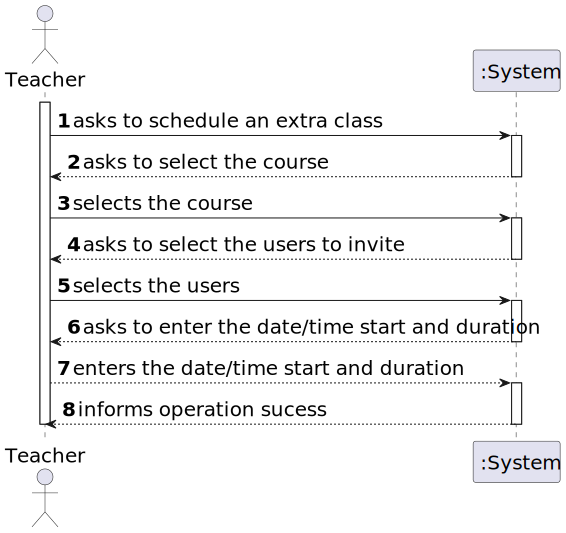
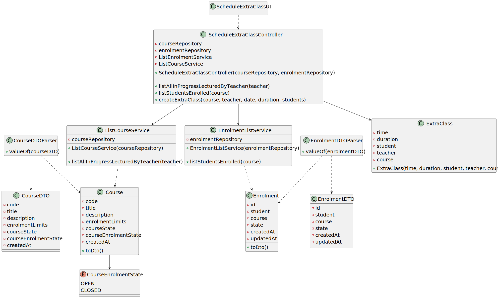

# User Story 1011 - Schedule an Extra Class

> As Teacher, I want to schedule an extraordinary class.

|             |             |
| ----------- | ----------- |
| ID          | 17          |
| Sprint      | B           |
| Application | 2 - Courses |
| Priority    | 5           |

---

## 1. Context

This is the first time this task is assigned to be developed. This is a new functionality that allows teachers to schedule an extra class.

## 2. Requirements

### "Create Board - A user creates a board"

## 2.1. Client Specifications

- "An extra class is a one occurrence only and it has a specific group of participants (a subset of the class students)"

- " The system should also warn if one of the participants in the class (either a teacher or a student) has other classes at the same time.

## 2.2. Client Clarifications

- N/a

## 2.3. Functional Requirements

> **FRC10** Schedule of Extra Class A - teacher schedule an extraordinary class. An extra class is a one occurrence only and it has a specific group of participants (a subset of the class students)

## 2.4. Acceptance Criteria

- N/a

---

## 3. Analysis

### 3.1. Conditions

- The teacher must be authenticated and authorized to perform the operation.
- The teacher must be teacher of the course.
- The invited users must be part of the course.
- The invited users must and teacher must be available at the time of the class (no class, extraordinary class or meeting overlap).

### 3.2. System Sequence Diagram



### 3.3. Partial Domain Model


## 4. Design

### 4.1. Functionality Realization


### 4.2. Class Diagram



### 4.3. Applied Patterns

- **Builder:** The builder pattern is used to provide a flexible way to create a board. This is done by using the `BoardBuilder` class. This allows the creation of a board with different ways to set some of its attributes and also allows the creation of a board without setting non mandatory attributes. This will also be useful to develop the tests.
- **Dependency Injection:** This is used in the controller and in the service. This is done to enable the use of a mock repository in the tests and to reduce coupling.
- **Repository:** This is used to store the boards. This is done to allow the persistence of the boards and to allow the use of the boards in other parts of the application.
- **Service:** This is used to provide a list of System Users to the controller. This is done to reduce coupling and to allow the use of the service in other parts of the application.

### 4.4. Tests

_Note: This are some simplified versions of the tests for readability purposes._

**Test 1:** Ensure the enrolment state is accurate after accepting an application

```java
  @Test
  public void ensureCourseIsInCorrectStateAfterToggle() {
    final Enrolment enrolment = getDummyOpenCourse();

    assertTrue(enrolment.state().isPending());

    enrolment.accept();

    assertTrue(enrolment.state().isAccepted());
  }
```

**Test 1:** Ensure the enrolment state is accurate after accepting an application

```java
  @Test
  public void ensureCourseIsInCorrectStateAfterToggle() {
    final Enrolment enrolment = getDummyOpenCourse();

    assertTrue(enrolment.state().isPending());

    enrolment.reject();

    assertTrue(enrolment.state().isRejected());
  }
```

**Test 3:** Ensure that is not possible to accept/reject an application in a course enrolment state is closed

```java
  @Test
  public void ensureCannotAcceptOrRejectApplicationInClosedCourse() {
    final Enrolment enrolment = getDummyClosedCourse();

    assertTrue(enrolment.state().isClosed());
    assertThrows(IllegalStateException.class, () -> enrolment.accept());
    assertThrows(IllegalStateException.class, () -> enrolment.reject());
  }
```

## 5. Implementation

### 5.1. Controller

- Relevant implementation details

```java
  public CourseDTO toggleEnrolmentState(CourseDTO courseDTO) {
    authz.ensureAuthenticatedUserHasAnyOf(ClientRoles.POWER_USER, ClientRoles.MANAGER);

    Course course = courseRepository.findByCode(courseDTO.getCode()).orElseThrow();

    course.toggleEnrolmentState();

    return courseRepository.save(course).toDto();
  }
```

## 6. Integration & Demonstration

### 6.1. Success scenario


### 6.2. Failure scenario


## 7. Observations

- The history of the states of a course is not relevant.
