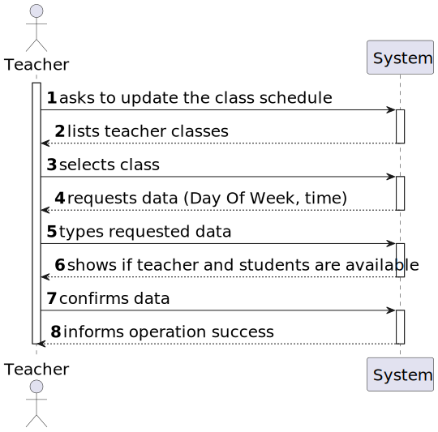
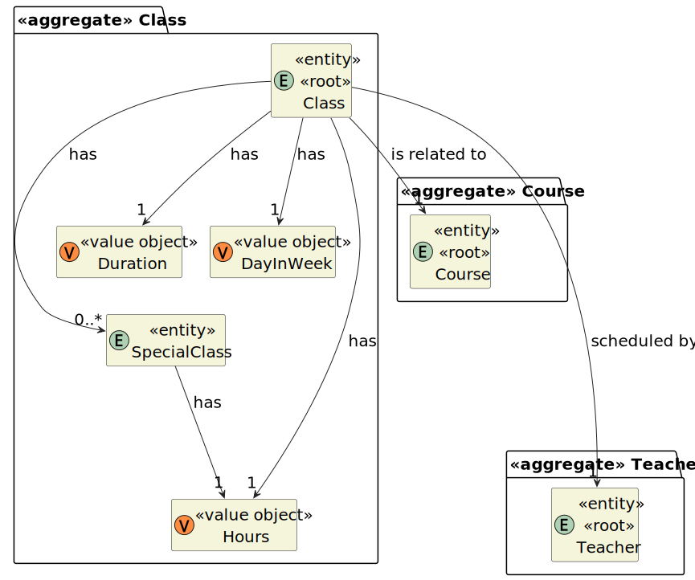

# User Story 1012 - Update Class Schedule

|             |             |
| ----------- | ----------- |
| ID          | 18          |
| Sprint      | B           |
| Application | 2 - Courses |
| Priority    | 5           |

## 1. Context

- This is the first time this task is assigned to be developed. This is a new functionality that is needed let the teachers update one instance of the class of a specific course.

## 2. Requirements

### " As Teacher, I want to update the schedule of a class."

## 2.1. Client Specifications

## 2.2. Client Clarifications

> [**Question**: Can a meeting and class overlap?](https://moodle.isep.ipp.pt/mod/forum/discuss.php?d=21994)
>
> **Answer**: "Regarding classes:
> FRC09 - Schedule of Class A teacher schedule a class (always a recurring class, happens every week). System must check if the Teacher is available for the class period.

## 2.3. Functional Requirements

- **FRC09** Schedule of Class A teacher schedule a class (always a recurring class, happens every week). System must check if the Teacher is available for the class period

- **FRC11** Update Schedule of Class - A teacher changes the time of a specific class (only changes a specific occurrence of a recurring class).

## 2.4. Acceptance Criteria

- Users must be able to attend the class in the new time.
- Teacher must be able to give the class in the new time.

## 3. Analysis

### 3.1. Conditions

### 3.2. System Sequence Diagram



### 3.3. Partial Domain Model



## 4. Design

### 4.1. Functionality Realization


### 4.2. Class Diagram


### 4.3. Applied Patterns

### 4.4. Tests

_Note: This are some simplified versions of the tests for readability purposes._

**Test 1:** Ensure its possible to create class

```java
  @Test
  public void ensureItsPossibleToCreateClass() {
    new CourseClass(DayInWeek.valueOf(WeekDay.MONDAY), Duration.valueOf(50),
        Hours.valueOf(Calendar.getInstance()), getDummyCourse(), getDummyTeacher());
  }
```

**Test 2:** Ensure that the class is updated

```java
  @Test
  public void ensureClassIsUpdated() {
    CourseClass courseClass = createCourseClass();
    Time time = createTime();

    CourseClass updatedClass = updateScheduleClass(time, courseClass);

    assertEquals(time, updatedClass.getSchedule().get(0));
  }
```

**Test 3:** Ensure that the class is not updated if users are not available

```java
  @Test
  public void ensureClassIsNotUpdatedIfUsersNotAvailable() {
    CourseClass courseClass = createCourseClass();
    Time time = createTime();

    when(authzRegistry.isAuthenticatedUserAuthorizedTo(any())).thenReturn(false);

    assertThrows(
        AuthorizationException.class,
        () -> updateScheduleClass(time, courseClass));
  }
```

## 5. Implementation

### 5.1. Controller

- Relevant implementation details

```java
  public CourseClass updateScheduleClass(Time time, ClassDTO courseClass) {
    authzRegistry.ensureAuthenticatedUserHasAnyOf(ClientRoles.TEACHER);

    Preconditions.noneNull(time, courseClass);

    CourseClass newClass = classRepository.ofIdentity(courseClass.getId()).orElseThrow();
    newClass.addSpecialClass(time);
    return saveClass(newClass);
  }
```

## 6. Integration & Demonstration

### 6.1. Success scenario


## 7. Observations

- N/a
