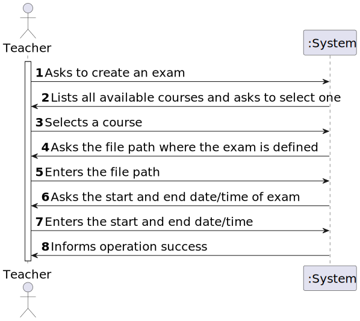

# User Story 2001 - Create/Update Exam

|             |           |
| ----------- | --------- |
| ID          | 19        |
| Sprint      | B         |
| Application | 3 - Exams |
| Priority    | 1         |

---

## 1. Context

This is the first time this task is assigned to be developed. This is a new functionality that is needed to create new exams, using a specific language.

---

## 2. Requirements

#### "As Teacher, I want to create/update an exam."

### 2.1. Client Specifications

- **Teachers** can create exams.

- An exam is related to a specific **course**.

- It has a unique **title** and a small **description**.

- Exams have also a **open** and a **close date**. The open date is the time when students can start to take the exam. The close date is the deadline for students to submit the exam.

- The system must provide a **language** to support the specification and "execution" of exams. The language must support the **design** of the exam layout and its questions as well as **solutions**, **feedback** and **grading**.

### 2.2. Client Clarifications

#### [Question 1](https://moodle.isep.ipp.pt/mod/forum/discuss.php?d=21836)

> As for the exam, is the title written in the exam the same as its unique title to identify?

"The title should be unique. Maybe it could be used to identify the exam."

#### [Question 2](https://moodle.isep.ipp.pt/mod/forum/discuss.php?d=22003)

> "In regards to the exam, what do you mean by feedback and grading? Is it necessary to save the answers of the users showing and comparing them with the correct answer? Furthermore is it necessary to save the answer of the question?"

"The idea is to have feedback and grading similarly to what is available for tests in the moodle platform. How you may achieve this is not up to me to decide."

#### [Question 3](https://moodle.isep.ipp.pt/mod/forum/discuss.php?d=22228)

> Should students sign up for exams?

"No. Exams should be available to all students of the course."

#### [Question 4](https://moodle.isep.ipp.pt/mod/forum/discuss.php?d=22286)

> After an exame being created, can it be edited?

"No. FRE01 could be very complex, with many steps prone to user errors. As a final step, you should consider a "publish" operation that marks the end of the creation process."

### 2.3. Functional Requirements

- **FRE01** Create Exam - A Teacher creates a new exam. This includes the specification of the exam (i.e., its structure, in accordance with a grammar for exams that is used to validate the specification of the exam).

### 2.4. Non-Functional Requirements

- **NFR09** Exam Language - The support for exams (its design, feedback and grading) must follow specific technical requirements, specified in LPROG. The ANTLR tool should be used (<https://www.antlr.org/>).

### 2.5. Acceptance Criteria

- This includes the specification of the exam (i.e., its structure, in accordance with a grammar for exams that is used to validate the specification of the exam).
- The support for exams (its design, feedback and grading) must follow specific technical requirements, specified in LPROG.
- The ANTLR tool should be used (<https://www.antlr.org/>).

---

## 3. Analysis

### 3.1. Input and Output Data

#### Input

- Course (Selected from a list of courses)
- Exam Structure (Text file)

#### Output

- Success or error messages (from parser)

### 3.2. System Sequence Diagram



### 3.3. Partial Domain Model


---

## 4. Design

### 4.1. Functionality Realization


### 4.2. Class Diagram


### 4.3. Applied Patterns

- xxx

### 4.4. Tests

**Test 1:** xxx

```java
  @Test
  private void test1() {
    assetTrue(true);
  }
```

---

## 5. Implementation

### 5.1. Controller

- Relevant implementation details

```java
  private void sample() {
    return true;
  }
```

---

## 6. Integration & Demonstration


---

## 7. Observations

- N/A
