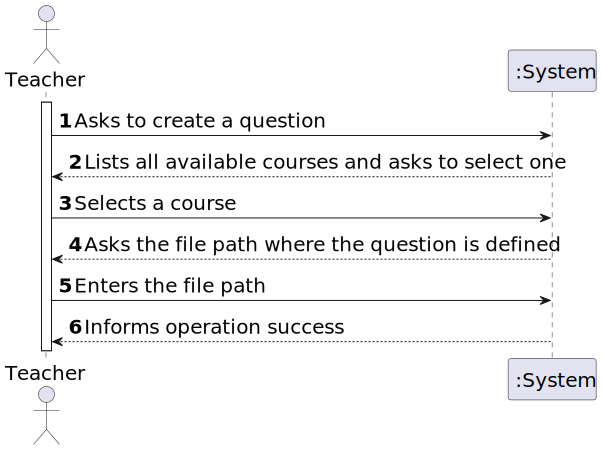
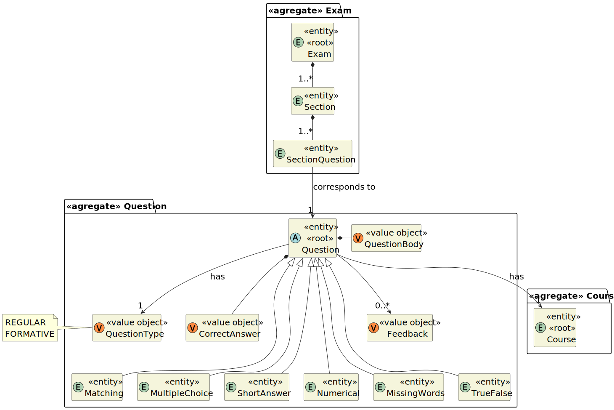
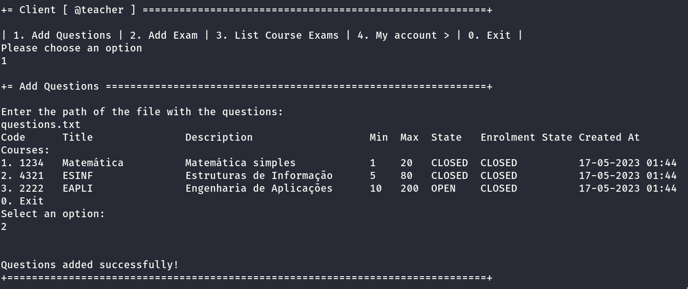

# User Story 2007 - Add/Update Exam Questions

|             |           |
| ----------- | --------- |
| ID          | 20        |
| Sprint      | B         |
| Application | 3 - Exams |
| Priority    | 5         |

---

## 1. Context

This is the first time this task is assigned to be developed. This is a new functionality that is needed to create new questions, using a specific language.

---

## 2. Requirements

### As Teacher I want to add/update exam questions to a repository of exam questions to be used in automatic formative exams

### 2.1. Client Specifications

- **Question Types**
  - _Matching_ - A list of sub-questions is provided, along with a list of answers. The respondent must "match" the correct answers with each question.
  - _Multiple Choice_ - With the Multiple Choice question type you can create single-answer
    and multiple-answer questions and weight individual answers.
  - _Short Answer_ - In response to a question, the respondent types a word or phrase. There
    may be several possible correct answers, with different grades. Answers may or may not
    be sensitive to case
  - _Numerical_ - From the student perspective, a numerical question looks just like a short-answer question. The difference is that numerical answers are allowed to have an accepted error. This allows a continuous range of answers to be set.
  - _Select Missing Words_ - Students select a missing word or phrase from a dropdown
    menu. Items may be grouped and used more than once.
  - _True/False_ - In response to a question, the respondent selects from two options: True
    or False

### 2.2. Client Clarifications

> [**Question:** All questions should accept a feedback?](https://moodle.isep.ipp.pt/mod/forum/discuss.php?d=22188)
>
> **Answer**: "Yes"

### 2.3. Functional Requirements

- **FRE01** Create Exam - A Teacher creates a new exam. This includes the specification of the exam (i.e., its structure, in accordance with a grammar for exams that is used to validate the specification of the exam).

### 2.4. Non-Functional Requirements

## Acceptance Criteria

- **NFR09** Exam Language - The support for exams (its design, feedback and grading) must follow specific technical requirements, specified in LPROG. The ANTLR tool should be used (<https://www.antlr.org/>).

### 2.5. Acceptance Criteria

- This includes only the specification of single questions to be used only in automatic formative exams, not on regular exams.
- The support for exams (its design, feedback and grading) must follow specific technical requirements, specified in LPROG.
- The ANTLR tool should be used (<https://www.antlr.org/>).

---

## 3. Analysis

### 3.1. Conditions

- The manager must be authenticated and authorized to perform the operation.
- The course must be in a state that allows the operation to be performed. (e.g. a course cannot open enrolments if it is closed)

### 3.2. System Sequence Diagram



### 3.3. Partial Domain Model



## 4. Design

### 4.1. Grammar

#### 4.1.1. Tokens

#### 4.1.2. Example

## 5. Implementation

### 5.1. Controller

- Relevant implementation details

```java
  public void sample() {
    return true;
  }
```

## 6. Integration & Demonstration



## 7. Observations

N/a
