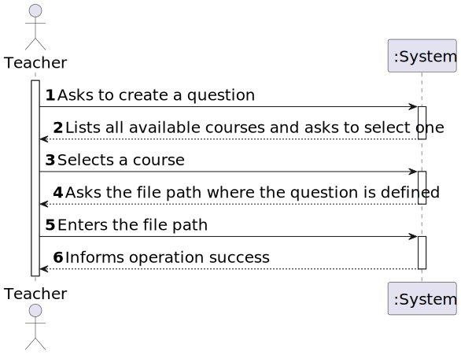

# User Story 2007 - Add/Update Exam Questions

|             |           |
| ----------- | --------- |
| ID          | 20        |
| Sprint      | B         |
| Application | 3 - Exams |
| Priority    | 5         |

---

## 1. Context

This is the first time this task is assigned to be developed. This is a new functionality that is needed to create new questions, using a specific language.

---

## 2. Requirements

### As Teacher I want to add/update exam questions to a repository of exam questions to be used in automatic formative exams

### 2.1. Client Specifications

- **Question Types**
  - _Matching_ - A list of sub-questions is provided, along with a list of answers. The respondent must "match" the correct answers with each question.
  - _Multiple Choice_ - With the Multiple Choice question type you can create single-answer
    and multiple-answer questions and weight individual answers.
  - _Short Answer_ - In response to a question, the respondent types a word or phrase. There
    may be several possible correct answers, with different grades. Answers may or may not
    be sensitive to case
  - _Numerical_ - From the student perspective, a numerical question looks just like a short-answer question. The difference is that numerical answers are allowed to have an accepted error. This allows a continuous range of answers to be set.
  - _Select Missing Words_ - Students select a missing word or phrase from a dropdown
    menu. Items may be grouped and used more than once.
  - _True/False_ - In response to a question, the respondent selects from two options: True
    or False

### 2.2. Client Clarifications

> [**Question:** All questions should accept a feedback?](https://moodle.isep.ipp.pt/mod/forum/discuss.php?d=22188)
>
> **Answer**: "Yes"

### 2.3. Functional Requirements

- **FRE01** Create Exam - A Teacher creates a new exam. This includes the specification of the exam (i.e., its structure, in accordance with a grammar for exams that is used to validate the specification of the exam).

### 2.4. Non-Functional Requirements

## Acceptance Criteria

- **NFR09** Exam Language - The support for exams (its design, feedback and grading) must follow specific technical requirements, specified in LPROG. The ANTLR tool should be used (<https://www.antlr.org/>).

### 2.5. Acceptance Criteria

- This includes only the specification of single questions to be used only in automatic formative exams, not on regular exams.
- The support for exams (its design, feedback and grading) must follow specific technical requirements, specified in LPROG.
- The ANTLR tool should be used (<https://www.antlr.org/>).

---

## 3. Analysis

### 3.1. Conditions

- The manager must be authenticated and authorized to perform the operation.
- The course must be in a state that allows the operation to be performed. (e.g. a course cannot open enrolments if it is closed)

### 3.2. System Sequence Diagram



### 3.3. Partial Domain Model


---

## 4. Design

### 4.1. Grammar

We defined some custom tokens to keep the input files simple and readable.

All the files defining questions to be used in exams must follow the following structure:

```txt
@start-question
  @type numerical|multiple-choice|short-answer|true-false|matching|select-missing-words;
  @question-body <question-body>
  @correct-answer <correct-answer>;
@end-question;
```

This is the base structure. As there are many question types and each one has its own structure, we will define the structure of each one of them.

To make the understanding easier we will use the following notation:

- [] - optional
- <> - replace with the value (required)
- | - or
- {} - repeatable.

#### 4.1.1. Numerical

```txt
@start-question
  @type numerical;
  @question-body <body>;
  @correct-answer <correct-answer>;
  @accepted-error <accepted-error>;
@end-question;
```

**Note**: The score must be a real number with a maximum of 2 decimal places between 0 and 1.

#### 4.1.2. Short Answer

```txt
@start-question;
  @type short-answer;
  @question-body "<question-body>";

  @start-correct-answers
    {@correct-answer "<answer>" <score>;}
  @end-correct-answers;
@end-question;
```

#### 4.1.3. True/False

```txt
@start-question
  @type true-false;
  @question-body "<question-body>";
  @correct-answer true|false;
@end-question;
```

**Note**: The score must be a real number with a maximum of 2 decimal places between 0 and 1.
**Note 2**: The sum of the scores specified in the `@correct-answers` section must be 1.

#### 4.1.4. Multiple Choice (Multiple Answers)

```txt
@start-question
  @type multiple-choice;
  @question-body "<question-body>";
  [@feedback <feedback>;]

  @start-correct-answers
    {@correct-answer <id> <score>;}
  @end-correct-answers;

  @start-options
    {@option <id> "<answer>" ["feedback"];}
  @end-options;
@end-question;
```

#### 4.1.5. Multiple Choice (Single Answer)

```txt
@start-question
  @type multiple-choice;
  @question-body "<question-body>";
  [@feedback <feedback>;]
  @correct-answer <id>;

  @start-options
    {@option <id> ["feedback"];}
  @end-options;
@end-question;
```

#### 4.1.6. Matching

**Note:** We considered that there can be missing matches both in the options and in the matches.

```txt
@start-question
  @type matching;
  @question-body "<question-body>";
  [@feedback "<feedback>";]

  @start-correct-answers
    {@correct-answer <id> <id-match>;}
  @end-correct-answers;

  @start-options
    {@option <id> "<string>";}
  @end-options;

  @start-matching
    {@match <id-match> "<string>";}
  @end-matching;
@end-question;
```

##### 4.1.7 Select Missing Words

In this case the question body must have the placeholder for the missing words using '\_\_' (double underscore).
_E.g. "A \_\_ é um lugar onde se pode comer \_\_."_

In the correct answer section the words must be in the same order as they appear in the question body and must be placed inside double quotes separated by a space.
_E.g. "restaurante" "bem";_

**Note:** The number of correct answers must be equal to the number of placeholders.

```txt
@start-question
  @type missing-words
  @question-body "<question-body>";
  @correct-answer {"<word>" };

  @start-options
    {@option <value>;}
  @end-options;
@end-question;
```

#### 4.2. Example

You can check a pratical example with all the question types [here](../../../ecourse.core/src/main/java/eapli/ecourse/exammanagement/domain/grammars/Question/Question.txt).

---

## 5. Implementation

### 5.1. Controller

- Relevant implementation details

```java
  public void addQuestionsFromFile(String filename, CourseDTO courseDTO) throws IOException, ParseException {
    authz.ensureAuthenticatedUserHasAnyOf(ClientRoles.POWER_USER, ClientRoles.TEACHER);

    if (!fileExists(filename))
      throw new IllegalArgumentException("Invalid file path!");

    Course course = courseRepository.ofIdentity(courseDTO.getCode()).orElseThrow();
    List<Question> questions = QuestionsParser.parseWithVisitor(filename);

    questions.forEach(question -> {
      question.changeCourse(course);
      addQuestion(question);
    });
  }
```

---

## 6. Integration & Demonstration

### 6.1. Success scenario


### 6.2. Fail scenario


---

## 7. Observations

N/a
