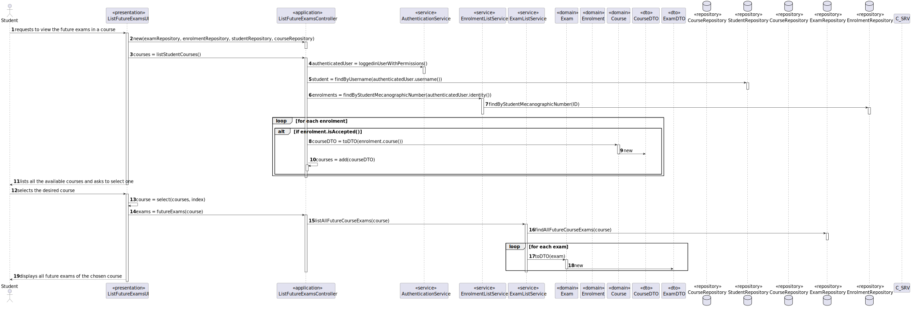
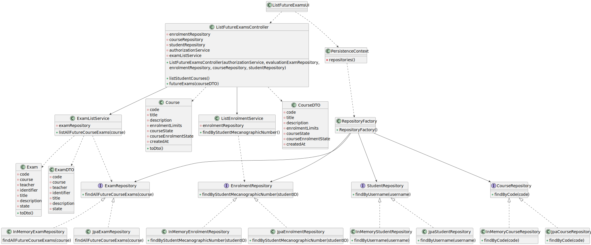
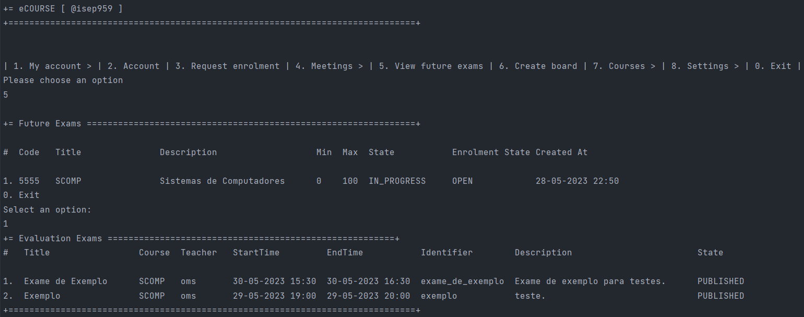

# User Story 2002 - List Future Exams

> As Student, I want to view a list of my future exams.

|             |           |
| ----------- | --------- |
| ID          | 22        |
| Sprint      | B         |
| Application | 3 - Exams |
| Priority    | 1         |

## Acceptance Criteria

- N/A.

## 2.1 Client Specifications


## 2.2. Client Clarifications

> [**Question:** Can one student be enrolled in different courses? (https://moodle.isep.ipp.pt/mod/forum/discuss.php?d=21922)
>
> **Answer**: "Yes"

## 2.3. Functional Requirements

> **FRE02** List Exams - The system displays to a student his/her future exams.

## 2.4. Acceptance Criteria

- N/A

## 3. Analysis

### 3.1. Main success scenario

1. Student request so view future exams
2. The system displays the courses the student's enrolled in
3. Students selects one
4. System display all the future exams of the chosen course


### 3.2. Conditions

- The student must be authenticated


### 3.3. System Sequence Diagram


### 3.4. Sequence Diagram (Simplified)



### 3.5. Partial Domain Model


## 4. Design

### 4.1. Functionality Realization


### 4.2. Class Diagram



### 4.3. Applied Patterns

- xxx

### 4.4. Tests

- N/A

## 5. Implementation

### 5.1. Controller

- Relevant implementation details

```java
 public Iterable<CourseDTO> listStudentCourses() {
    SystemUser authenticatedUser = authz.loggedinUserWithPermissions(ClientRoles.STUDENT).orElseThrow();

    Student student = studentListService.findStudentUserByUsername(authenticatedUser.identity()).orElseThrow();

    List<CourseDTO> courses = new ArrayList<>();
    for (EnrolmentDTO enrolment : enrolmentListService.findByStudentMecanographicNumber(student.identity())) {
        if (enrolment.getState().equals(EnrolmentState.State.ACCEPTED.toString())) {
            Optional<CourseDTO> course = courseService.findByCode(enrolment.getCourseCode());
            course.ifPresent(courses::add);
        }
    }

     return () -> new Iterator<CourseDTO>() {
        private int index = 0;
        private final List<CourseDTO> coursesDTO = courses;

        @Override
        public boolean hasNext() {
            return index < coursesDTO.size();
        }

        @Override
        public CourseDTO next() {
            return coursesDTO.get(index++);
        }
    };
  }

  public Iterable<ExamDTO> futureExams(CourseDTO courseDTO) {
    return examListService.listAllFutureCourseExams(courseRepository.ofIdentity(courseDTO.getCode()).orElseThrow());
  }
```

## 6. Integration & Demonstration

### 6.1. Success scenario



### 6.2. Failure scenarios

#### 6.2.1. Student not enrolled in any course


#### 6.2.2. No future exams


## 7. Observations

N/a
