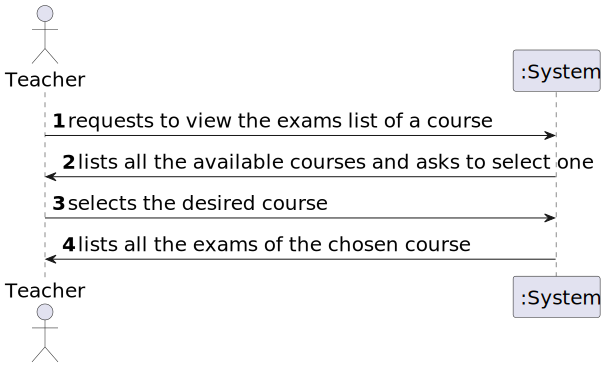
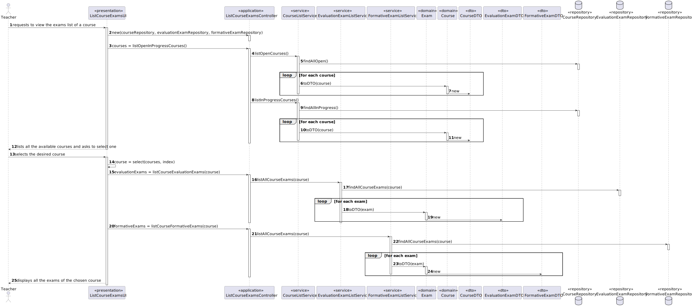

# User Story 2003 - List Exams in a Course

> As Teacher, I want to view a list of all exams in a course.

|             |           |
| ----------- | --------- |
| ID          | 23        |
| Sprint      | B         |
| Application | 3 - Exams |
| Priority    | 1         |

## Acceptance Criteria

- N/A.

## 2.1 Client Specifications


## 2.2. Client Clarifications


## 2.3. Functional Requirements

> **FRE03** List Course Exams - The system displays to a teacher of a course all the exams of the course.

## 2.4. Acceptance Criteria

- N/A

## 3. Analysis

### 3.1. Main success scenario

1. Teacher requests to view all the exams in a course
2. The system displays all the available courses
3. Teacher selects the desired course
4. The system display all the exams in the course


### 3.2. Conditions

- The teacher must be authenticated.

### 3.3. System Sequence Diagram



### 3.4. Sequence Diagram (Simplified)



### 3.5. Partial Domain Model


## 4. Design

### 4.1. Functionality Realization


### 4.2. Class Diagram


### 4.3. Applied Patterns

- xxx

### 4.4. Tests

- N/A

## 5. Implementation

### 5.1. Controller

- Relevant implementation details

```java
public Iterable<CourseDTO> listOpenInProgressCourses() {
    Iterable<CourseDTO> openCourses = this.service.listOpenCourses();

    Iterable<CourseDTO> inProgressCourses = this.service.listInProgressCourses();
    Stream<CourseDTO> combinedStream = Stream.concat(StreamSupport.stream(openCourses.spliterator(), false), StreamSupport.stream(inProgressCourses.spliterator(), false));

    return combinedStream::iterator;
  }

public Iterable<ExamDTO> listCourseExams(CourseDTO courseDTO) {
    authz.ensureAuthenticatedUserHasAnyOf(ClientRoles.POWER_USER, ClientRoles.TEACHER, ClientRoles.MANAGER);
    Optional<Course> course = courseRepository.findByCode(courseDTO.getCode());

    if (course.isEmpty())
        throw new IllegalArgumentException("There is no Course with the given code");

    return examService.listAllCourseExams(course.get());
}
```

## 6. Integration & Demonstration


## 7. Observations

N/a
