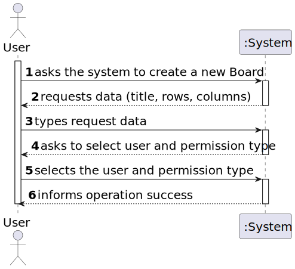
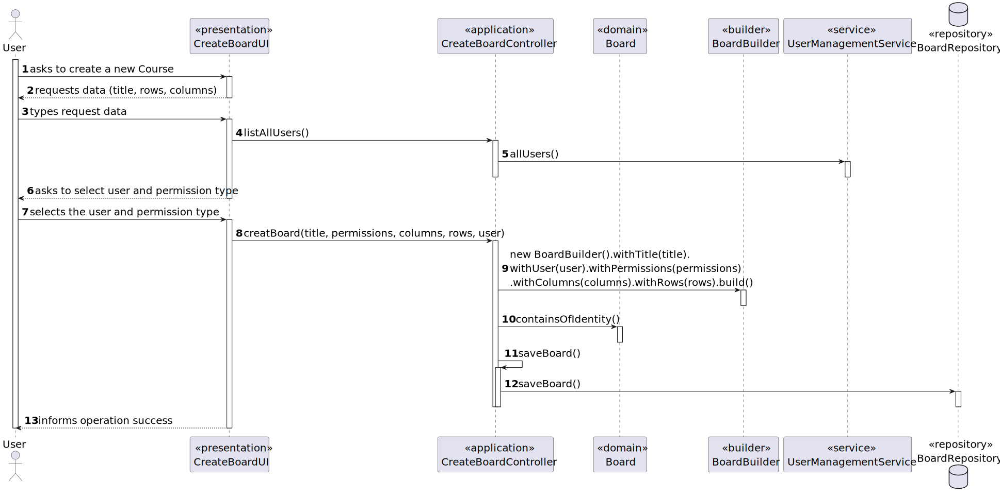
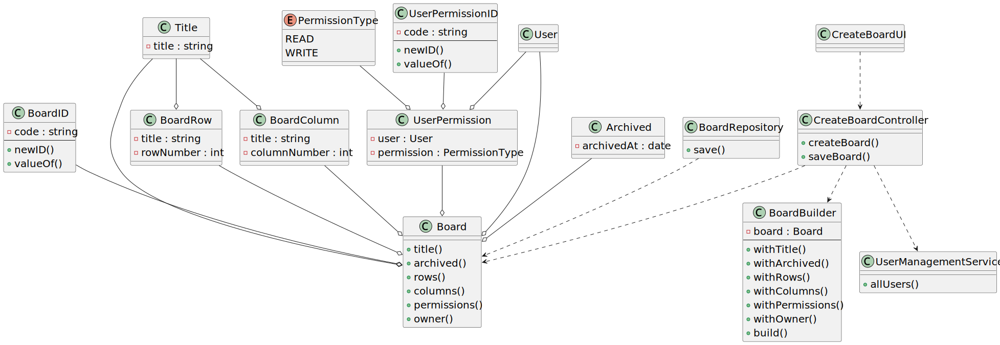

# User Story 3002 - Create a Board

> As User, I want to create a board.

|             |                   |
| ----------- | ----------------- |
| ID          | 25                |
| Sprint      | B                 |
| Application | 4 - Shared Boards |
| Priority    | 1                 |

---

## 1. Context

This is the first time this task is assigned to be developed. This is a new functionality that is needed to create a board.

## 2. Requirements

### "Create Board - A user creates a board"

## 2.1. Client Specifications

- "The project aims to implement the concept of shared board, as a board that can [...] used for managing projects."

- "All users can create and use boards"

- "It has a unique title."

- "It is divided into a certain number of columns and rows. Therefore it has a certain number of cells. For the moment it makes sense to define the maximum number of rows to 20 and of columns to 10. But this should be a setting in a property file. Columns and rows may have titles. They may also be identified by an integer number from 1 to the maximum number."

- "The user that creates the board is its owner. The owner can share the board with other users. Users may have read or write access to the board."

- "The owner of a board can archive the board when it will no longer be used."

## 2.2. Client Clarifications

> [**Question:** Can the owner of a board set custom permissions for each user?](https://moodle.isep.ipp.pt/mod/forum/discuss.php?d=21945)
>
> **Answer**: "Yes"
>
> [**Question:** Should it be possible to have a column with no title and no identifier in a board?](https://moodle.isep.ipp.pt/mod/forum/discuss.php?d=22120)
>
> **Answer**: "In order for user to post content into a cell they must identify the cell. Therefore, I think at least, it should be possible to identify the cell by the number of its column and the number of its row. If the cells have titles, these titles can be used to identify the cells. However, it should always be possible to identify a cell by the column number and row number."
>
> [**Question:** Can a user own more than one board?](https://moodle.isep.ipp.pt/mod/forum/discuss.php?d=22171)
>
> **Answer**: "Yes"

## 2.3. Functional Requirements

> **FRB01** Create Board - A user creates a board.

## 2.4. Acceptance Criteria

- N/a

---

## 3. Analysis

### 3.1. Conditions

- The user must be authenticated, although it is not necessary to have any specific role.

### 3.2. System Sequence Diagram

**Note:** The system will request the user to input board rows and columns while he wants to add them or until he reaches the maximum number of rows and columns. The same applies to user permissions, but those are not mandatory.



### 3.3. Partial Domain Model

**Note:** The domain model was made in a way to avoid the synchronization problems, as several clients will try to concurrently update boards.


## 4. Design

### 4.1. Functionality Realization



### 4.2. Class Diagram



### 4.3. Applied Patterns

- **Builder:** The builder pattern is used to provide a flexible way to create a board. This is done by using the `BoardBuilder` class. This allows the creation of a board with different ways to set some of its attributes and also allows the creation of a board without setting non mandatory attributes. This will also be useful to develop the tests.
- **Dependency Injection:** This is used in the controller and in the service. This is done to enable the use of a mock repository in the tests and to reduce coupling.
- **Repository:** This is used to store the boards. This is done to allow the persistence of the boards and to allow the use of the boards in other parts of the application.
- **Service:** This is used to provide a list of System Users to the controller. This is done to reduce coupling and to allow the use of the service in other parts of the application.

### 4.4. Tests

_Note: This are some simplified versions of the tests for readability purposes._

**Test 1:** Ensure board has valid title

```java
@Test
  public void ensureBoardHasTitle() {
    List<UserPermission> permissions = new ArrayList<>();
    List<BoardColumn> columns = new ArrayList<>();
    List<BoardRow> rows = new ArrayList<>();

    assertThrows(IllegalArgumentException.class, () -> new Board(null, permissions, columns, rows, user));
  }
```

**Test 2:** Ensure board does not need permissions

```java
@Test
public void ensureBoardPermissionsAreNotMandatory() {
  List<BoardColumn> columns = new ArrayList<>();
  List<BoardRow> rows = new ArrayList<>();

  Board b = new Board(new BoardTitle("title"), null, columns, rows, user);

  assert (b != null);
}
```

**Test 3:** Ensure board has valid columns

```java

@Test
public void ensureBoardHasColumns() {
  List<UserPermission> permissions = new ArrayList<>();
  List<BoardRow> rows = new ArrayList<>();

  assertThrows(IllegalArgumentException.class,
      () -> new Board(new BoardTitle("title"), permissions, null, rows, user));
}
```

**Test 4:** Ensure board has valid rows

```java

@Test
public void ensureBoardHasRows() {
  List<UserPermission> permissions = new ArrayList<>();
  List<BoardColumn> columns = new ArrayList<>();

  assertThrows(IllegalArgumentException.class,
      () -> new Board(new BoardTitle("title"), permissions, columns, null, user));
}
```

**Test 5:** Ensure board has valid owner

```java

@Test
public void ensureBoardHasUser() {
  List<UserPermission> permissions = new ArrayList<>();
  List<BoardColumn> columns = new ArrayList<>();
  List<BoardRow> rows = new ArrayList<>();

  assertThrows(IllegalArgumentException.class,
      () -> new Board(new BoardTitle("title"), permissions, columns, rows, null));
}
```

## 5. Implementation

### 5.1. Controller

```java
@UseCaseController
public class CreateBoardController {

  private BoardRepository boardRepo;
  private UserManagementService userSvc;
  private AuthorizationService authz;

  public CreateBoardController(BoardRepository boardRepo, UserManagementService userSvc, AuthorizationService authz) {
    this.boardRepo = boardRepo;
    this.userSvc = userSvc;
    this.authz = authz;
  }

  public Board createBoard(final String title, final Map<SystemUser, PermissionType> permissions,
      final Map<String, Integer> columns, final Map<String, Integer> rows) {

    Preconditions.noneNull(title, columns, rows);

    SystemUser user = authz.loggedinUserWithPermissions(ClientRoles.MANAGER,
        ClientRoles.POWER_USER, ClientRoles.STUDENT, ClientRoles.TEACHER).orElseThrow();

    Board board = new BoardBuilder().withTitle(title).withUser(user).withPermissions(permissions)
        .withColumns(columns).withRows(rows).build();

    if (boardRepo.containsOfIdentity(board.identity()))
      throw new IllegalStateException("There is already a board with that id.");

    return saveBoard(board);
  }

  public Iterable<SystemUser> listAllUsers() {
    return userSvc.allUsers();
  }

  private Board saveBoard(Board board) {
    if (board == null)
      throw new IllegalArgumentException("Board cannot be null.");

    return boardRepo.save(board);
  }
}

```

## 6. Integration & Demonstration

### 6.1. Success scenario


## 7. Observations

- All users can create a Board.
