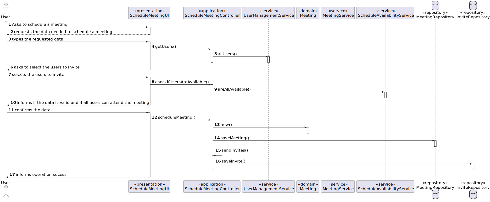
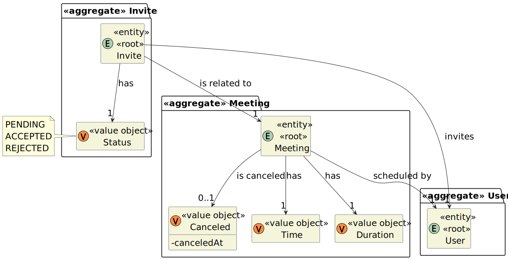

# User Story 4001 - Schedule a Meeting

> As User, I want to schedule a meeting.

|             |              |
| ----------- | ------------ |
| ID          | 27           |
| Sprint      | B            |
| Application | 5 - Meetings |
| Priority    | 5            |

## 1. Context

This is the first time this task is assigned to be developed. This is a new functionality that is needed to schedule meetings.

## 2. Requirements

### "As User, I want to schedule a meeting."

## 2.1. Client Specifications

-

## 2.2. Client Clarifications

> [**Question 17**: Can a meeting and class overlap?](https://moodle.isep.ipp.pt/mod/forum/discuss.php?d=21994)
>
> **Answer**: Regarding Meetings: FRM01 - Schedule a Meeting A user schedules a meeting. The system must check if all participants are available and send invitations to participants. In the case of Meetings they should not be created if the participants are not available.

> [**Question 23**: Can any user of the system invite any other user? For example, can a student invite another student who is in a different course, or can a manager can create a meeting with any group of teachers.](https://moodle.isep.ipp.pt/mod/forum/discuss.php?d=22064)
>
> **Answer**: "When in the document specification the term "User" is used it usually means "any user" of the system. Therefore, any user of the system can schedule a meeting and be a participant in a meeting."

> [**Question 24**: When a user does not respond to a meeting invitation, should his status be changed to "not responded" or "rejected"?](https://moodle.isep.ipp.pt/mod/forum/discuss.php?d=22080)
>
> **Answer**: "The status of someone that did not answer should be "no answer" or "unknown""

## 2.3 Functional Requirements

> **FRC01** - Schedule a Meeting - A user schedules a meeting. The system must check if all participants are available and send invitations to participants.

## 2.4. Acceptance Criteria

- The system must check if all participants are available and send invitations to participants.

## 3. Analysis

### 3.1 Main success scenario

1. User asks to schedule a meeting
2. The System asks the user to introduce the data needed to schedule a meeting
3. User types the requested data
4. The system shows the user the data typed and asks for confirmation
5. User confirms the data
6. The system reports the success of the operation

### 3.2. Conditions

- The user must be authenticated and authorized to perform the operation.

### 3.3. System Sequence Diagram


### 3.4. Sequence Diagram (Simplified)



### 3.5. Partial Domain Model



## 4. Design

### 4.1. Functionality Realization


### 4.2. Class Diagram


### 4.3. Applied Patterns

- xxx

### 4.4. Tests

**Test 1:** Ensure user can receive an invite to a meeting

```java
  @Test
  public void testUserHasInvite() {
    Invite invite = getDummyInvite();
    assertEquals(invite.user(), getDummyUser());
  }
```

**Test 2:** Ensure user can accept an invite to a meeting

```java
  @Test
  public void testUserCanAcceptInvite() {
    Invite invite = getDummyInvite();
    invite.accept();
    assertEquals(invite.status(), InviteStatus.Status.ACCEPTED);
  }
```

**Test 3:** Ensure user can reject an invite to a meeting

```java
  @Test
  public void testUserCanRejectInvite() {
    Invite invite = getDummyInvite();
    invite.reject();
    assertEquals(invite.status(), InviteStatus.Status.REJECTED);
  }
```

**Test 4:** Ensure user can ignore an invite to a meeting

```java
  @Test
  public void testUserCanIgnoreInvite() {
    Invite invite = getDummyInvite();
    invite.ignore();
    assertEquals(invite.status(), InviteStatus.Status.NO_ANSWER);
  }
```

**Test 5:** Ensure its possible to create a meeting

```java
  @Test
  public void ensureItsPossibleToCreateMeeting() {
    Meeting meeting = getDummyMeeting();
    assertEquals(meeting.time(), getDummyMeeting().time());
    assertEquals(meeting.duration(), getDummyMeeting().duration());
  }
```

## 5. Implementation

### 5.1. Controller

- Relevant implementation details

```java
  private void sample() {
    return true;
  }
```

## 6. Integration & Demonstration


## 7. Observations

- TODO: explain why the solution is designed like this (not using observer pattern, etc)
