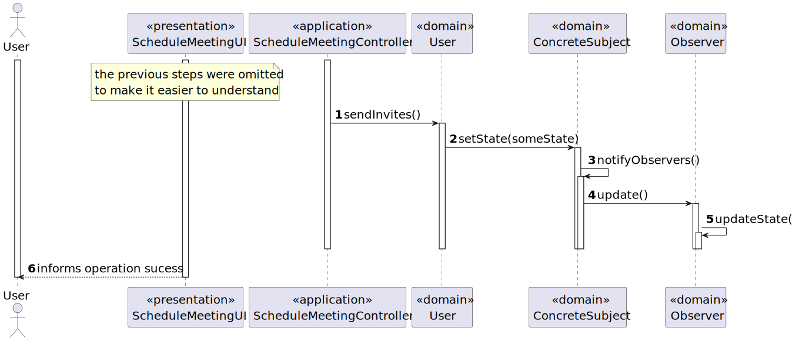

# User Story 4001 - Schedule a Meeting

> As User, I want to schedule a meeting.

|             |              |
| ----------- | ------------ |
| ID          | 27           |
| Sprint      | B            |
| Application | 5 - Meetings |
| Priority    | 5            |

## 1. Context

This is the first time this task is assigned to be developed. This is a new functionality that is needed to schedule meetings.

## 2. Requirements

### "As User, I want to schedule a meeting."

## 2.1. Client Specifications

-

## 2.2. Client Clarifications

> [**Question**:]

## 2.3 Functional Requirements

> **FRC01** - Schedule a Meeting - A user schedules a meeting. The system must check if all participants are available and send invitations to participants.

## 2.4. Acceptance Criteria

- The system must check if all participants are available and send invitations to participants.

## 3. Analysis

### 3.1 Main success scenario

1. User asks to schedule a meeting
2. The System asks the user to introduce the data needed to schedule a meeting
3. User types the requested data
4. The system shows the user the data typed and asks for confirmation
5. User confirms the data
6. The system reports the success of the operation

### 3.2. Conditions

- The user must be authenticated and authorized to perform the operation.

### 3.3. System Sequence Diagram


### 3.4. Sequence Diagram (Simplified)



### 3.5. Partial Domain Model


## 4. Design

### 4.1. Functionality Realization


### 4.2. Class Diagram


### 4.3. Applied Patterns

- xxx

### 4.4. Tests

**Test 1:** xxx

```java
  @Test
  private void test1() {
    assetTrue(true);
  }
```

## 5. Implementation

### 5.1. Controller

- Relevant implementation details

```java
  private void sample() {
    return true;
  }
```

## 6. Integration & Demonstration


## 7. Observations

- The history of the states of a course is not relevant.
