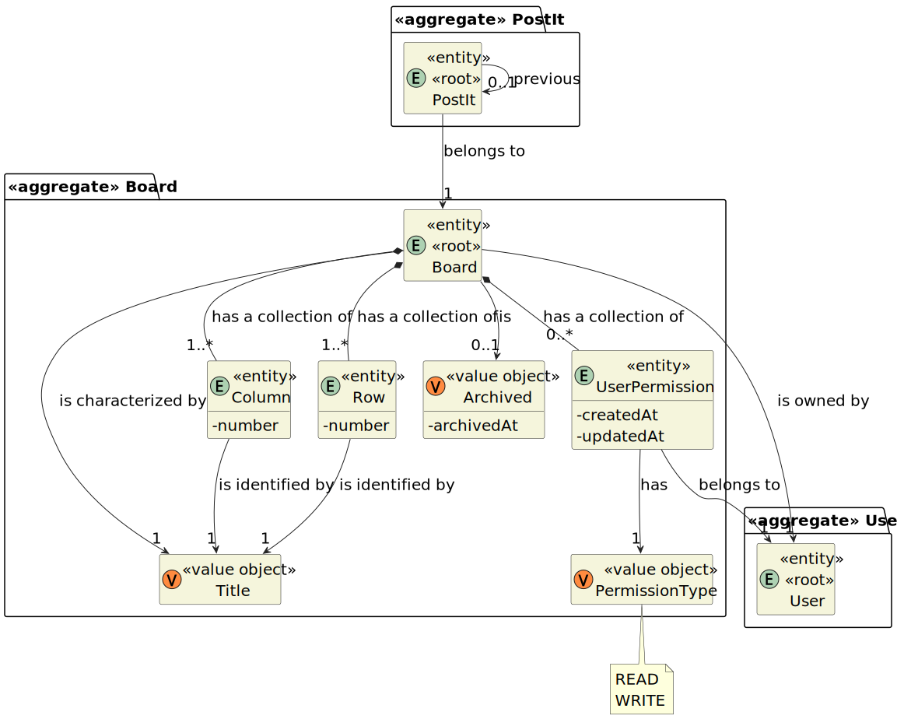
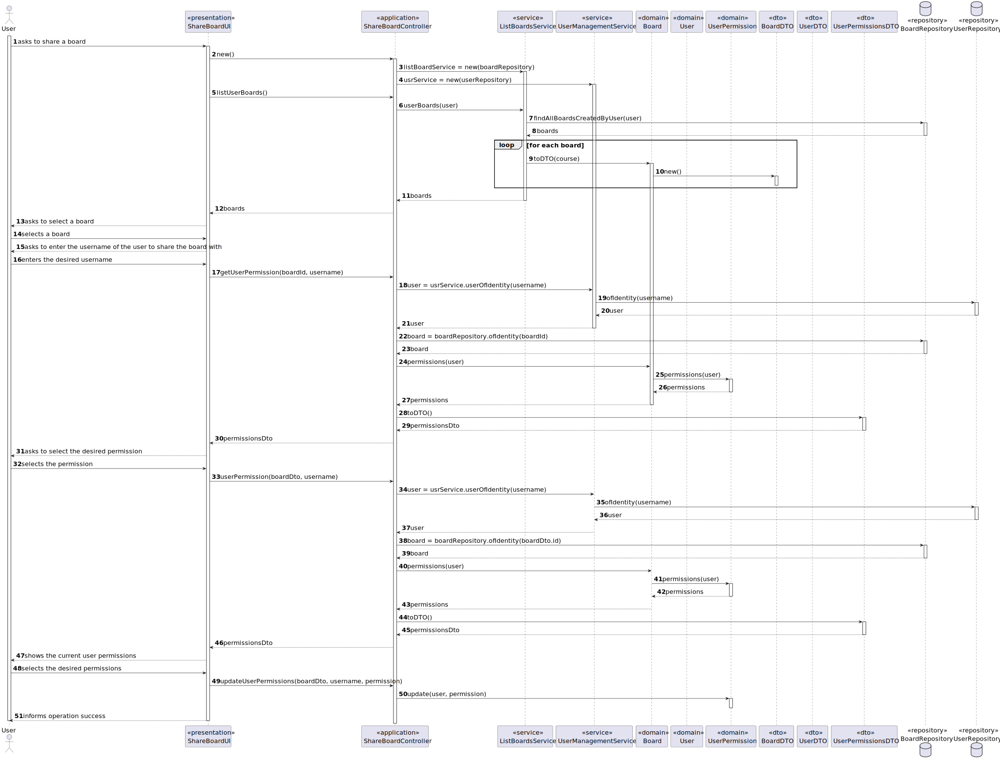
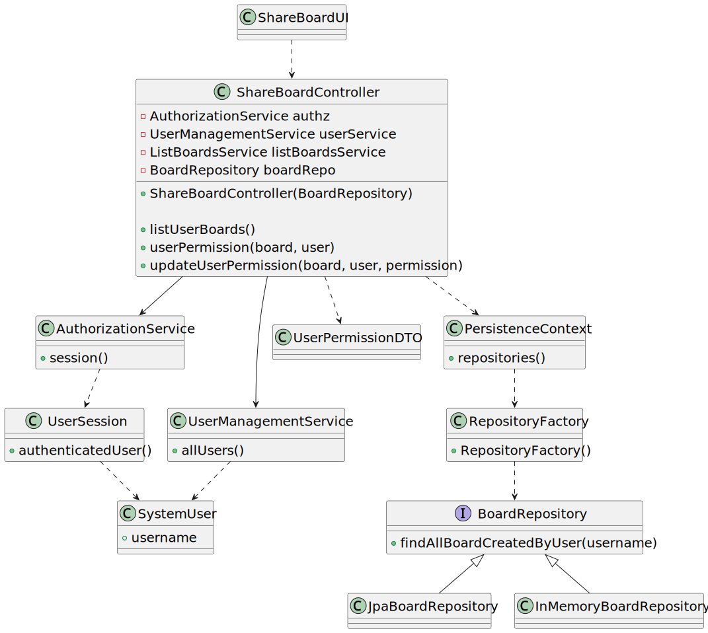

# User Story 3004 - Share a board

> As User, I want to share a board.

|             |                   |
| ----------- | ----------------- |
| ID          | 29                |
| Sprint      | C                 |
| Application | 4 - Shared Boards |
| Priority    | 1                 |

## 1. Context

This is the first time the task is assigned to be developed and is to be completed in this sprint. This user story is a feature.

## 2. Requirements

- **NFR13** Design and Implement Shared Board Synchronization - This functional part of the system has very specific technical requirements, particularly some concerns about synchronization problems. In fact, several clients will try to concurrently update boards. As such, the solution design and implementation must be based on threads, condition variables and mutexes. Specific requirements will be provided in SCOMP.

## 2.1. Client Specifications

- Shared Boards - Boards are one of the main used tools for teaching. From the old chalk boards to the new connected digital boards, boards are one of the most successful teaching tool. The project aims to implement the concept of shared board, as a board that can be used to share and organize ideas and information.
- A shared board is a digital implementation of a post-it board.
- Shared boards follow a specific design (as described in NFR07).
- The owner can share the board with other users.
- Users may have read or write access to the board.
- There is a separation between a frontend (Shared Board App) and a backend (Shared Board Server). The server implements the shared boards and receives updates from the clients. As updates are executed in the server, the server notifies the clients of these updates. As such, all clients are able to maintain a "real-time" clone of the shared boards. The Shared Board App implements a "small" HTTP server that serves a page that displays a board view.

## 2.2. Client Clarifications

- N/A.

## 2.3. Functional Requirements

- **FRB02** Share Board - A user shares a board it owns with other users.

## 2.4. Acceptance Criteria

- This functional part of the system has very specific technical requirements, particularly some concerns about synchronization problems.
- In fact, several clients will try to concurrently update boards.
- As such, the solution design and implementation must be based on threads, condition variables and mutexes.
- Specific requirements will be provided in SCOMP.

---

## 3. Analysis

Multiple clients will try to concurrently update boards, as such, the solution design and implementation must be based on threads, condition variables and mutexes. The client will establish a TCP connection to the server and the communication protocol [described here](../../sprint-b/us24-3001/README.md) will be used.


### 3.1. Main success scenario

The user who owns the board shares it with another user, giving him the appropriate permissions. The recipient user can now access this board.

#### 3.1.1. Other scenarios

- Recipient user does not exist

The system notifies the user that the recipient user does not exist.

- Recipient user already has permissions to the board

The system notifies the user that the recipient user already has permissions to the board and asks if it is his desire to update them.

### 3.2. Conditions

- The user must be authenticated in order to share a board.
- The user must be the owner of the board to be able to share it.
- The recipient user must exist in the system.
- The recipient user must not have permissions to the board.
- The recipient user must be given the appropriate permissions to the board.

### 3.3. System Sequence Diagram


### 3.4. Partial Domain Model



## 4. Design

### 4.1. Functionality Realization



### 4.2. Class Diagram



### 4.3. Applied Patterns

- XXX

### 4.4. Tests

_Note: This are some simplified versions of the tests for readability purposes._

**Test 1:** XXX

```java

```

## 5. Implementation

### 5.1. Controller

- Relevant implementation details

```java
public ShareBoardController(BoardRepository boardRepo) {
  this.authz = AuthzRegistry.authorizationService();
  this.userService = AuthzRegistry.userService();
  this.listBoardsService = new ListBoardsService(boardRepo);
}
```

## 6. Integration & Demonstration


## 7. Observations

- N/a
