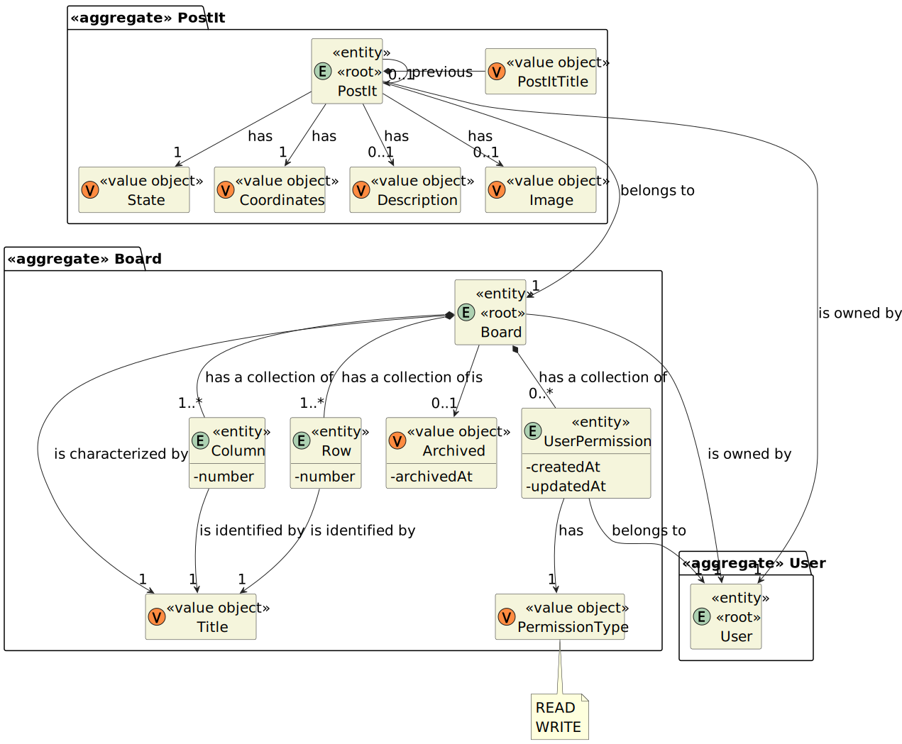

# User Story 3005 - View shared boards in real-time

|             |                   |
| ----------- | ----------------- |
| ID          | 30                |
| Sprint      | C                 |
| Application | 4 - Shared Boards |
| Priority    | 1                 |

---

## 1. Context

- This is the first time this task is assigned to be developed. This is a new functionality that is needed to enable all the users to check a board.

---

## 2. Requirements

### "As User, I want to view, in real-time, the updates in the shared boards"

## 2.1. Client Specifications

- "This functional part of the system has very specific technical requirements, particularly some concerns about synchronization problems.
  In fact, several clients will try to concurrently update boards.
  As such, the solution design and implementation must be based on threads, condition variables and mutexes. Specific requirements will be provided in SCOMP.
  The client app should implement an HTTP server to be able to generate the "views" of the boards. This should be done automatically, without the intervention of the users (i.e., without reload of the web page) by using AJAX."
- "Shared boards follow a specific design (as described in NFR07). There is a separation between a frontend (Shared Board App) and a backend (Shared Board Server)"
- "As such, all clients are able to maintain a "real-time" clone of the shared boards. The Shared Board App implements a 'small' HTTP server that serves a page that displays a board view."
- The system should generate 'real-time' HTML rendering of the board, presenting all the actual contents of the board, the row and column titles, the board title, the authors (short name and email) of the posts and a timestamp of each post. This "real-time" HTML rendering should be available in the server and in each client."

## 2.2. Client Clarifications

> [**Question:** Where should a notification regarding the update of a board post appear? In the user app, the shared board app or both?](https://moodle.isep.ipp.pt/mod/forum/discuss.php?d=22041)
>
> **Answer:**"it should be in the Shared Board App."

## 2.3. Functional Requirements

> **FRB03** View Board The system should display, in "real-time", the shared boards available to the user in a HTML page

## 2.4. Non Functional Requirements

> **NFR10** Shared Board Architecture This functional part of the system has very specific technical requirements. It must follow a client-server architecture, where a client application is used to access the shared boards that should be implemented in a server. Communications between these two components must follow specific protocol described in a document from RCOMP ("Application Protocol"). Also, the client application can not access the relational database, it can only access the server application. The client app should implement an HTTP server to be able to generate the "views" of the boards. This should be done automatically, without the intervention of the users (i.e., without reload of the web page) by using AJAX.

## 2.5. Acceptance Criteria

- N/a

---

## 3. Analysis

### 3.1. Conditions

- The board server must be running
- The user must be logged in
- The board server and app must be able to communicate with each other

### 3.2. System Sequence Diagram


### 3.4. Partial Domain Model



---

## 4. Design

### 4.1. Sequence Diagram


### 4.2. Class Diagram


### 4.3. Applied Patterns

- XXX

### 4.4. Tests

_Note: This are some simplified versions of the tests for readability purposes._

**Test 1:** XXX

```java

```

## 5. Implementation

### 5.1. Controller

- Relevant implementation details

```java

```

---

## 6. Integration & Demonstration

### 6.1. Select Board


### 6.2. View Board


## 7. Observations

- Tailwind CSS will be used to style the application.
