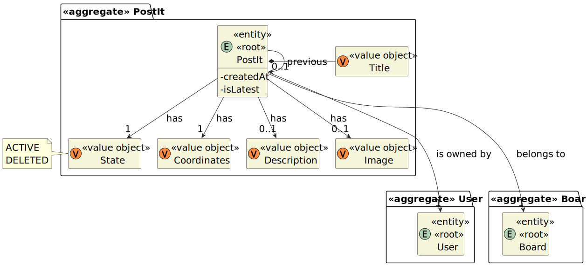
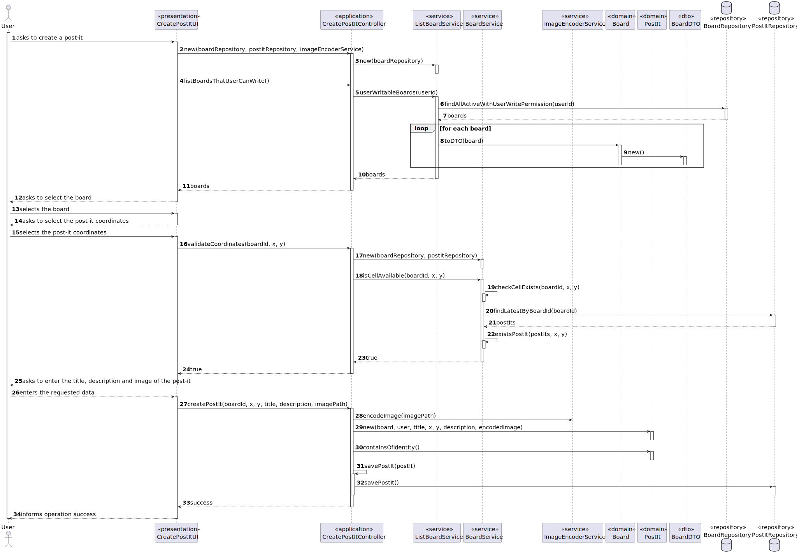
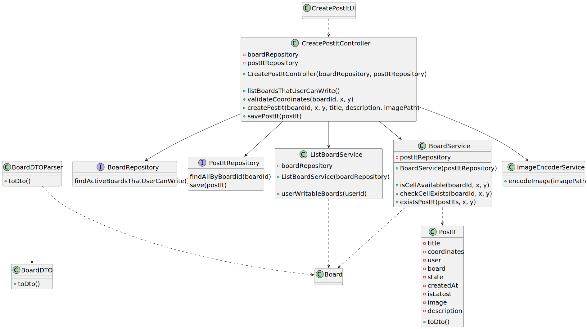

# User Story 3004 - Create Post-It

> A user creates a post-it on a board

|             |                   |
| ----------- | ----------------- |
| ID          | 31                |
| Sprint      | C                 |
| Application | 4 - Shared Boards |
| Priority    | 1                 |

## 1. Context

- This is the first time this task is assigned to be developed. This is a new functionality that allows user to create post-it in a board.

## 2. Requirements

### "Create Post-it - A user creates a post-it on a board"

## 2.1. Client Specifications

- When the server commits a post it also should notify all clients with access to the board of the update.
- The user who created a post in a cell can change that post. It may change its contents or
  move the post into a free cell. The user can also undo the last change.
- The owner of a post can delete it.

## 2.2. Client Clarifications

> [**Question:** Can a cell have more than one post?](https://moodle.isep.ipp.pt/mod/forum/discuss.php?d=22202)
>
> **Answer**: "No"

## 2.3. Functional Requirements

- **FRB04** Create Post-it - A user creates a post-it on a board

## 2.4. Acceptance Criteria

- This functional part of the system has very specific technical requirements, particularly some concerns about synchronization problems.
- In fact, several clients will try to concurrently update boards.
- As such, the solution design and implementation must be based on threads, condition variables and mutexes. Specific requirements will be provided in SCOMP.

---

## 3. Analysis

- User must have write permissions to create a post-it.
- The post-it must be created in a cell that is not occupied by another post-it.

### 3.3. System Sequence Diagram


### 3.4. Partial Domain Model



## 4. Design

### 4.1. Functionality Realization



### 4.2. Class Diagram



### 4.3. Applied Patterns

- **Builder:** The builder pattern is used to provide a flexible way to create a board. This is done by using the `PostItBuilder` class. This allows the creation of a post-it with different ways to set some of its attributes and also allows the creation of a post-it without setting non mandatory attributes. This will also be useful to develop the tests.
- **Dependency Injection:** This is used in the controller and in the service. This is done to enable the use of a mock repository in the tests and to reduce coupling.
- **Repository:** This is used to store the post-its. This is done to allow the persistence of the post-its and to allow the use of the post-its in other parts of the application.
- **Service:** This is used to provide a list of boards and to do some validations. This is done to reduce coupling and to allow the use of the service in other parts of the application.

### 4.4. Tests

**Test 1:** Ensure that post-it needs a title

```java
@Test
public void ensurePostItNeedsTitle{ ... }
```

**Test 2:** Ensure that post-it does not need a description

```java
@Test
public  void ensurePostItDoesNotNeedDescription{ ... }
```

**Test 3:** Ensure that post-it needs a coordinates

```java
@Test
public void ensurePostItNeedsCoordinates{ ... }
```

## 5. Implementation

### 5.1. Controller

[Click here](/ecourse.core/src/main/java/eapli/ecourse/postitmanagement/application/CreatePostItController.java) to see the full code.

## 6. Integration & Demonstration


## 7. Observations

- The scomp implementation is documented in the [scomp report](/docs/scomp-concurrency.md).
