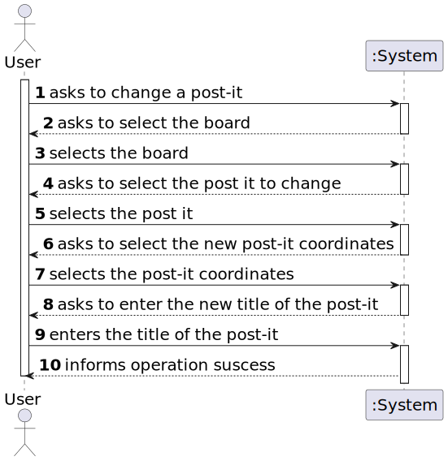
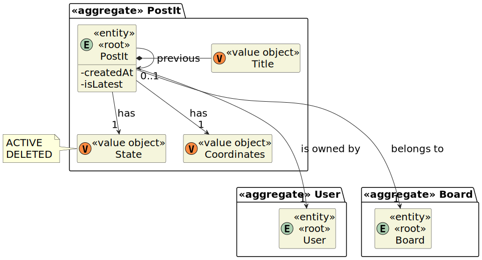

# User Story 3004 - Change Post-It

> As User, I want to change a post-it

|             |                   |
| ----------- | ----------------- |
| ID          | 32                |
| Sprint      | C                 |
| Application | 4 - Shared Boards |
| Priority    | 1                 |

## 1. Context

- This is the first time this task is assigned to be developed. This is a new functionality that allows user to update post-it in a board.

## 2. Requirements

### "Update Post-it - A user update a post-it on a board"

## 2.1. Client Specifications

- When the server commits a post it also should notify all clients with access to the board of the update.
- The user who created a post in a cell can change that post. It may change its contents or
  move the post into a free cell. The user can also undo the last change.
- The owner of a post can delete it.

## 2.2. Client Clarifications

> [**Question:** Can a cell have more than one post?](https://moodle.isep.ipp.pt/mod/forum/discuss.php?d=22202)
>
> **Answer**: "No"
>
> [**Question:** Where should a notification regarding the update of a board post appear? In the user app, the shared board app or both?](https://moodle.isep.ipp.pt/mod/forum/discuss.php?d=22041)
>
> **Answer**:"it should be in the Shared Board App."

## 2.3. Functional Requirements

- **FRB04** Change Post-it - A user change a post-it on a board

## 2.4. Acceptance Criteria

- This functional part of the system has very specific technical requirements, particularly some concerns about synchronization problems.
- In fact, several clients will try to concurrently update boards.
- As such, the solution design and implementation must be based on threads, condition variables and mutexes. Specific requirements will be provided in SCOMP.

---

## 3. Analysis

- User must have write permissions to update a post-it.
- If the post-it is moved, it should be moved to a cell that is not occupied by another post-it.

### 3.3. System Sequence Diagram



### 3.4. Partial Domain Model



## 4. Design

### 4.1. Functionality Realization


### 4.2. Class Diagram


### 4.3. Applied Patterns

- 3006

### 4.4. Tests

_Note: This are some simplified versions of the tests for readability purposes._

**Test 1:** 3006

```java

```

## 5. Implementation

### 5.1. Controller

- Relevant implementation details

```java

```

## 6. Integration & Demonstration


## 7. Observations

- N/a
