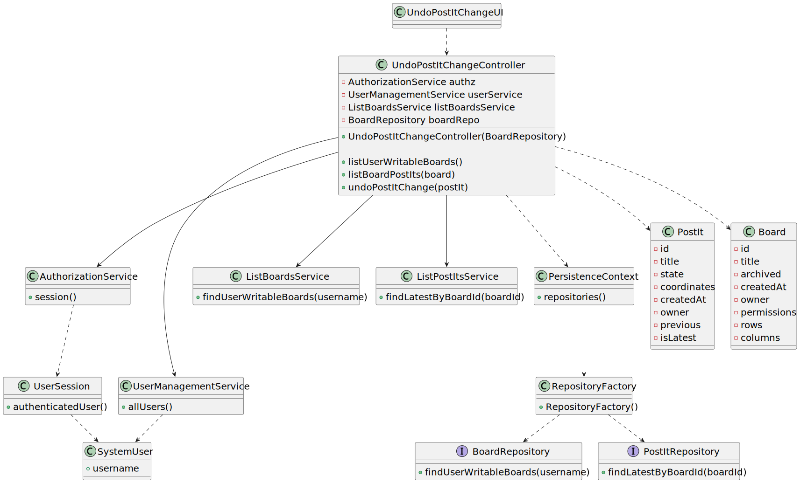
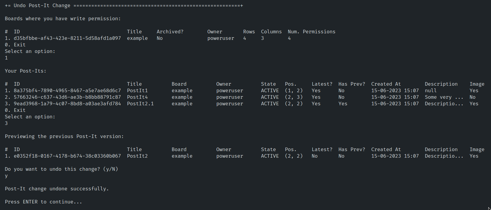
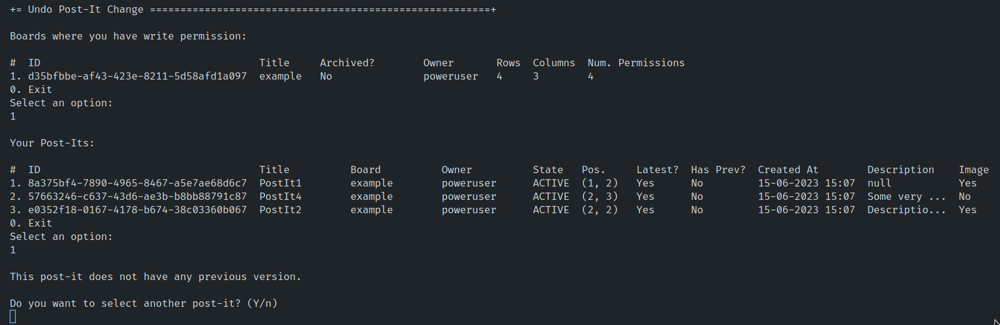

# User Story 3008 - Undo Post-It Change

> As User, I want to undo the last change in a post-it on a board.

|             |                   |
| ----------- | ----------------- |
| ID          | 33                |
| Sprint      | C                 |
| Application | 4 - Shared Boards |
| Priority    | 1                 |

## 1. Context

This is the first time the task is assigned to be developed and is to be completed in this sprint. This user story is a feature.

## 2. Requirements

- **NFR13** Design and Implement Shared Board Synchronization - This functional part of the system has very specific technical requirements, particularly some concerns about synchronization problems. In fact, several clients will try to concurrently update boards. As such, the solution design and implementation must be based on threads, condition variables and mutexes. Specific requirements will be provided in SCOMP.

## 2.1. Client Specifications

- Shared Boards - Boards are one of the main used tools for teaching. From the old chalk boards to the new connected digital boards, boards are one of the most successful teaching tool. The project aims to implement the concept of shared board, as a board that can be used to share and organize ideas and information.
- A shared board is a digital implementation of a post-it board.
- Shared boards follow a specific design (as described in NFR07).
- Users may have read or write access to the board.
- The user who created a post in a cell can change that post.
- The user can also undo the last change.

## 2.2. Client Clarifications

- N/A.

## 2.3. Functional Requirements

- **FRB06** Undo Post-it Change - A user undo the last change in a post-it.

## 2.4. Acceptance Criteria

- This functional part of the system has very specific technical requirements, particularly some concerns about synchronization problems.
- In fact, several clients will try to concurrently update boards.
- As such, the solution design and implementation must be based on threads, condition variables and mutexes.
- Specific requirements will be provided in SCOMP.

---

## 3. Analysis

Multiple clients will try to concurrently update boards, as such, the solution design and implementation must be based on threads, condition variables and mutexes. The client will establish a TCP connection to the server and the communication protocol [described here](../../rcomp-shared-board.md) will be used.


### 3.1. Main success scenario

The user is able to undo the last change in a post-it and it is reflected in the board.

#### 3.1.1. Other scenarios

- The post-it does not have previous changes:

A user will be unable to undo the last change in a post-it if the post-it does not have previous changes.

### 3.2. Conditions

- The user must be authenticated in order to perform this action.
- The user must have write permission in the board.
- The user must be owner of the post-it.

### 3.3. System Sequence Diagram


### 3.4. Partial Domain Model


## 4. Design

### 4.1. Functionality Realization


### 4.2. Class Diagram



### 4.3. Applied Patterns

- **Dependency Injection:** This is used in the controller and in the services. This is done to enable the use of a mock repository in the tests and to reduce coupling.
- **Repository:** This is used to store the post-its. This is done to reduce coupling and to allow the use of the repository in other parts of the application.
- **Service:** This is used to provide a list of System Users to the controller. This is done to reduce coupling and to allow the use of the service in other parts of the application.

### 4.4. Tests

> ️️💡 These tests are simplified versions for readability purposes.
>
> [Click here](/ecourse.core/src/test/java/eapli/ecourse/boardmanagement/application/ShareBoardControllerTest.java) to see the full code.

**Test 1:** Test if a Post-It exists.

```java
@Test
public void testPostItExists() { ... }
```

**Test 2:** Test if a Post-It does not exist.

```java
@Test
public void testPostItDoesNotExist() { ... }
```

**Test 3:** Test if a Post-It can be edited by its owner.

```java
@Test
public void testCanEditPostItAsOwner() { ... }
```

**Test 4:** Test if a Post-It cannot be edited by another user.

```java
@Test
public void testCannotEditPostIt() { ... }
```

**Test 5:** Test if undoing a Post-It works.

```java
@Test
public void testUndoPostIt() { ... }
```

**Test 6:** Test if undoing a Post-It that is not the latest fails.

```java
@Test
public void testUndoNotLatestPostIt() { ... }
```

**Test 7:** Test if undoing a Post-It that does not have a previous version fails.

```java
@Test
public void testPreviousPostItDoesNotExistWhenUndoing() { ... }
```

## 5. Implementation

### 5.1. Controller

```java
public UndoPostItController(TransactionalContext ctx, PostItRepository postItRepository) {
  this.ctx = ctx;
  this.postItRepository = postItRepository;
}
```

## 6. Integration & Demonstration

- Success cenario:



- User does not have write permission to any board:


- Post-it does not have previous changes:



## 7. Observations

- This US was implemented using specific requirements provided in RCOMP & SCOMP.
