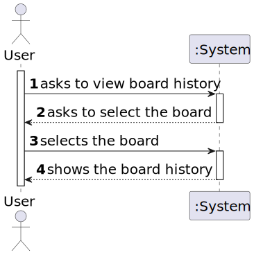

# User Story 3009 - View board history

> As User, I want to view the history of updates on a board

|             |                   |
| ----------- | ----------------- |
| ID          | 34                |
| Sprint      | C                 |
| Application | 4 - Shared Boards |
| Priority    | 3                 |

## 1. Context

- This is the first time this task is assigned to be developed. This is a new functionality that allows user to view the board history.

## 2. Requirements

### "View Board History - A user views a history of updates in a board"

## 2.1. Client Specifications

- The system should maintain an history/log of all the updates in the board.

## 2.2. Client Clarifications

> [**Question:** Should someone be able to see the logs of a board?](https://moodle.isep.ipp.pt/mod/forum/discuss.php?d=22229)
>
> **Answer**: "If a user as read access to the board he can view the history. Logs are important for FRB06 and FRB07."

## 2.3. Functional Requirements

- **FRB04** View Board History - A user views a history of updates in a board

## 2.4. Acceptance Criteria

- This functional part of the system has very specific technical requirements, particularly some concerns about synchronization problems.
- In fact, several clients will try to concurrently update boards.
- As such, the solution design and implementation must be based on threads, condition variables and mutexes. Specific requirements will be provided in SCOMP.

---

## 3. Analysis

As the way to view the history of a board needs to be presented to the user, there will be implemented 2 ways to do it:

- Board History - List the post-its versions ordered by date
- Post-it History - List, for each post-it, the versions ordered by date

### 3.1. Conditions

- User must have read/write permissions or be the owner to view the history of a board.

### 3.2. System Sequence Diagram



### 3.3. Partial Domain Model


## 4. Design

### 4.1. Functionality Realization


### 4.2. Class Diagram


### 4.3. Applied Patterns

- **Dependency Injection:** This is used in the controller and in the service. This is done to enable the use of a mock repository in the tests and to reduce coupling.
- **Repository:** This is used to store the post-its. This is done to allow the persistence of the post-its and to allow the use of the post-its in other parts of the application.
- **Service:** This is used to provide a list of boards/post-its to the controller. This is done to reduce coupling and to allow the use of the service in other parts of the application.

### 4.4. Tests

**Test 1:** Ensure user needs read/write permissions views the history of a board

```java
@Test
public void ensureUserNeedsPermissionToViewBoardHistory() { ... }
```

**Test 2:** Ensure board history is ordered by date

```java
@Test
public void ensureBoardHistoryIsOrderedByDate() { ... }
```

## 5. Implementation

### 5.1. Controller

[Click here](/ecourse.core/src/main/java/eapli/ecourse/boardmanagement/application/ViewBoardHistoryController.java) to see the full code.

## 6. Integration & Demonstration

### 6.1. Board History


### 6.2. Post-It History


## 7. Observations

- The scomp implementation is documented in the [scomp report](/docs/scomp-concurrency.md).
