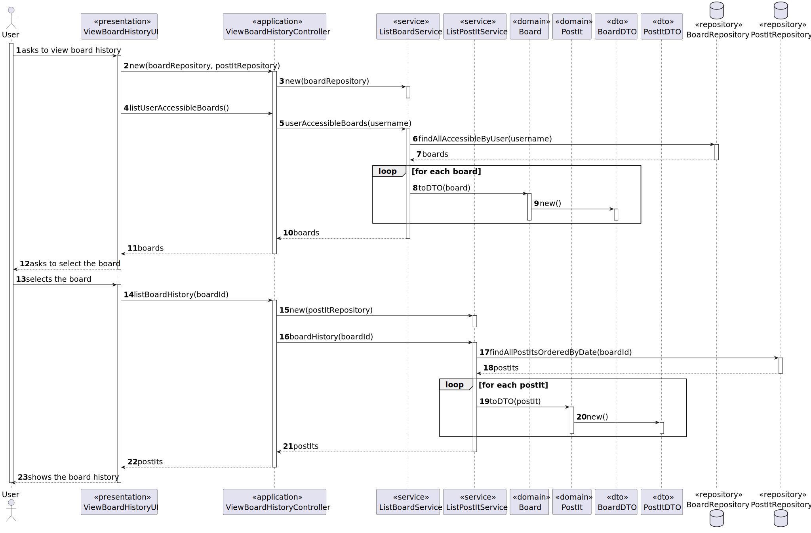

# User Story 3009 - View board history

> As User, I want to view the history of updates on a board

|             |                   |
| ----------- | ----------------- |
| ID          | 34                |
| Sprint      | C                 |
| Application | 4 - Shared Boards |
| Priority    | 3                 |

## 1. Context

- This is the first time this task is assigned to be developed. This is a new functionality that allows user to view the board history.

## 2. Requirements

### "View Board History - A user views a history of updates in a board"

## 2.1. Client Specifications

- The system should maintain an history/log of all the updates in the board.

## 2.2. Client Clarifications

> [**Question:** Should someone be able to see the logs of a board?](https://moodle.isep.ipp.pt/mod/forum/discuss.php?d=22229)
>
> **Answer**: "If a user as read access to the board he can view the history. Logs are important for FRB06 and FRB07."

## 2.3. Functional Requirements

- **FRB04** View Board History - A user views a history of updates in a board

## 2.4. Acceptance Criteria

- This functional part of the system has very specific technical requirements, particularly some concerns about synchronization problems.
- In fact, several clients will try to concurrently update boards.
- As such, the solution design and implementation must be based on threads, condition variables and mutexes. Specific requirements will be provided in SCOMP.

---

## 3. Analysis

### 3.1. Conditions

- User must have read/write permissions or be the owner to view the history of a board.

### 3.2. System Sequence Diagram


### 3.3. Partial Domain Model


## 4. Design

### 4.1. Functionality Realization



### 4.2. Class Diagram


### 4.3. Applied Patterns

- XXX

### 4.4. Tests

_Note: This are some simplified versions of the tests for readability purposes._

**Test 1:** XXX

```java

```

## 5. Implementation

### 5.1. Controller

- Relevant implementation details

```java

```

## 6. Integration & Demonstration


## 7. Observations

- N/a
