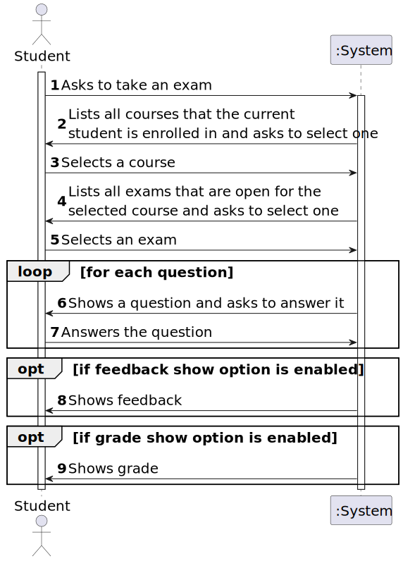
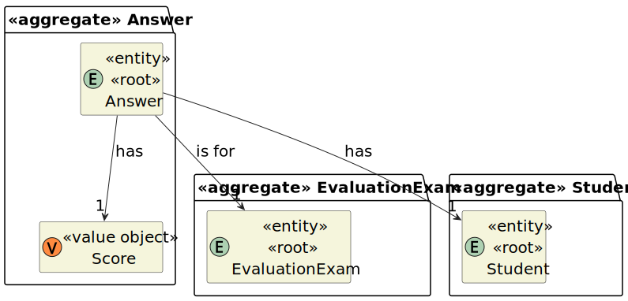
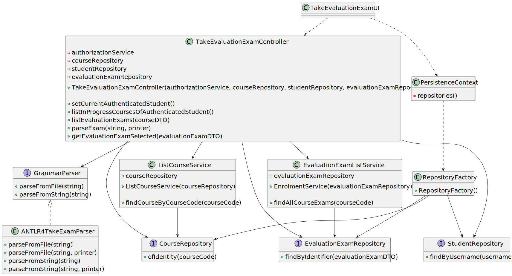
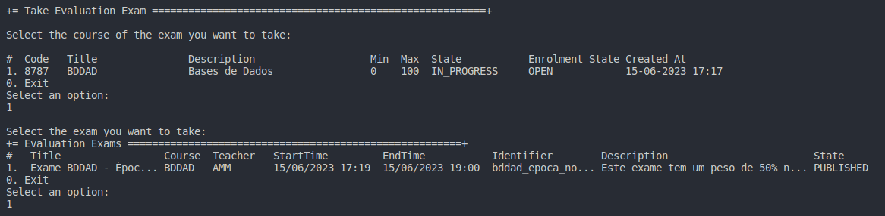
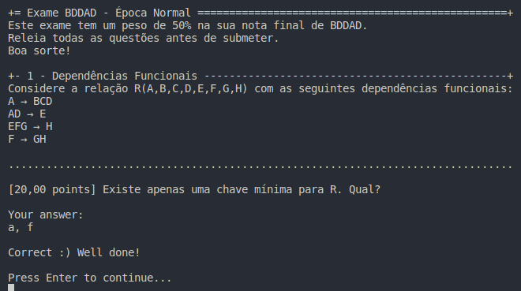
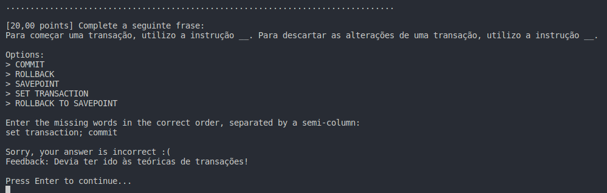

# User Story 2004 - Take an exam

|             |           |
| ----------- | --------- |
| ID          | 36        |
| Sprint      | C         |
| Application | 3 - Exams |
| Priority    | 1         |

---

## 1. Context

This is an enhance of last sprint's US 2001. The goal is to update the parser's implementation in order to make possible students to take an exam, using the parser to display and process the students' answers.

---

## 2. Requirements

### "As Student, I want to take an exam"

## 2.1. Client Specifications

- The system must provide a language to support the specification and "execution" of exams.
- The language must support the design of the exam layout and its questions as well as solutions, feedback and grading.
- The system must also support the automatic production of feedback and grading for the answers given by students when they take the exam. Usually this is done at the end of the exam.
- At the end of the exam, the system should display the feedback and result (i.e., grade) of the exam.
- The feedback and grade of the exam should be automatically calculated by a parser based on the grammar defined for exams structure.


## 2.2. Client Clarifications

## [Question 1](https://moodle.isep.ipp.pt/mod/forum/discuss.php?d=23245)

> How do exams get displayed to the user? Using a HTML page? Or console?

"Exams must be displayed using a normal Java Console application."

## [Question 2](https://moodle.isep.ipp.pt/mod/forum/discuss.php?d=23236)

> After a student answers a exam, is his grade saved in the database? And what is the flow of the feedback and the grade?

"Yes, the grades must be saved in the database.
The feedback and final grade are displayed in the end of the exam.
Regarding grades, each question will have points when the answer is correct. If you sum all the points form all the answers you will have the grade of the exam."

## 2.3. Functional Requirements

- **FRE04** Take Exam - A Student takes an exam and answer its questions. At the end of the exam, the system should display the feedback and result (i.e., grade) of the exam. The feedback and grade of the exam should be automatically calculated by a parser based on the grammar defined for exams structure.

## 2.4. Acceptance Criteria

- N/A

---

## 3. Analysis

### 3.1. Main success scenario

- A student enters the file path where the exam is defined. While the exam is parsed using ANTLR4, the questions are displayed to the student. The answer, and respective grade and feedback, are also handled by the ANTLR4 parser. In the end, the total final score and each feedback

### 3.2. Conditions

- The inserted file path must exist, and the defined exam structure must be valid, i.e., must be accepted by the defined grammar, described in [this](grammar.md) file.

### 3.3. System Sequence Diagram



### 3.4. Partial Domain Model



## 4. Design

<!-- ### 4.1. Functionality Realization -->

<!--  -->

### 4.1. Class Diagram



---

## 5. Design

### 5.1. Tests

_Note: This are some simplified versions of the tests for readability purposes._

**Test 1:** Ensure that exam title is parsed correctly

```java
@Test
public void ensureExamTitleIsCorrect() {
  // Create mock exam's text file, defining the title as "Title"
  // Parse the created text file, obtaining a Exam object
  // Ensure that the title of the returned exam is "Title"
}
```

**Test 2:** Ensure that exam total score is parsed correctly

```java
@Test
public void ensureTotalScoreIsCorrect() {
  // Create mock exam's text file, where the sum of all questions' scores is 100
  // Parse the created text file, obtaining a Exam object (The parser must sum all questions' scores)
  // Ensure that the total score of the returned exam is 100
}
```

---

## 6. Implementation

### 6.1. Controller

- Exam parser using ANTLR4 listeners.

```java
public ExamScore parseFromString(String str, ExamPrinter printer) throws ParseException {
    ExamLexer lexer = new ExamLexer(CharStreams.fromString(str));
    CommonTokenStream tokens = new CommonTokenStream(lexer);
    ExamParser parser = new ExamParser(tokens);
    ParseTree tree = parser.start();

    if (parser.getNumberOfSyntaxErrors() > 0)
      throw new ParseException();

    ParseTreeWalker walker = new ParseTreeWalker();
    ExamTakerListener listener = new ExamTakerListener(printer);
    walker.walk(listener, tree);

    return listener.getStudentsScore();
}
```

---

## 7. Integration & Demonstration

- Select an exam



- Example of Short Answer question



- Example of Missing Words question



---

## 8. Observations

- N/A
