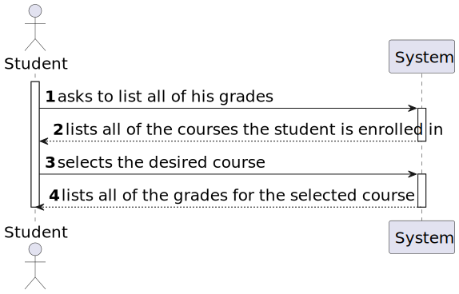
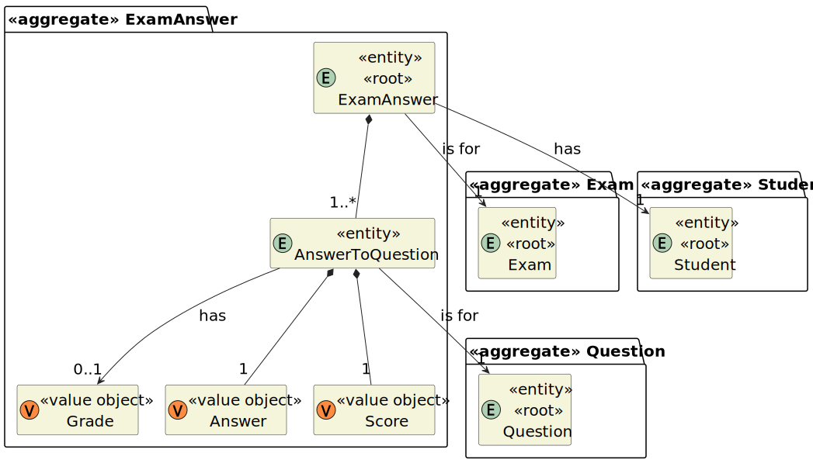
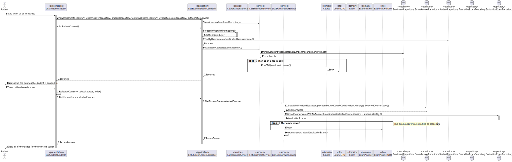

# User Story 2005 - List of grades

|             |           |
| ----------- | --------- |
| ID          | 37        |
| Sprint      | C         |
| Application | 3 - Exams |
| Priority    | 3         |

---

## 1. Context

This is the first time this task is assigned to be developed. This is a new functionality that is needed to enable students to view their grades.

---

## 2. Requirements

### "As Student, I want to view a list of my grades"

## 2.1. Client Specifications

- "[...] students should be able to take these exams and automatically have feedback and resulting grades after submitting them"

- "At the end of the exam, the system should display the feedback and result (i.e., grade) of the exam."

- "support online exams that can be automatically graded."

## 2.2. Client Clarifications

> [**Question:** If a student misses a exam, his grade should be 0 or what?](https://moodle.isep.ipp.pt/mod/forum/discuss.php?d=22187)
>
> **Answer:** "Should be N/A. You should not notify anyone about the absence of a student."

> [**Question:** Do courses have a final grade?](https://moodle.isep.ipp.pt/mod/forum/discuss.php?d=22278)
>
> **Answer:** "No. You only need to list the grade of exams."

## 2.3. Functional Requirements

> **FRE05** List Grades - The system displays to a students his/her grades

## 2.4. Acceptance Criteria

- N/a

---

## 3. Analysis

### 3.1. Conditions

- The student must be authenticated and authorized to perform the operation.

### 3.2. System Sequence Diagram



### 3.3. Partial Domain Model



---

## 4. Design

### 4.1. Sequence Diagram



### 4.2. Class Diagram


### 4.3. Applied Patterns

- **Factory:** The factory pattern is used in the instantiation of the repositories. This is done to enable the use of a mock repository in the tests and to allow swapping of the repository using a property file.
- **Dependency Injection:** This is used in the controller and in the service. This is done to enable the use of a mock repository in the tests and to reduce coupling.

### 4.4. Tests

_Note: This are some simplified versions of the tests for readability purposes._

**Test 1:** Ensure a student cannot check grade of a class that he is not enrolled in (throws exception).
**Test 2:** Ensure a student can check his grade of a class that he is enrolled in.
**Test 3:** Ensure a student can check his grade of a class that he is enrolled in, even if he has not taken any exams yet (returns empty list).

---

## 5. Implementation

### 5.1. Controller

- Relevant implementation details

```java

```

---

## 6. Integration & Demonstration


## 7. Observations

- N/a
