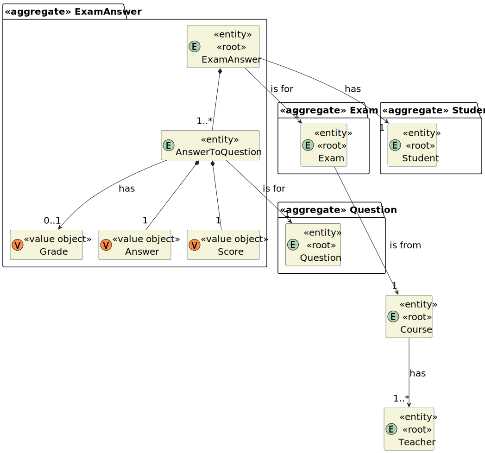
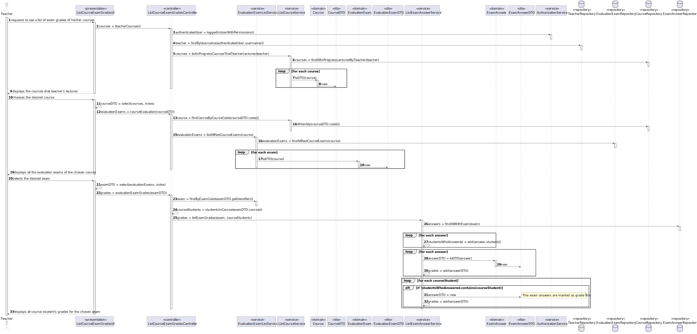
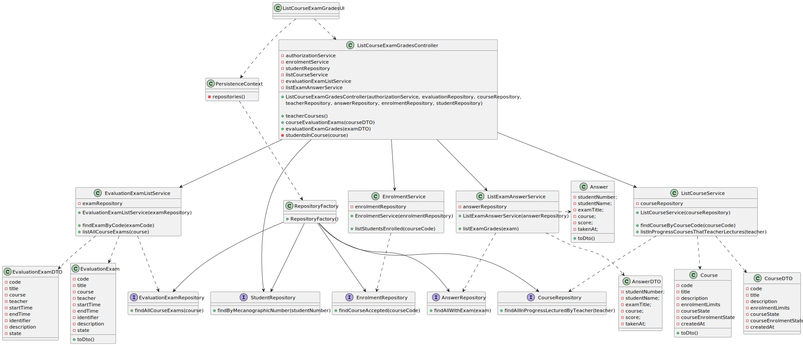

# User Story 2006 - List of grades in courses

|             |           |
| ----------- | --------- |
| ID          | 38        |
| Sprint      | C         |
| Application | 3 - Exams |
| Priority    | 3         |

## 1. Context

This is the first time this task is assigned to be developed. This is a new functionality that allows a teacher to view the grades of exams of her/his courses

## 2. Requirements

### As Teacher, I want to view a list of the grades of exams of my courses

## 2.1. Client Specifications

- N/a

## 2.2. Client Clarifications

> [**Question:** If a student misses a exam, his grade should be 0 or what?](https://moodle.isep.ipp.pt/mod/forum/discuss.php?d=22187)
>
> **Answer:** "Should be N/A. You should not notify anyone about the absence of a student."

> [**Question:** Do courses have a final grade?](https://moodle.isep.ipp.pt/mod/forum/discuss.php?d=22278)
>
> **Answer:** "No. You only need to list the grade of exams."

## 2.3. Functional Requirements

> **FRE06** List Course Exam Grades - The system displays to a teacher a list of the grades of exams of his/her courses

## 2.4. Acceptance Criteria

- N/a

---

## 3. Analysis

### 3.1. Main success scenario

1. Teacher requests to see a list of exam grades of his/her courses
2. System displays the courses that teacher's lectures
3. Teacher chooses the desired course
4. System displays all the evaluation exams of the chosen course
5. Teacher selects the desired exam
6. System displays all course student's grades for the chosen exam

### 3.2. Conditions

- The teacher must be authenticated and authorized to perform the operation.

### 3.3. System Sequence Diagram


### 3.4. Partial Domain Model



## 4. Design

### 4.1. Functionality Realization



### 4.2. Class Diagram



### 4.3. Applied Patterns

- **Dependency Injection:** This is used in the controller and in the service. This is done to enable the use of a mock repository in the tests and to reduce coupling.
- **Repository:** This is used to store the courses, exams and the exam answers. This is done to reduce coupling and to allow the use of the repository in other parts of the application.
- **Service:** This is used to provide a list of courses, exams and exam answers to the controller. This is done to reduce coupling and to allow the use of the service in other parts of the application.

### 4.4. Tests

- N/a

## 5. Implementation

### 5.1. Controller

- Relevant implementation details

```java
public Iterable<CourseDTO> teacherCourses() {
    SystemUser user = authz.loggedinUserWithPermissions(ClientRoles.TEACHER).orElseThrow();

    Teacher teacher = teacherRepository.findByUsername(user.username()).orElseThrow();

    return courseService.listInProgressCoursesThatTeacherLectures(teacher);
}

public Iterable<EvaluationExamDTO> courseEvaluationExams(CourseDTO course) {
    return evaluationService
        .listAllPastCourseExams(courseService.findCourseByCourseCode(course.getCode()).orElseThrow());
}

public Iterable<AnswerDTO> evaluationExamGrades(EvaluationExamDTO examDTO) {
    return answerService.listExamGrades(evaluationService.findExamByCode(examDTO.getIdentifier()).orElseThrow(),
        studentsInCourse(examDTO.getCourse()));
}

private Collection<Student> studentsInCourse(Course course) {
    Collection<Student> students = new ArrayList<>();

    Iterable<EnrolmentDTO> enrollments = enrolmentService.listStudentsEnrolled(course.code());

    enrollments.forEach(
        e -> students.add(studentRepository.findByMecanographicNumber(e.getStudentNumber()).orElseThrow()));
    return students;
  }
}
```

## 6. Integration & Demonstration

### 6.1. Success scenario


### 6.2. Failure scenario

#### 6.2.1. No evaluated exams in chosen course


#### 6.2.2. No courses available to the teacher


## 7. Observations

- N/a
