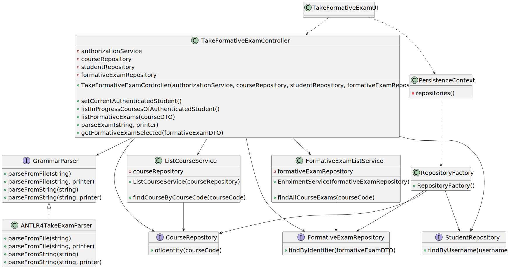

# User Story 2009 - Take an formative exam

> As Student, I want to take an automatic formative exam

|             |           |
| ----------- | --------- |
| ID          | 39        |
| Sprint      | C         |
| Application | 3 - Exams |
| Priority    | 5         |

## 1. Context

This is an enhance of last sprint's US 2001. The goal is to update the parser's implementation in order to make possible students to take an formative exam, using the parser to display and process the students' answers.

## 2. Requirements

### "As Student, I want to take an automatic formative exam"

## 2.1. Client Specifications

- Students enroll in courses. They take exams. They can view the results of their exams.
- The system must provide a language to support the specification and "execution" of exams.
- The language must support the design of the exam layout and its questions as well as solutions, feedback and grading.
- The system must also support the automatic production of feedback and grading for the answers given by students when they take the exam. Usually this is done at the end of the exam.
- At the end of the exam, the system should display the feedback and result (i.e., grade) of the exam.
- The feedback and grade of the exam should be automatically calculated by a parser based on the grammar defined for exams structure.

## 2.2. Client Clarifications

> [**Question 1**: How do exams get displayed to the user? Using a HTML page? Or console?](https://moodle.isep.ipp.pt/mod/forum/discuss.php?d=23245)
>
> **Answer**: "Exams must be displayed using a normal Java Console application.

> [**Question 19**: In regards to the exam, what do you mean by feedback and grading? Is it necessary to save the answers of the users showing and comparing them with the correct answer? Furthermore is it necessary to save the answer of the question?](https://moodle.isep.ipp.pt/mod/forum/discuss.php?d=22003)
>
> **Answer**: "The idea is to have feedback and grading similarly to what is available for tests in the moodle platform. How you may achieve this is not up to me to decide."

## 2.3. Functional Requirements

- **FRE04** Take Exam A Student takes an exam and answer its questions. At the end of the exam, the system should display the feedback and result (i.e., grade) of the exam. The feedback and grade of the exam should be automatically calculated by a parser based on the grammar defined for exams structure

## 2.4. Acceptance Criteria

- A Student takes an automatic formative exam and answer its questions. Each time the system generates a new exam based on the database of questions and the specification of that exam. At the end of the exam, the system should display the feedback and result (i.e., grade) of the exam. The feedback and grade of the exam should be automatically calculated by a parser based on the grammar defined for exams structure.

---

## 3. Analysis

### 3.1. Main success scenario

1. The Student requests to take an formative exam
2. The System asks to select a course
3. The Student selects a course
4. The System presents the exam to the Student
5. The Student answers the questions and submits the exam
6. The System calculates the grade and feedback of the exam

### 3.2. Conditions

- The Student must be authenticated in the system
- The inserted file path must exist, and the defined exam structure must be valid, i.e., must be accepted by the defined grammar, described in [this](../../grammar-doc.md) file.

### 3.3. System Sequence Diagram


### 3.4. Partial Domain Model


## 4. Design

<!-- ### 4.1. Functionality Realization

 -->

### 4.1. Class Diagram



### 4.2. Applied Patterns

- **Strategy:** This is used in the parser, when printing the exam's questions. This is done to enable the use of different printers, depending on the type of the UI being used.
- **Dependency Injection:** This is used in the controller and in the parser. This is done to enable the use of a mock repository in the tests and to reduce coupling.
- **Adapter:** This is used to reduce coupling between the controller and the parser. This is done to enable the use of different parsers, from different libraries, without having to change the controller. To achieve this, the parser uses the interface `GrammarParser`, which is implemented by the ANTLR4 parser.

### 4.3. Tests

_Note: This are some simplified versions of the tests for readability purposes._

**Test 1:** Ensure it is possible to generate structure of a formative exam string

```java
@Test
public void ensureIsPossibleToCreateFormativeExamString() {}
```

**Test 2:** Ensure it is possible to generate structure of a formative exam string with multiple questions

```java
@Test
public void ensureIsPossibleToCreateFormativeExamStringWithMultipleQuestions() {}
```

**Test 3:** Ensure it is possible to generate structure of a formative exam string with multiple sections

```java
@Test
public void ensureIsPossibleToCreateFormativeExamStringWithMultipleSections() {}
```

**Test 4:** ensureGeneratedStringFromExamPassesTheParser

```java
@Test
public void ensureGeneratedStringFromExamPassesTheParser() {}
```

## 5. Implementation

### 5.1. Generate structure of a formative exam string service

```java
public String generateStructureString() {
    StringBuilder sb = new StringBuilder();

    sb.append(buildStartExam());
    sb.append(buildHeaderExam());

    double score = getScorePerQuestion();

    sb.append(buildSections(score));
    sb.append(buildEndExam());

    return sb.toString();
  }
```

### 5.2. Take formative exam controller

Take Exam controller, using the adapter pattern to reduce coupling between the controller and the parser.

```java
public interface GrammarParser<B> {
    public B parseFromFile(String path) throws IOException, ParseException;
    public B parseFromString(String str) throws ParseException;
}
```

```java

public TakeFormativeExamController {
  private final Grammar<ExamScore> parser;

public TakeFormativeExamController(final AuthorizationService authz, final StudentRepository studentRepository,
      final CourseRepository courseRepository, final FormativeExamRepository formativeExamRepository) {

    (...) // omitted for brevity

    this.parser = new ANTLR4TakeExamParser();
  }
}
```

Exam parser using ANTLR4 listeners. This class implements the `GrammarParser` interface.

```java
public ExamScore parseFromString(String str, ExamPrinter printer) throws ParseException {
    ExamLexer lexer = new ExamLexer(CharStreams.fromString(str));
    CommonTokenStream tokens = new CommonTokenStream(lexer);
    ExamParser parser = new ExamParser(tokens);
    ParseTree tree = parser.start();

    if (parser.getNumberOfSyntaxErrors() > 0)
      throw new ParseException();

    ParseTreeWalker walker = new ParseTreeWalker();
    ExamTakerListener listener = new ExamTakerListener(printer);
    walker.walk(listener, tree);

    return listener.getStudentsScore();
}
```

## 6. Integration & Demonstration


## 7. Observations

- N/a

```

```
