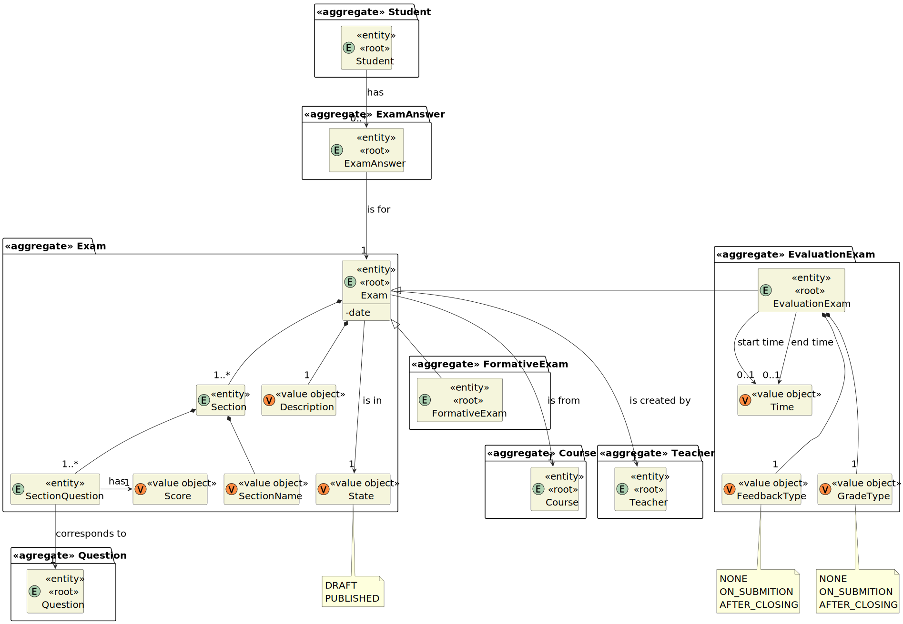

# User Story 2009 - Take an formative exam

> As Student, I want to take an automatic formative exam

|             |           |
| ----------- | --------- |
| ID          | 39        |
| Sprint      | C         |
| Application | 3 - Exams |
| Priority    | 5         |

## 1. Context

This user story is related to the creation of a formative exam. The student should be able to take the exam and see the results.

## 2. Requirements

### "As Student, I want to take an automatic formative exam"

## 2.1. Client Specifications

- Students enroll in courses. They take exams. They can view the results of their exams

## 2.2. Client Clarifications

> [**Question 19**: In regards to the exam, what do you mean by feedback and grading? Is it necessary to save the answers of the users showing and comparing them with the correct answer? Furthermore is it necessary to save the answer of the question?](https://moodle.isep.ipp.pt/mod/forum/discuss.php?d=22003)
>
> **Answer**: "The idea is to have feedback and grading similarly to what is available for tests in the moodle platform. How you may achieve this is not up to me to decide."

## 2.3. Functional Requirements

- **FRE04** Take Exam A Student takes an exam and answer its questions. At the end of
  the exam, the system should display the feedback and result (i.e., grade) of the exam. The
  feedback and grade of the exam should be automatically calculated by a parser based on
  the grammar defined for exams structure

## 2.4. Acceptance Criteria

- A Student takes an automatic formative exam and answer its questions. Each time the system generates a new exam based on the database of questions and the specification of that exam. At the end of the exam, the system should display the feedback and result (i.e., grade) of the exam. The feedback and grade of the exam should be automatically calculated by a parser based on the grammar defined for exams structure.

---

## 3. Analysis

### 3.1. Main success scenario

1. The Student requests to take an formative exam
2. The System asks to select a course
3. The Student selects a course
4. The System presents the exam to the Student
5. The Student answers the questions and submits the exam
6. The System calculates the grade and feedback of the exam

### 3.2. Conditions

- The Student must be authenticated in the system

### 3.3. System Sequence Diagram


### 3.4. Partial Domain Model



## 4. Design

### 4.1. Functionality Realization


### 4.2. Class Diagram


### 4.3. Applied Patterns

- XXX

### 4.4. Tests

_Note: This are some simplified versions of the tests for readability purposes._

**Test 1:** XXX

```java

```

## 5. Implementation

### 5.1. Controller

- Relevant implementation details

```java

```

## 6. Integration & Demonstration


## 7. Observations

- N/a
