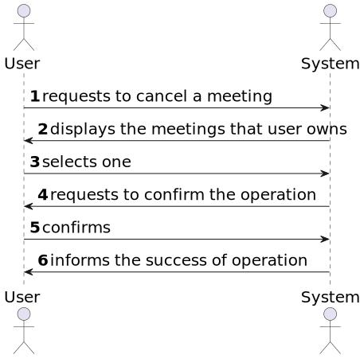
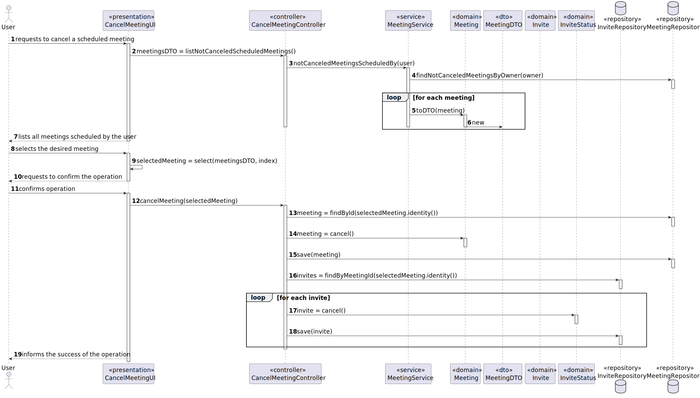
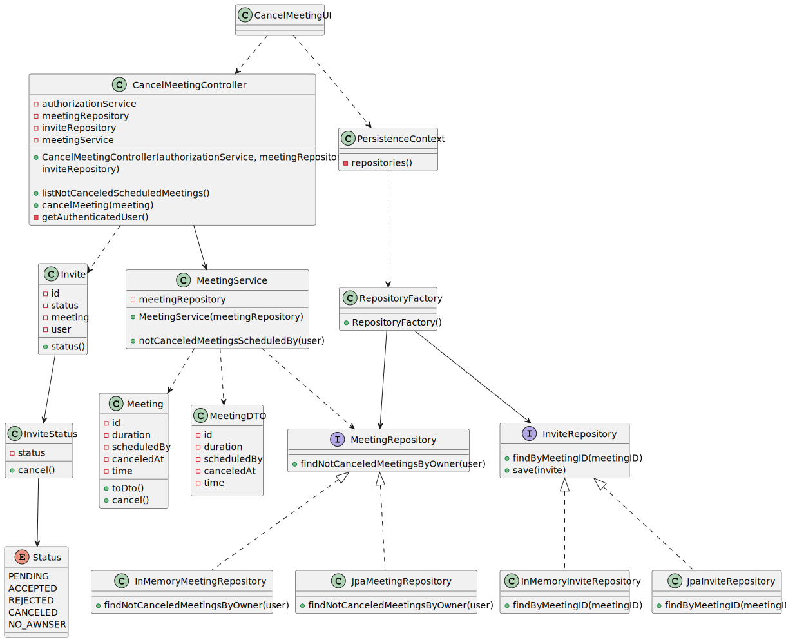

# User Story 4002 - Cancel Meeting

|             |              |
| ----------- | ------------ |
| ID          | 40           |
| Sprint      | C            |
| Application | 5 - Meetings |
| Priority    | 5            |

## 1. Context

- This is the first time this task is assigned to be developed. This is a new functionality that allows a user to cancel a scheduled meeting.

## 2. Requirements

### "As User, I want to cancel a meeting"

## 2.1. Client Specifications

- N/A

## 2.2. Client Clarifications

- N/A

## 2.3. Functional Requirements

-- **FRM02** Cancel Meeting - A user cancels a scheduled meeting.

## 2.4. Acceptance Criteria

- N/A

---

## 3. Analysis

### 3.1. Main success scenario

1. User requests to cancel a scheduled meeting
2. Systems displays all the meetings scheduled by the user
3. User selects the desired meeting
4. System requests to confirm the operation
5. User confirms
6. System informs the success of the operation

### 3.2. Conditions

- The user must be authenticated and authorized to perform the operation.
- The user must have scheduled at least one meeting.

### 3.3. System Sequence Diagram



### 3.4. Partial Domain Model


## 4. Design

### 4.1. Functionality Realization



### 4.2. Class Diagram



### 4.3. Applied Patterns

- **Dependency Injection:** This is used in the controller and in the service. This is done to enable the use of a mock repository in the tests and to reduce coupling.

### 4.4. Tests

_Note: This are some simplified versions of the tests for readability purposes._

**Test 1:** Ensure its possible to cancel a meeting

```java
  @Test
  public void ensureItsPossibleToCancelMeeting() {}
```

## 5. Implementation

### 5.1. Controller

- Relevant implementation details

```java
public Iterable<MeetingDTO> listNotCanceledScheduledMeetings() {
    return this.service.notCanceledMeetingsScheduledBy(getAuthenticatedUser());
  }

  public void cancelMeeting(MeetingDTO meetingDTO) {
    Meeting meeting = meetingRepository.ofIdentity(meetingDTO.getId()).orElseThrow();
    meeting.cancel();
    meetingRepository.save(meeting);

    Iterable<Invite> invites = inviteRepository.findByMeetingID(meetingDTO.getId());
    invites.forEach(inviteRepository::remove);
  }

  public SystemUser getAuthenticatedUser() {
    return authz.loggedinUserWithPermissions(ClientRoles.TEACHER, ClientRoles.MANAGER, ClientRoles.STUDENT)
        .orElseThrow(IllegalStateException::new);
  }
```

## 6. Integration & Demonstration

### 6.1. Success scenario


### 6.2. Failure scenario


## 7. Observations

- N/a
