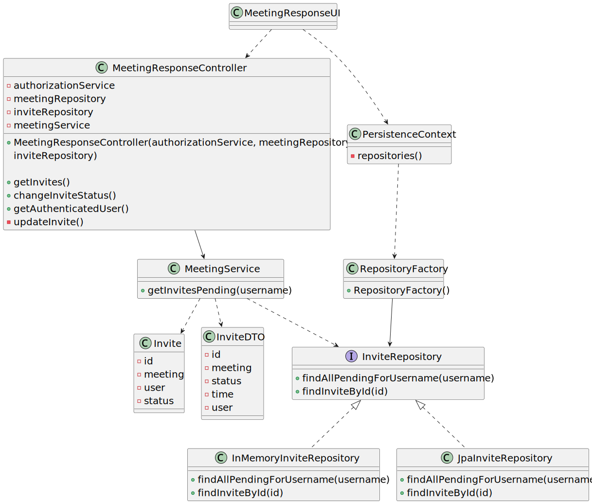

# User Story 4003 - Accept/Reject Meeting

> As User, I want to accept or reject a meeting request

|             |              |
| ----------- | ------------ |
| ID          | 41           |
| Sprint      | C            |
| Application | 5 - Meetings |
| Priority    | 5            |

## 1. Context

This is a new feature that allows users to accept or reject a meeting request.

## 2. Requirements

### "As User, I want to accept or reject a meeting request."

## 2.1. Client Specifications

- Classes and meetings are events that happen in some time and have a duration. They also have participants. However there is no concept of location related to classes and meetings. They do not take place in a specific location and "nothing" happens at the time of the event.

## 2.2. Client Clarifications

> [**Question 24**: When a user does not respond to a meeting invitation, should his status be changed to "not responded" or "rejected"?](https://moodle.isep.ipp.pt/mod/forum/discuss.php?d=22080)
>
> **Answer**: "The status of someone that did not answer should be "no answer" or "unknown""

## 2.3. Functional Requirements

- **FRM03** Accept/Reject Meeting A user accepts or rejects an invitation to a meeting.

## 2.4. Acceptance Criteria

- N/a

---

## 3. Analysis

### 3.1. Main success scenario

1. Checks if theres an invite to a meeting
2. System shows list of invites
3. Selects an invite
4. Asks if the user wants to accept or reject the invite
5. Accepts or reject the meeting invitation
6. Reports success of the operation

### 3.2. Conditions

- The user must be authenticated and authorized to perform the operation.

- The user must have received an invitation to at least one meeting.

### 3.3. System Sequence Diagram


### 3.4. Sequence Diagram (Simplified)


### 3.5. Partial Domain Model


## 4. Design

### 4.1. Functionality Realization


### 4.2. Class Diagram



### 4.3. Applied Patterns

- **Dependency Injection:** This is used in the controller and in the service. This is done to enable the use of a mock repository in the tests and to reduce coupling.
- **State:** The state pattern is used to represent the state of the invite. This is done to keep the invite state logic encapsulated in the invite status class and to reduce coupling.

### 4.4. Tests

_Note: This are some simplified versions of the tests for readability purposes._

**Test 1:** Ensure its possible to accept a meeting invite

```java
@Test
public void ensureItsPossibleToAcceptAMeetingInvite() {
    // Arrange
    MeetingInvite invite = new MeetingInvite();
    invite.setStatus(MeetingInviteStatus.PENDING);
    MeetingInviteRepository repository = new MeetingInviteRepository();
    repository.add(invite);
    MeetingInviteService service = new MeetingInviteService(repository);
    MeetingInviteController controller = new MeetingInviteController(service);
    // Act
    controller.accept(invite);
    // Assert
    assertEquals(MeetingInviteStatus.ACCEPTED, invite.getStatus());
}
```

**Test 2:** Ensure its possible to reject a meeting invite

```java
@Test
public void ensureItsPossibleToRejectAMeetingInvite() {
    // Arrange
    MeetingInvite invite = new MeetingInvite();
    invite.setStatus(MeetingInviteStatus.PENDING);
    MeetingInviteRepository repository = new MeetingInviteRepository();
    repository.add(invite);
    MeetingInviteService service = new MeetingInviteService(repository);
    MeetingInviteController controller = new MeetingInviteController(service);
    // Act
    controller.reject(invite);
    // Assert
    assertEquals(MeetingInviteStatus.REJECTED, invite.getStatus());
}
```

**Test 3:** Ensure its not possible to accept a meeting invite that is not pending

```java
@Test
public void ensureItsNotPossibleToAcceptAMeetingInviteThatIsNotPending() {
    // Arrange
    MeetingInvite invite = new MeetingInvite();
    invite.setStatus(MeetingInviteStatus.ACCEPTED);
    MeetingInviteRepository repository = new MeetingInviteRepository();
    repository.add(invite);
    MeetingInviteService service = new MeetingInviteService(repository);
    MeetingInviteController controller = new MeetingInviteController(service);
    // Act
    controller.accept(invite);
    // Assert
    assertEquals(MeetingInviteStatus.ACCEPTED, invite.getStatus());
}
```

**Test 4:** Ensure its not possible to reject a meeting invite that is not pending

```java
@Test
public void ensureItsNotPossibleToRejectAMeetingInviteThatIsNotPending() {
    // Arrange
    MeetingInvite invite = new MeetingInvite();
    invite.setStatus(MeetingInviteStatus.REJECTED);
    MeetingInviteRepository repository = new MeetingInviteRepository();
    repository.add(invite);
    MeetingInviteService service = new MeetingInviteService(repository);
    MeetingInviteController controller = new MeetingInviteController(service);
    // Act
    controller.reject(invite);
    // Assert
    assertEquals(MeetingInviteStatus.REJECTED, invite.getStatus());
}
```

## 5. Implementation

### 5.1. Controller

- Relevant implementation details

```java
public MeetingResponseController(final InviteRepository inviteRepository, final MeetingRepository meetingRepository) {
    this.inviteRepository = inviteRepository;
    this.meetingRepository = meetingRepository;
    this.meetingService = new MeetingService(meetingRepository, inviteRepository);
  }
```

## 6. Integration & Demonstration


## 7. Observations

- N/a
