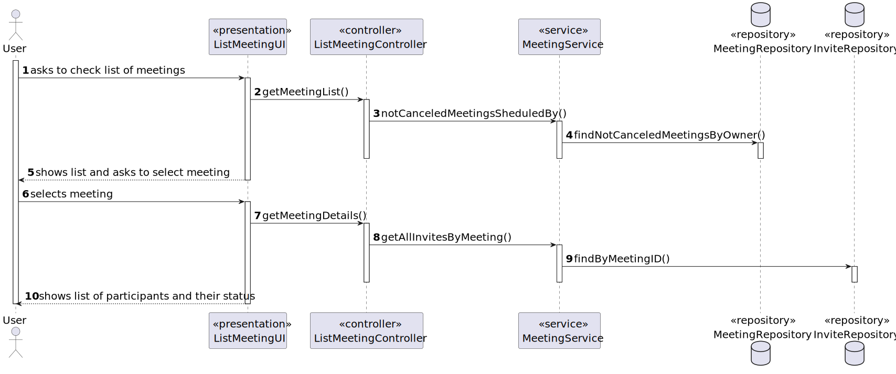
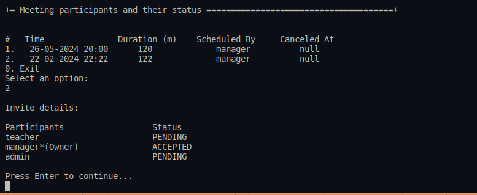

# User Story 4004 - List of participants

> As User, I want to view a list of participants in my meeting and their status (accept or reject)

|             |              |
| ----------- | ------------ |
| ID          | 42           |
| Sprint      | C            |
| Application | 5 - Meetings |
| Priority    | 5            |

## 1. Context

This is a new feature that allows users to view a list of participants in a meeting and their status.

## 2. Requirements

### "As User, I want to view a list of participants in my meeting and their status (accept or reject)."

## 2.1. Client Specifications

- Classes and meetings are events that happen in some time and have a duration. They also have
  participants. However there is no concept of location related to classes and meetings. They do
  not take place in a specific location and "nothing" happens at the time of the event.

## 2.2. Client Clarifications

- N/a

## 2.3. Functional Requirements

- **FRM04** List Participants The system displays the lists of participants in a meeting and the response status (accept or reject meeting)

## 2.4. Acceptance Criteria

- N/a

---

## 3. Analysis

### 3.1. Main success scenario

1. Asks to check the list of meetings
2. System shows list of meetings
3. Selects a meeting
4. System shows list of participants and their status

### 3.2. Conditions

- The user must be authenticated and authorized to perform the operation.

- The user must have created at least one meeting.

### 3.3. System Sequence Diagram


### 3.4. Partial Domain Model


## 4. Design

### 4.1. Functionality Realization



### 4.2. Class Diagram


### 4.3. Applied Patterns

- **Dependency Injection:** This is used in the controller and in the service. This is done to enable the use of a mock repository in the tests and to reduce coupling.
- **State:** The state pattern is used to represent the state of the invite and the meeting. This is done to keep the invite and meeting state logic encapsulated in the invite status class/canceled meeting class and to reduce coupling.
- **Service:** This is used to provide a list of participants to the controller. This is done to reduce coupling and to allow the use of the service in other parts of the application.

### 4.4. Tests

_Note: This are some simplified versions of the tests for readability purposes._

**Test 1:** Ensure meeting can be created

```java
@Test
public void ensureItsPossibleToCreateInvite() {
}
```

**Test 2:** Ensure meeting can be accepted

```java
@Test
public void ensureItsPossibleToAcceptInvite() {
}
```

**Test 3:** Ensure meeting can be rejected

```java
@Test
public void ensureItsPossibleToRejectInvite() {
}
```

## 5. Implementation

### 5.1. Controller

- Relevant implementation details

```java
public ListMeetingController(final MeetingRepository meetingRepository, final InviteRepository inviteRepository,
      final AuthorizationService authz) {
    this.authz = authz;
    this.service = new MeetingService(meetingRepository, inviteRepository);

  }
```

## 6. Integration & Demonstration



## 7. Observations

- It was decided to remove the Invite Status "No Answer" from the domain classes.
